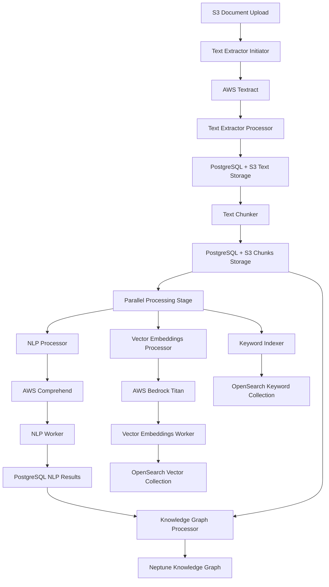

# Design Document

## Overview

This design document outlines a comprehensive approach to systematically test, debug, and verify the complete Climate Risk RAG document processing pipeline following significant code refactoring and cleanup changes. The design leverages the production-ready cleanup service to enable clean slate testing and implements a stage-by-stage verification methodology to ensure end-to-end functionality.

## Architecture

### System Architecture Overview

The Climate Risk RAG system implements a multi-stage serverless document processing pipeline on AWS:



### Core Infrastructure Components

#### Data Stores
- **PostgreSQL RDS**: Document metadata, processing status, chunks, NLP results
- **S3 Buckets**: Raw documents, extracted text, chunks, intermediate data
- **OpenSearch Serverless**: Vector embeddings collection, keyword search collection
- **Neptune**: Knowledge graph with RDF triples

#### Processing Components
- **16 Lambda Functions**: Distributed across the processing pipeline
- **AWS Services**: Textract (OCR), Comprehend (NLP), Bedrock Titan (embeddings)
- **Messaging**: SNS topics for stage coordination, SQS for async processing

#### Testing Infrastructure
- **Cleanup Service**: Production-ready system reset capability
- **Pipeline Test Function**: End-to-end testing orchestration
- **Monitoring**: CloudWatch logs, X-Ray tracing, custom metrics

## Components and Interfaces

### Stage 1: Document Ingestion and Text Extraction

#### Text Extractor Initiator
- **Function**: `solve-global-kr-textextractor-initiator`
- **Trigger**: S3 ObjectCreated event on source documents bucket
- **Input**: S3 event notification with document location
- **Output**: Textract job submission
- **Interface**: Async processing with job ID tracking

#### Text Extractor Processor
- **Function**: `solve-global-kr-textextractor-processor`
- **Trigger**: Textract job completion notification
- **Input**: Textract job results
- **Output**: Extracted text stored in S3 and PostgreSQL
- **Interface**: Standardized messaging format for downstream processing

```python
# Text Extraction Output Interface
{
    "doc_id": "uuid-string",
    "processing_status": "text_extracted",
    "data_locations": {
        "text_s3_url": "s3://bucket/text/doc_id.txt",
        "metadata_location": "postgresql://table/documents"
    },
    "extraction_metadata": {
        "page_count": 25,
        "text_length": 45000,
        "extraction_confidence": 0.95
    }
}
```

### Stage 2: Text Processing and Chunking

#### Text Chunker
- **Function**: `text-chunker-pipeline`
- **Trigger**: Text extraction completion message
- **Input**: Extracted text location and metadata
- **Output**: Document chunks stored in S3 and PostgreSQL
- **Interface**: Smart structured chunking with metadata preservation

```python
# Text Chunking Output Interface
{
    "doc_id": "uuid-string",
    "processing_status": "chunks_created",
    "data_locations": {
        "chunks_s3_url": "s3://bucket/chunks/doc_id/",
        "chunks_metadata": "postgresql://table/chunks"
    },
    "chunking_metadata": {
        "total_chunks": 19,
        "chunk_types": ["paragraph", "table", "list"],
        "avg_chunk_size": 850
    }
}
```

### Stage 3: Parallel Processing Stage

#### NLP Processing Pipeline
- **Processor**: `nlp-processor`
- **Worker**: `nlp-worker`
- **Service**: AWS Comprehend for entity and key phrase extraction
- **Output**: Structured NLP results in PostgreSQL

#### Vector Embeddings Pipeline
- **Processor**: `vector-embeddings-pipelin-VectorEmbeddingsProcesso-YU1t1iUbDEkA`
- **Worker**: `vector-embeddings-pipelin-VectorEmbeddingsWorker5F-nCQL6EhDMuyi`
- **Service**: AWS Bedrock Titan for embedding generation
- **Output**: Vector embeddings indexed in OpenSearch

#### Keyword Indexing Pipeline
- **Synchronous**: `keyword-indexer`
- **Async Initiator**: `async-keyword-indexer-initiator`
- **Async Worker**: `async-keyword-indexer-worker`
- **Output**: Keyword-searchable documents in OpenSearch

### Stage 4: Knowledge Graph Processing

#### Knowledge Graph Components
- **Document Structure**: `document-structure-kg-processor`
- **Entity Resolution**: `entity-resolution-service`
- **KG Integration**: `kg-integration-worker`
- **Output**: RDF triples stored in Neptune

### Testing and Verification Interfaces

#### Cleanup Service Interface
```python
# Cleanup Service API
{
    "operation": "complete_cleanup",  # or "component_cleanup"
    "components": ["postgresql", "opensearch", "neptune", "s3"],
    "dry_run": false,
    "verification": true
}

# Cleanup Response
{
    "status": "success",
    "items_cleaned": {
        "postgresql": 2039,
        "opensearch_vector": 0,
        "opensearch_keyword": 3,
        "neptune": 422,
        "s3": 1
    },
    "verification_results": {
        "all_clean": true,
        "details": {...}
    }
}
```

#### Pipeline Test Interface
```python
# Pipeline Test Invocation
{
    "test_document": "s3://bucket/test-doc.pdf",
    "test_mode": "single_document",
    "verification_points": [
        "text_extraction",
        "chunking",
        "nlp_processing",
        "vector_embeddings",
        "keyword_indexing",
        "knowledge_graph"
    ]
}
```

## Data Models

### Document Processing State Model

```python
class DocumentProcessingState:
    doc_id: str
    source_location: str
    processing_stages: Dict[str, StageStatus]
    created_at: datetime
    updated_at: datetime
    
class StageStatus:
    stage_name: str
    status: str  # "pending", "in_progress", "completed", "failed"
    started_at: Optional[datetime]
    completed_at: Optional[datetime]
    error_message: Optional[str]
    output_location: Optional[str]
    metadata: Dict[str, Any]
```

### Verification Data Model

```python
class PipelineVerification:
    test_id: str
    document_id: str
    test_timestamp: datetime
    stage_results: Dict[str, StageVerificationResult]
    overall_status: str
    cost_tracking: CostMetrics
    
class StageVerificationResult:
    stage_name: str
    expected_output: Any
    actual_output: Any
    verification_status: str  # "pass", "fail", "warning"
    verification_details: Dict[str, Any]
    performance_metrics: Dict[str, float]
```

### Cost Tracking Model

```python
class CostMetrics:
    textract_pages: int
    textract_cost: float
    comprehend_characters: int
    comprehend_cost: float
    bedrock_tokens: int
    bedrock_cost: float
    opensearch_operations: int
    opensearch_cost: float
    total_estimated_cost: float
```

## Error Handling

### Comprehensive Error Handling Strategy

#### Stage-Level Error Handling
Each pipeline stage implements standardized error handling:

```python
class StageErrorHandler:
    def handle_stage_error(self, stage_name: str, error: Exception, context: Dict):
        """Standardized error handling for pipeline stages"""
        
        error_info = {
            "stage": stage_name,
            "error_type": type(error).__name__,
            "error_message": str(error),
            "timestamp": datetime.utcnow().isoformat(),
            "context": context,
            "retry_count": context.get("retry_count", 0)
        }
        
        # Log error with full context
        logger.error(f"Stage {stage_name} failed", extra=error_info)
        
        # Determine retry strategy
        if self.should_retry(error, context):
            return self.schedule_retry(stage_name, context)
        else:
            return self.mark_stage_failed(stage_name, error_info)
```

#### Error Recovery Patterns

1. **Transient Errors**: Automatic retry with exponential backoff
2. **Configuration Errors**: Immediate failure with detailed diagnostics
3. **Resource Errors**: Graceful degradation or alternative processing
4. **Data Errors**: Skip problematic items, continue processing

#### Error Monitoring and Alerting

```python
class ErrorMonitoring:
    def setup_error_alerts(self):
        """Configure CloudWatch alarms for error conditions"""
        
        error_patterns = [
            {
                "pattern": "ERROR.*database.*connection",
                "severity": "high",
                "action": "immediate_alert"
            },
            {
                "pattern": "ERROR.*textract.*quota",
                "severity": "medium", 
                "action": "cost_alert"
            },
            {
                "pattern": "ERROR.*opensearch.*timeout",
                "severity": "medium",
                "action": "performance_alert"
            }
        ]
        
        for pattern in error_patterns:
            self.create_log_metric_filter(pattern)
            self.create_cloudwatch_alarm(pattern)
```

## Testing Strategy

### Systematic Testing Methodology

#### Phase 1: Clean Slate Preparation
```python
def prepare_clean_environment():
    """Establish clean testing environment"""
    
    # 1. Execute complete cleanup
    cleanup_result = invoke_cleanup_service({
        "operation": "complete_cleanup",
        "components": ["postgresql", "opensearch", "neptune", "s3"],
        "dry_run": False,
        "verification": True
    })
    
    # 2. Verify clean state
    assert cleanup_result["verification_results"]["all_clean"] == True
    
    # 3. Initialize cost tracking
    cost_tracker = CostTracker()
    cost_tracker.reset_daily_limits()
    
    return cleanup_result, cost_tracker
```

#### Phase 2: Single Document End-to-End Test
```python
def execute_single_document_test(test_document_path: str):
    """Execute comprehensive single document test"""
    
    test_results = {}
    
    # Stage 1: Document Upload and Text Extraction
    test_results["text_extraction"] = test_text_extraction_stage(test_document_path)
    
    # Stage 2: Text Chunking
    test_results["chunking"] = test_chunking_stage(test_results["text_extraction"]["doc_id"])
    
    # Stage 3: Parallel Processing
    test_results["nlp_processing"] = test_nlp_stage(test_results["chunking"]["doc_id"])
    test_results["vector_embeddings"] = test_vector_embeddings_stage(test_results["chunking"]["doc_id"])
    test_results["keyword_indexing"] = test_keyword_indexing_stage(test_results["chunking"]["doc_id"])
    
    # Stage 4: Knowledge Graph
    test_results["knowledge_graph"] = test_knowledge_graph_stage(
        test_results["nlp_processing"]["doc_id"],
        test_results["chunking"]["doc_id"]
    )
    
    return test_results
```

#### Phase 3: Stage-by-Stage Verification
```python
def verify_stage_completion(stage_name: str, doc_id: str, expected_outputs: Dict):
    """Verify individual stage completion and outputs"""
    
    verification_result = StageVerificationResult(stage_name=stage_name)
    
    # Check data store populations
    if stage_name == "text_extraction":
        verification_result.actual_output = {
            "postgresql_record": check_postgresql_document_record(doc_id),
            "s3_text_file": check_s3_text_file(doc_id),
            "text_length": get_extracted_text_length(doc_id)
        }
    
    elif stage_name == "chunking":
        verification_result.actual_output = {
            "postgresql_chunks": count_postgresql_chunks(doc_id),
            "s3_chunk_files": count_s3_chunk_files(doc_id),
            "chunk_metadata": get_chunk_metadata(doc_id)
        }
    
    elif stage_name == "vector_embeddings":
        verification_result.actual_output = {
            "opensearch_vectors": count_opensearch_vectors(doc_id),
            "vector_dimensions": get_vector_dimensions(doc_id),
            "embedding_metadata": get_embedding_metadata(doc_id)
        }
    
    # Compare with expected outputs
    verification_result.verification_status = compare_outputs(
        expected_outputs, verification_result.actual_output
    )
    
    return verification_result
```

### Cost-Conscious Testing Protocol

#### Daily Cost Limits and Monitoring
```python
class CostControlledTesting:
    def __init__(self):
        self.daily_limits = {
            "textract_pages": 50,
            "comprehend_characters": 1000000,
            "bedrock_tokens": 100000,
            "total_cost": 20.00
        }
        self.current_usage = {}
    
    def check_cost_limits_before_test(self, test_plan: Dict) -> bool:
        """Verify test won't exceed daily cost limits"""
        
        estimated_cost = self.estimate_test_cost(test_plan)
        current_total = sum(self.current_usage.values())
        
        if current_total + estimated_cost > self.daily_limits["total_cost"]:
            logger.warning(f"Test would exceed daily cost limit: {estimated_cost}")
            return False
        
        return True
    
    def track_test_costs(self, test_results: Dict):
        """Track actual costs from test execution"""
        
        for stage, result in test_results.items():
            if "cost_metrics" in result:
                self.current_usage[stage] = result["cost_metrics"]
```

#### Progressive Testing Strategy
```python
def execute_progressive_testing():
    """Execute tests with increasing complexity"""
    
    test_phases = [
        {
            "name": "single_document_minimal",
            "documents": 1,
            "document_size": "small",  # 1-3 pages
            "verification_depth": "basic"
        },
        {
            "name": "single_document_comprehensive", 
            "documents": 1,
            "document_size": "medium",  # 5-10 pages
            "verification_depth": "detailed"
        },
        {
            "name": "multi_document_batch",
            "documents": 3,
            "document_size": "small",
            "verification_depth": "basic"
        },
        {
            "name": "production_simulation",
            "documents": 5,
            "document_size": "mixed",
            "verification_depth": "comprehensive"
        }
    ]
    
    for phase in test_phases:
        if not cost_controller.check_cost_limits_before_test(phase):
            logger.warning(f"Skipping phase {phase['name']} due to cost limits")
            continue
            
        phase_results = execute_test_phase(phase)
        analyze_phase_results(phase_results)
        
        # Use cleanup service between phases
        cleanup_between_phases()
```

## Implementation Plan

### Development Phases

#### Phase 1: Testing Infrastructure Setup (Days 1-2)
1. **Enhanced Pipeline Test Function**
   - Implement comprehensive stage verification
   - Add cost tracking and monitoring
   - Create detailed reporting capabilities

2. **Test Data Preparation**
   - Curate small test documents (1-5 pages each)
   - Create test document metadata
   - Establish baseline expectations

3. **Monitoring Enhancement**
   - Configure CloudWatch dashboards
   - Set up cost monitoring alerts
   - Implement X-Ray tracing

#### Phase 2: Stage-by-Stage Testing (Days 3-5)
1. **Text Extraction Testing**
   - Verify Textract integration
   - Test PostgreSQL storage
   - Validate S3 text storage

2. **Chunking Pipeline Testing**
   - Test smart structured chunking
   - Verify chunk metadata
   - Validate chunk storage

3. **Parallel Processing Testing**
   - Test NLP processing pipeline
   - Debug vector embeddings pipeline
   - Verify keyword indexing

#### Phase 3: End-to-End Integration (Days 6-7)
1. **Complete Pipeline Testing**
   - Execute full document processing
   - Verify all data stores populated
   - Test query functionality

2. **Performance Optimization**
   - Identify bottlenecks
   - Optimize resource allocation
   - Tune processing parameters

### Success Metrics

#### Technical Success Criteria
- **Pipeline Completion Rate**: >95% successful end-to-end processing
- **Data Consistency**: All data stores properly populated
- **Processing Time**: <5 minutes per document average
- **Error Recovery**: Graceful handling of transient failures

#### Cost Success Criteria
- **Daily Testing Cost**: <$20 per day
- **Cost per Document**: <$1 per document processed
- **Resource Efficiency**: Optimal Lambda memory/timeout settings

#### Quality Success Criteria
- **Search Functionality**: Vector and keyword search return relevant results
- **Data Integrity**: No data loss or corruption
- **Monitoring Coverage**: Complete observability across all stages

This comprehensive design provides the foundation for systematic testing and verification of the complete Climate Risk RAG pipeline, ensuring robust functionality while maintaining strict cost controls.