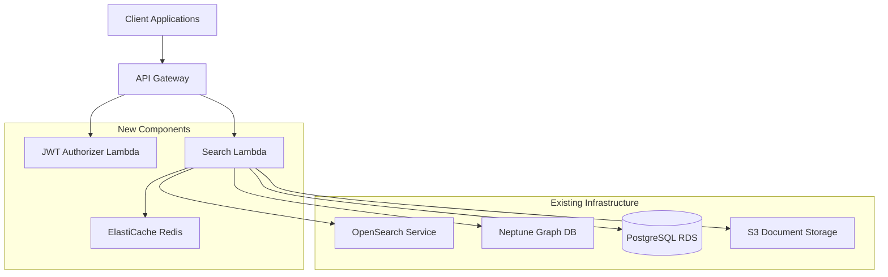
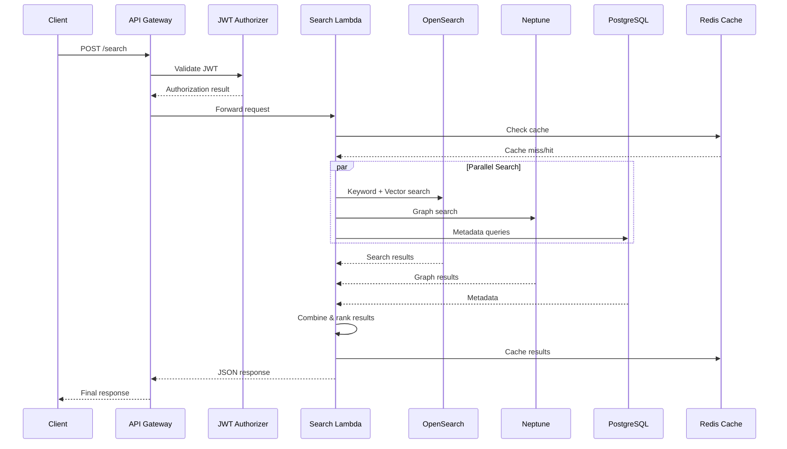
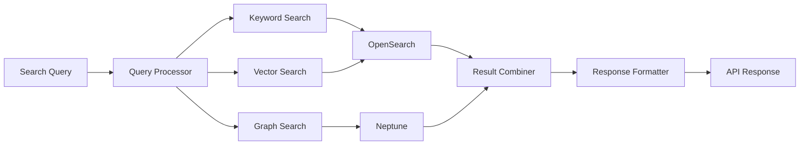
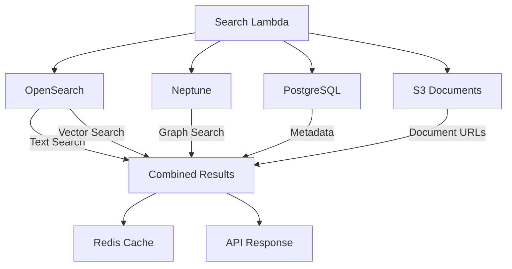

## ✅ DEPLOYMENT STATUS: COMPLETED

**Deployed**: 2025-09-16  
**Status**: Fully Operational  
**Endpoint**: `https://43l6kohmrf.execute-api.us-east-1.amazonaws.com/v1/search`  
**Authentication**: JWT Bearer tokens required  

See `GAIP_API_DEPLOYED_CONFIGURATION_2025-09-16.md` for complete deployment details.

---

# GAIP API Implementation Plan - September 16, 2025

## Executive Summary

This document outlines the comprehensive implementation plan for the GAIP Knowledge Repository Search API using AWS serverless architecture. The implementation will create a production-ready API that matches the OpenAPI specification exactly while leveraging existing infrastructure components (Neptune, OpenSearch, PostgreSQL) and integrating with the current document processing pipeline.

## 1. Architecture Overview

### 1.1 High-Level Architecture



### 1.2 Component Integration

The GAIP API will integrate with existing infrastructure:

- **OpenSearch**: Text search and vector operations
- **Neptune**: Knowledge graph queries and concept expansion  
- **PostgreSQL**: Document metadata and tracking
- **S3**: Document storage and retrieval
- **Existing Layers**: knowledge-graph-layer, database-core-layer

### 1.3 Request Flow



## 2. Implementation Components

### 2.1 API Gateway Configuration

**Endpoint Structure:**
- Base URL: `https://api.solve.global/gaip/v1`
- Single endpoint: `POST /search`
- JWT authentication with custom authorizer
- Rate limiting: 60/min, 1000/hour, 10000/day
- CORS configuration for web clients

**Features:**
- Request validation against OpenAPI schema
- Response transformation and compression
- CloudWatch logging and metrics
- WAF integration for security

### 2.2 Lambda Functions

#### 2.2.1 JWT Authorizer Lambda
**Purpose**: Validate JWT tokens and extract user context
**Runtime**: Python 3.11
**Memory**: 256MB
**Timeout**: 10 seconds

**Responsibilities:**
- JWT token validation
- User permission checking
- Rate limit enforcement
- Request context enrichment

#### 2.2.2 Search Lambda
**Purpose**: Core search processing and result combination
**Runtime**: Python 3.11  
**Memory**: 2048MB
**Timeout**: 30 seconds
**VPC**: Required for Neptune/OpenSearch access

**Layers Required:**
- knowledge-graph-layer:61 (entity alignment)
- database-core-layer:16 (database access)
- database-dependencies:2 (database libraries)

**Responsibilities:**
- Request parsing and validation
- Multi-modal search coordination
- Result combination and ranking
- Response formatting per API spec
- Caching integration

### 2.3 Infrastructure Integration

#### 2.3.1 Existing Services Access

**OpenSearch Service:**
- Endpoint: `https://vpc-solve-global-kr-search-hsacnclbjsoclui75hefj2espq.us-east-1.es.amazonaws.com`
- Access: VPC security group configuration
- Operations: Text search, vector search, aggregations

**Neptune Database:**
- Endpoint: `solve-global-kr-neptune-s3.cluster-cqhsckw0edl1.us-east-1.neptune.amazonaws.com`
- Port: 8182
- Access: VPC security group configuration
- Operations: SPARQL queries, concept expansion

**PostgreSQL RDS:**
- Host: `solve-global-kr-rag-data-postgresqldatabase03fc658-gpdrsfsllfh8.cqhsckw0edl1.us-east-1.rds.amazonaws.com`
- Database: `climate_risk_rag`
- Access: VPC security group + database credentials
- Operations: Document metadata, tracking, provenance

**S3 Storage:**
- Documents bucket: Source documents
- Text bucket: Extracted text and chunks
- Access: IAM roles and policies
- Operations: Document retrieval, metadata access

#### 2.3.2 New Infrastructure Components

**ElastiCache Redis:**
- Purpose: Query result caching, session management
- Configuration: Single-node for development, cluster for production
- TTL: Configurable per query type
- Integration: Search Lambda caching layer

## 3. Search Implementation Strategy

### 3.1 Multi-Modal Search Architecture

The search implementation will port the proven POC approach while adapting to the GAIP API format:



### 3.2 Search Components Mapping

**From POC to AWS Lambda:**

1. **Query Processing**
   - Port: `EnhancedQueryProcessor` → Search Lambda core logic
   - Adapt: Request format (Form → JSON)
   - Add: JWT context integration

2. **Search Processors**
   - Port: `OpenSearchProcessor` → OpenSearch integration
   - Port: `VectorSearchProcessor` → Vector search logic
   - Port: `DocumentGraphSearchProcessor` → Neptune integration

3. **Result Processing**
   - Port: `ResultCombiner` → Score normalization
   - Port: `SnippetManager` → Snippet generation
   - Adapt: Response format to match API spec

### 3.3 Search Flow Implementation

```python
# Pseudo-code for Search Lambda
async def lambda_handler(event, context):
    # 1. Parse API Gateway request
    request = parse_gaip_request(event)
    
    # 2. Initialize search components
    search_coordinator = SearchCoordinator(
        opensearch_client=opensearch,
        neptune_client=neptune,
        postgres_client=postgres
    )
    
    # 3. Execute multi-modal search
    results = await search_coordinator.search(
        query=request.query,
        filters=request.filters,
        parameters=request.parameters
    )
    
    # 4. Format response per API spec
    response = format_gaip_response(results, request)
    
    # 5. Cache results
    await cache_results(request, response)
    
    return api_gateway_response(response)
```

## 4. Implementation Phases

### Phase 1: Core API Implementation (Week 1)
**Deliverables:**
- Search Lambda function with basic multi-modal search
- API Gateway configuration with JWT authorizer
- Integration with existing OpenSearch and Neptune
- Basic response formatting per API spec

**Tasks:**
1. Create Search Lambda function
2. Port core search logic from POC
3. Configure API Gateway with OpenAPI spec
4. Implement JWT authorizer
5. Basic integration testing

### Phase 2: Advanced Features (Week 2)
**Deliverables:**
- Complete filtering and faceting
- Pagination with cursor support
- Caching layer implementation
- Error handling per API spec

**Tasks:**
1. Implement all filter types (categories, regions, date_range)
2. Add faceted search capabilities
3. Implement cursor-based pagination
4. Add ElastiCache integration
5. Comprehensive error handling

### Phase 3: Production Readiness (Week 3)
**Deliverables:**
- Rate limiting implementation
- Monitoring and alerting
- Performance optimization
- Documentation and testing

**Tasks:**
1. Implement rate limiting
2. Add CloudWatch metrics and alarms
3. Performance testing and optimization
4. Create test frontend for validation
5. Documentation and deployment guides

## 5. Technical Implementation Details

### 5.1 Lambda Function Structure

```
search-lambda/
├── handler.py              # Main Lambda handler
├── search/
│   ├── __init__.py
│   ├── coordinator.py      # Search orchestration
│   ├── opensearch.py       # OpenSearch integration
│   ├── neptune.py          # Neptune integration
│   ├── postgres.py         # PostgreSQL integration
│   └── cache.py           # Caching layer
├── models/
│   ├── __init__.py
│   ├── request.py         # Request models
│   ├── response.py        # Response models
│   └── errors.py          # Error models
├── utils/
│   ├── __init__.py
│   ├── auth.py            # JWT utilities
│   ├── formatting.py      # Response formatting
│   └── validation.py      # Request validation
└── requirements.txt
```

### 5.2 Search Logic Porting

**Core Components to Port:**

1. **Query Analysis**
   - Concept extraction using existing TermMatcher
   - Query expansion via Neptune graph
   - Search strategy selection

2. **Multi-Modal Execution**
   - Parallel search across OpenSearch (keyword + vector)
   - Neptune graph traversal for concept relationships
   - PostgreSQL metadata enrichment

3. **Result Processing**
   - Score normalization across search types
   - Snippet generation with highlighting
   - Metadata enrichment and formatting

### 5.3 Infrastructure Access Patterns

**VPC Configuration:**
- Lambda functions in same VPC as Neptune/OpenSearch
- Security group access to existing services
- NAT Gateway for external API calls

**IAM Permissions:**
```yaml
SearchLambdaRole:
  Policies:
    - OpenSearchAccess: Read/Query permissions
    - NeptuneAccess: Query permissions  
    - RDSAccess: Read permissions for metadata
    - S3Access: Read permissions for documents
    - ElastiCacheAccess: Read/Write for caching
    - CloudWatchLogs: Write permissions
```

## 6. Data Flow and Integration

### 6.1 Search Data Sources



### 6.2 Existing Infrastructure Utilization

**OpenSearch Integration:**
- Use existing indices and mappings
- Leverage current text and vector search capabilities
- Maintain existing performance characteristics

**Neptune Integration:**
- Use existing geonames data (6M+ triples)
- Leverage current FTS integration
- Maintain existing SPARQL query patterns

**PostgreSQL Integration:**
- Access existing document metadata tables
- Use current provenance tracking
- Maintain existing ID management

## 7. API Specification Compliance

### 7.1 Request Format Adaptation

**POC Format (Form-based):**
```python
@app.post("/api/search")
async def search(query: str = Form(...), max_results: int = Form(10)):
```

**GAIP Format (JSON-based):**
```python
@app.post("/search")
async def search(request: SearchRequest):
    # request.query, request.parameters, request.filters
```

### 7.2 Response Format Transformation

**Key Adaptations:**
- Structured JSON response matching OpenAPI schema
- Cursor-based pagination instead of page numbers
- Faceted search results
- Standardized error responses
- Execution time tracking

### 7.3 Authentication Integration

**JWT Implementation:**
- Custom Lambda authorizer for token validation
- User context extraction from token claims
- Rate limiting per user/organization
- Request correlation tracking

## 8. Performance and Scalability

### 8.1 Performance Targets

Based on API documentation requirements:
- Simple queries: <200ms
- Complex queries: <500ms  
- Large result sets: <800ms
- Faceted queries: <600ms

### 8.2 Optimization Strategies

**Caching:**
- Query result caching in Redis
- Concept expansion caching
- Metadata caching for frequent documents

**Parallel Processing:**
- Async search across all modalities
- Connection pooling for database access
- Batch operations where possible

**Resource Management:**
- Lambda memory optimization (2048MB)
- Connection reuse across invocations
- Efficient JSON serialization

## 9. Development and Testing Strategy

### 9.1 Development Environment

**Local Testing:**
- LocalStack for AWS services simulation
- Docker containers for OpenSearch/Neptune testing
- Pytest for unit and integration testing

**Staging Environment:**
- Dedicated AWS environment
- Copy of production data for testing
- Performance benchmarking setup

### 9.2 Testing Approach

**Unit Tests:**
- Individual search component testing
- Request/response format validation
- Error handling verification

**Integration Tests:**
- End-to-end API testing
- Multi-modal search validation
- Performance benchmarking

**Load Testing:**
- Rate limit validation
- Concurrent request handling
- Resource utilization monitoring

## 10. Deployment Strategy

### 10.1 Infrastructure as Code

**CDK Implementation:**
- API Gateway with OpenAPI specification
- Lambda functions with proper IAM roles
- ElastiCache cluster configuration
- CloudWatch monitoring setup

### 10.2 Deployment Pipeline

**Stages:**
1. **Development**: Local testing and validation
2. **Staging**: Full AWS environment testing
3. **Production**: Gradual rollout with monitoring

**Rollback Strategy:**
- Lambda versioning for quick rollbacks
- API Gateway stage management
- Database migration rollback procedures

## 11. Monitoring and Observability

### 11.1 CloudWatch Metrics

**API Metrics:**
- Request count and latency
- Error rates by type
- Authentication success/failure
- Rate limit violations

**Search Metrics:**
- Query processing time by type
- Result count distributions
- Cache hit/miss rates
- Component-specific latencies

### 11.2 Alerting Strategy

**Critical Alerts:**
- API error rate >5%
- Search latency >1000ms
- Authentication failures >10%
- Infrastructure component failures

**Warning Alerts:**
- Cache miss rate >50%
- Query processing time >500ms
- Rate limit approaching
- Resource utilization >80%

## 12. Security Implementation

### 12.1 Authentication and Authorization

**JWT Token Validation:**
- Token signature verification
- Expiration checking
- Claims validation
- User context extraction

**Access Control:**
- Role-based access to document categories
- Regional access restrictions
- Rate limiting per user/organization

### 12.2 Data Security

**Encryption:**
- TLS 1.3 for all API communications
- Encryption at rest for cached data
- Secure parameter storage for credentials

**Access Logging:**
- All API requests logged
- Search query audit trail
- Authentication event tracking

## 13. Cost Optimization

### 13.1 Resource Optimization

**Lambda Configuration:**
- Right-sized memory allocation
- Provisioned concurrency for consistent performance
- Connection pooling to reduce cold starts

**Caching Strategy:**
- Aggressive caching of frequent queries
- TTL optimization based on content freshness
- Cache warming for common searches

### 13.2 Cost Monitoring

**Budget Alerts:**
- Daily cost thresholds
- Service-specific cost tracking
- Usage pattern analysis

## 14. Migration from POC

### 14.1 Code Reuse Strategy

**Directly Portable:**
- Search logic and algorithms
- Score normalization
- Result combination
- Snippet generation

**Requires Adaptation:**
- Request/response formats
- Database connection patterns
- Error handling
- Authentication integration

### 14.2 Data Migration

**No Data Migration Required:**
- Existing OpenSearch indices
- Existing Neptune graph data
- Existing PostgreSQL metadata
- Existing S3 document storage

**Configuration Updates:**
- API endpoint configurations
- Authentication mechanisms
- Monitoring and alerting

## 15. Success Criteria

### 15.1 Functional Requirements

- [ ] API matches OpenAPI specification exactly
- [ ] All search modalities working (keyword, vector, graph)
- [ ] Authentication and rate limiting functional
- [ ] Error handling per specification
- [ ] Pagination and filtering working

### 15.2 Performance Requirements

- [ ] <500ms average response time
- [ ] >99.9% availability
- [ ] Handles 1000+ concurrent requests
- [ ] Cache hit rate >70%
- [ ] Error rate <1%

### 15.3 Integration Requirements

- [ ] Seamless integration with existing infrastructure
- [ ] No disruption to current document processing
- [ ] Monitoring and alerting operational
- [ ] Cost within budget parameters

## 16. Next Steps

### 16.1 Immediate Actions

1. **Create CDK stack** for API Gateway and Lambda
2. **Implement JWT authorizer** Lambda function
3. **Port search logic** to Search Lambda
4. **Configure API Gateway** with OpenAPI spec
5. **Set up basic monitoring**

### 16.2 Development Timeline

**Week 1: Foundation**
- API Gateway and Lambda setup
- Basic search functionality
- Authentication implementation

**Week 2: Features**
- Complete search implementation
- Filtering and pagination
- Caching integration

**Week 3: Production**
- Performance optimization
- Monitoring and alerting
- Testing and validation

## 17. Risk Mitigation

### 17.1 Technical Risks

**Integration Complexity:**
- Mitigation: Incremental development with testing
- Fallback: Maintain POC as reference implementation

**Performance Issues:**
- Mitigation: Comprehensive performance testing
- Fallback: Resource scaling and optimization

### 17.2 Operational Risks

**Service Dependencies:**
- Mitigation: Circuit breakers and fallback mechanisms
- Monitoring: Health checks for all dependencies

**Cost Overruns:**
- Mitigation: Budget alerts and resource optimization
- Monitoring: Daily cost tracking and analysis

This implementation plan provides a comprehensive roadmap for creating a production-ready GAIP API that leverages existing infrastructure while meeting all specification requirements.
