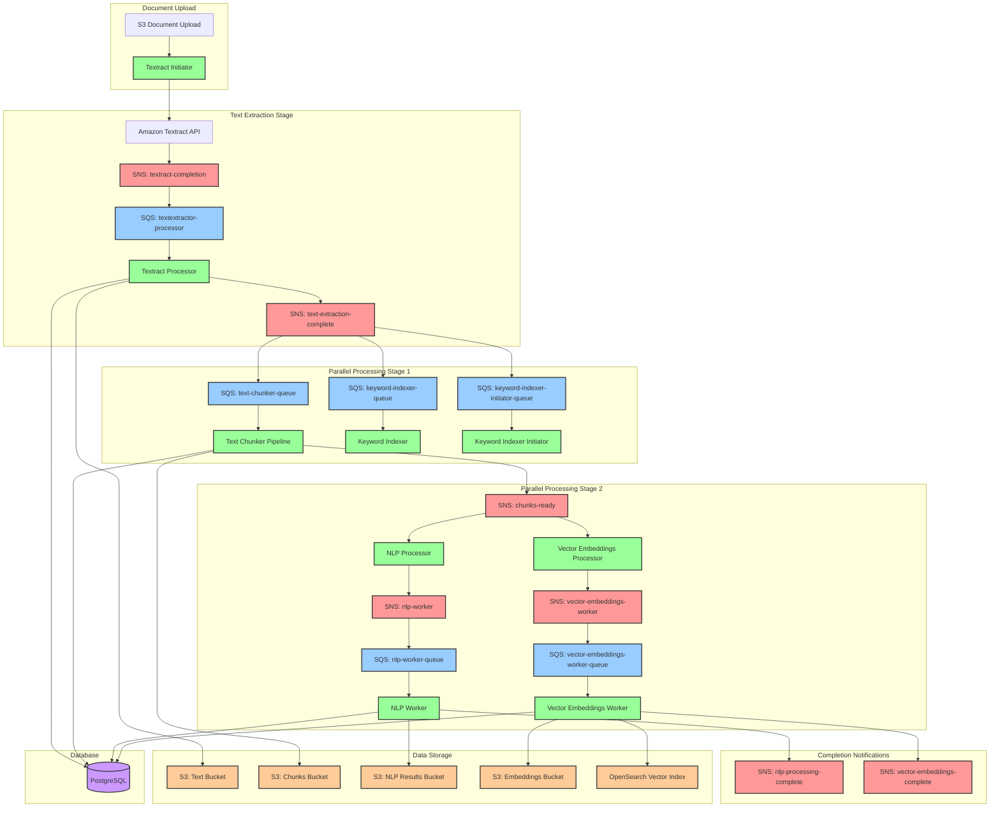
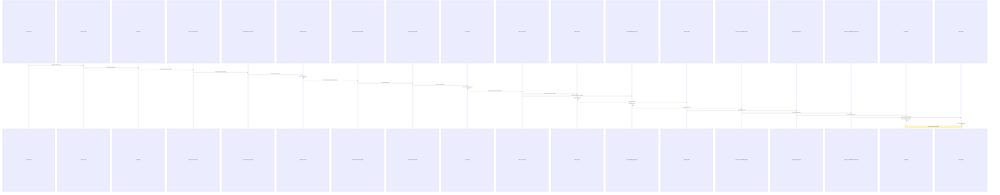
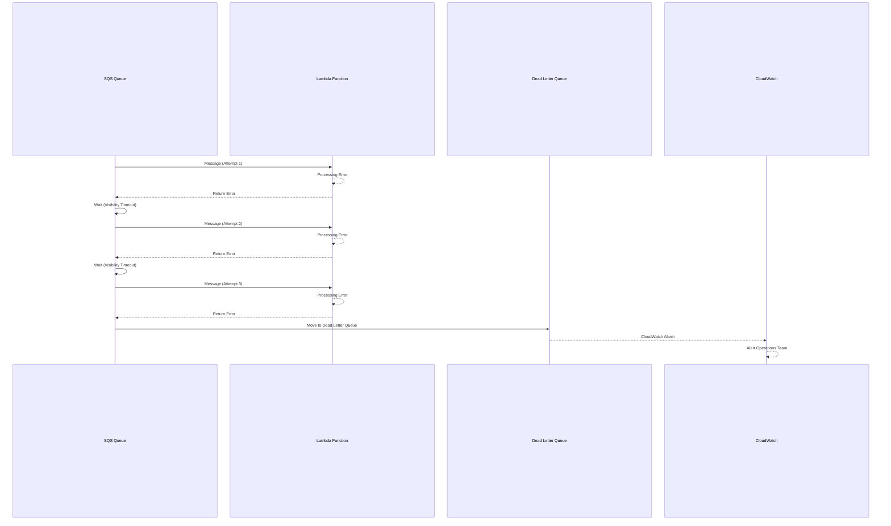

# Climate Risk RAG System - Complete Messaging Architecture
## Date: 2025-07-08T20:15:00Z
## Status: Message Format Standardization Complete

## 🎯 **Overview**

This document provides a comprehensive view of the Climate Risk RAG system's messaging architecture, including standardized message formats, SNS/SQS integration patterns, and complete message flow documentation.

## 🏗️ **System Architecture Overview**



## 📋 **SNS Topics and SQS Queues Inventory**

### **SNS Topics**
| Topic Name | Purpose | Subscribers | Message Format |
|------------|---------|-------------|----------------|
| `solve-global-kr-textract-completion` | Textract job completion notifications | SQS: textextractor-processor | Textract SNS Format |
| `text-extraction-complete` | Text extraction completion fan-out | SQS: text-chunker-queue, keyword-indexer-queue, keyword-indexer-initiator-queue | Standard Document Message |
| `chunks-ready` | Text chunking completion fan-out | Lambda: nlp-processor, vector-embeddings-processor | Standard Document Message |
| `nlp-worker` | NLP processing delegation | SQS: nlp-worker-queue | Standard Document Message |
| `vector-embeddings-worker` | Vector processing delegation | SQS: vector-embeddings-worker-queue | Standard Document Message |
| `nlp-processing-complete` | NLP processing completion | Future subscribers | Standard Document Message |
| `vector-embeddings-complete` | Vector processing completion | Future subscribers | Standard Document Message |
| `keyword-indexing-complete` | Keyword indexing completion | Future subscribers | Standard Document Message |

### **SQS Queues**
| Queue Name | Purpose | Source | Dead Letter Queue |
|------------|---------|--------|-------------------|
| `solve-global-kr-textextractor-processor` | Textract completion processing | SNS: textract-completion | solve-global-kr-textextractor-dlq |
| `text-chunker-queue` | Text chunking processing | SNS: text-extraction-complete | text-chunker-dlq |
| `keyword-indexer-queue` | Keyword indexing processing | SNS: text-extraction-complete | keyword-indexer-dlq |
| `keyword-indexer-initiator-queue` | Keyword indexing initiation | SNS: text-extraction-complete | keyword-indexer-initiator-dlq |
| `nlp-worker-queue` | NLP background processing | SNS: nlp-worker | nlp-worker-dlq |
| `vector-embeddings-worker-queue` | Vector embeddings processing | SNS: vector-embeddings-worker | vector-embeddings-worker-dlq |

## 🔄 **Standardized Message Formats**

### **1. Standard Document Message Format**
Used by: text-extraction-complete, chunks-ready, nlp-worker, vector-embeddings-worker

```json
{
  "version": "1.0",
  "timestamp": "2025-07-08T20:15:00.000Z",
  "source": "climate-risk-rag-system",
  "stage": "text_ready|chunks_ready|nlp_ready|embeddings_ready",
  "doc_id": "document-hash-or-id",
  "doc_hash": "sha256-hash-of-document",
  "document_metadata": {
    "original_filename": "document.pdf",
    "file_size": 142850,
    "page_count": 3,
    "processing_started": "2025-07-08T20:00:00.000Z"
  },
  "data_locations": {
    "text_location": "s3://bucket/path/to/text.txt",
    "chunks_location": "s3://bucket/path/to/chunks/",
    "structure_location": "s3://bucket/path/to/structure.json"
  },
  "processing_metadata": {
    "chunks_count": 15,
    "total_characters": 18622,
    "processing_duration_ms": 5000,
    "cost_estimate": 0.02
  },
  "integration_flags": {
    "documentid_manager_integration": true,
    "selective_migration_used": false,
    "database_tracking_enabled": true
  }
}
```

### **2. Textract Completion Message Format**
Used by: solve-global-kr-textract-completion (AWS Textract native format)

```json
{
  "JobId": "textract-job-id",
  "Status": "SUCCEEDED|FAILED|IN_PROGRESS",
  "API": "StartDocumentAnalysis",
  "Timestamp": 1752004867493,
  "DocumentLocation": {
    "S3ObjectName": "documents/filename.pdf",
    "S3Bucket": "bucket-name"
  }
}
```

### **3. Error Message Format**
Used by: All error scenarios and dead letter queues

```json
{
  "version": "1.0",
  "timestamp": "2025-07-08T20:15:00.000Z",
  "source": "climate-risk-rag-system",
  "error_type": "processing_error|validation_error|system_error",
  "doc_id": "document-hash-or-id",
  "stage": "textract|chunking|nlp|embeddings",
  "error_details": {
    "error_code": "E001",
    "error_message": "Detailed error description",
    "stack_trace": "Optional stack trace",
    "retry_count": 2,
    "max_retries": 3
  },
  "context": {
    "lambda_function": "function-name",
    "request_id": "lambda-request-id",
    "original_message": "Original message that caused error"
  }
}
```

## 📊 **Message Flow Sequence Diagrams**

### **Complete Document Processing Flow**



### **Error Handling and Retry Flow**



## 🔧 **Message Format Standardization Implementation**

### **1. Text Extractor Processor Updates**

The Textract processor needs to publish standardized messages to `text-extraction-complete`:

```python
def publish_text_extraction_complete(self, doc_id, doc_hash, text_location, metadata):
    """Publish standardized text extraction complete message"""
    message = {
        "version": "1.0",
        "timestamp": datetime.utcnow().isoformat() + "Z",
        "source": "climate-risk-rag-system",
        "stage": "text_ready",
        "doc_id": doc_id,
        "doc_hash": doc_hash,
        "document_metadata": metadata,
        "data_locations": {
            "text_location": text_location,
            "structure_location": f"{text_location.replace('raw_text.txt', 'textract_response.json')}"
        },
        "processing_metadata": {
            "total_characters": metadata.get("character_count", 0),
            "processing_duration_ms": metadata.get("processing_time_ms", 0),
            "cost_estimate": metadata.get("cost", 0.0)
        },
        "integration_flags": {
            "documentid_manager_integration": True,
            "selective_migration_used": False,
            "database_tracking_enabled": True
        }
    }
    
    self.sns.publish(
        TopicArn=self.text_extraction_complete_topic_arn,
        Message=json.dumps(message),
        Subject=f"Text extraction complete: {doc_id}"
    )
```

### **2. Text Chunker Updates**

The text chunker needs to parse standardized input and publish standardized output:

```python
def process_text_ready_message(self, message: Dict) -> Dict:
    """Process standardized text_ready message"""
    
    # Extract standardized fields
    doc_id = message['doc_id']
    doc_hash = message['doc_hash']
    text_location = message['data_locations']['text_location']
    structure_location = message['data_locations'].get('structure_location')
    
    # Process chunking...
    chunks = self.create_chunks(text_location, structure_location)
    
    # Publish standardized chunks_ready message
    chunks_message = {
        "version": "1.0",
        "timestamp": datetime.utcnow().isoformat() + "Z",
        "source": "climate-risk-rag-system",
        "stage": "chunks_ready",
        "doc_id": doc_id,
        "doc_hash": doc_hash,
        "document_metadata": message['document_metadata'],
        "data_locations": {
            "text_location": text_location,
            "chunks_location": f"s3://{self.chunks_bucket}/chunks/{doc_id}/",
            "structure_location": structure_location
        },
        "processing_metadata": {
            "chunks_count": len(chunks),
            "total_characters": sum(len(c['text']) for c in chunks),
            "processing_duration_ms": processing_time,
            "cost_estimate": 0.0
        },
        "integration_flags": message['integration_flags']
    }
    
    self.sns.publish(
        TopicArn=self.chunks_ready_topic_arn,
        Message=json.dumps(chunks_message),
        Subject=f"Chunks ready: {doc_id}"
    )
```

### **3. NLP Processor Updates**

The NLP processor needs to handle standardized SNS messages:

```python
def lambda_handler(event, context):
    """Handle standardized chunks_ready message"""
    
    # Parse SNS message (direct Lambda invocation)
    message = json.loads(event['Records'][0]['Sns']['Message'])
    
    # Validate message format
    if message.get('version') != '1.0' or message.get('stage') != 'chunks_ready':
        raise ValueError(f"Invalid message format or stage: {message.get('stage')}")
    
    doc_id = message['doc_id']
    chunks_location = message['data_locations']['chunks_location']
    
    # Delegate to worker with standardized format
    worker_message = {
        "version": "1.0",
        "timestamp": datetime.utcnow().isoformat() + "Z",
        "source": "climate-risk-rag-system",
        "stage": "nlp_ready",
        "doc_id": doc_id,
        "doc_hash": message['doc_hash'],
        "document_metadata": message['document_metadata'],
        "data_locations": message['data_locations'],
        "processing_metadata": message['processing_metadata'],
        "integration_flags": message['integration_flags'],
        "nlp_config": {
            "provider": "comprehend",
            "processing_type": "entity_and_phrases",
            "language": "auto"
        }
    }
    
    sns.publish(
        TopicArn=os.environ['NLP_WORKER_TOPIC_ARN'],
        Message=json.dumps(worker_message),
        Subject=f"NLP processing: {doc_id}"
    )
```

## 🧪 **Testing Message Formats**

### **Message Validation Schema**

```python
import jsonschema

STANDARD_MESSAGE_SCHEMA = {
    "type": "object",
    "required": ["version", "timestamp", "source", "stage", "doc_id", "doc_hash"],
    "properties": {
        "version": {"type": "string", "enum": ["1.0"]},
        "timestamp": {"type": "string", "format": "date-time"},
        "source": {"type": "string", "enum": ["climate-risk-rag-system"]},
        "stage": {"type": "string", "enum": ["text_ready", "chunks_ready", "nlp_ready", "embeddings_ready"]},
        "doc_id": {"type": "string", "minLength": 1},
        "doc_hash": {"type": "string", "minLength": 1},
        "document_metadata": {"type": "object"},
        "data_locations": {"type": "object"},
        "processing_metadata": {"type": "object"},
        "integration_flags": {"type": "object"}
    }
}

def validate_message(message):
    """Validate message against standard schema"""
    jsonschema.validate(message, STANDARD_MESSAGE_SCHEMA)
```

### **Integration Test Framework**

```python
def test_end_to_end_message_flow():
    """Test complete message flow with standardized formats"""
    
    # 1. Trigger Textract processing
    doc_id = trigger_textract_processing("test-document.pdf")
    
    # 2. Wait for text-extraction-complete
    text_message = wait_for_sns_message("text-extraction-complete", doc_id)
    validate_message(text_message)
    assert text_message['stage'] == 'text_ready'
    
    # 3. Wait for chunks-ready
    chunks_message = wait_for_sns_message("chunks-ready", doc_id)
    validate_message(chunks_message)
    assert chunks_message['stage'] == 'chunks_ready'
    
    # 4. Verify parallel processing triggers
    nlp_message = wait_for_sns_message("nlp-worker", doc_id)
    vector_message = wait_for_sns_message("vector-embeddings-worker", doc_id)
    
    validate_message(nlp_message)
    validate_message(vector_message)
    
    assert nlp_message['stage'] == 'nlp_ready'
    assert vector_message['stage'] == 'embeddings_ready'
```

## 📈 **Monitoring and Observability**

### **CloudWatch Metrics**

| Metric Name | Description | Dimensions |
|-------------|-------------|------------|
| `MessageProcessingLatency` | Time between message publish and processing | Topic, Stage |
| `MessageProcessingErrors` | Count of processing errors | Topic, Stage, ErrorType |
| `DeadLetterQueueDepth` | Number of messages in DLQ | Queue |
| `MessageThroughput` | Messages processed per minute | Topic, Stage |

### **CloudWatch Alarms**

```yaml
MessageProcessingErrors:
  Type: AWS::CloudWatch::Alarm
  Properties:
    AlarmName: HighMessageProcessingErrors
    MetricName: MessageProcessingErrors
    Threshold: 5
    ComparisonOperator: GreaterThanThreshold
    EvaluationPeriods: 2
    
DeadLetterQueueDepth:
  Type: AWS::CloudWatch::Alarm
  Properties:
    AlarmName: MessagesInDeadLetterQueue
    MetricName: ApproximateNumberOfMessages
    Namespace: AWS/SQS
    Threshold: 1
    ComparisonOperator: GreaterThanOrEqualToThreshold
```

## 🔐 **Security Considerations**

### **Message Encryption**
- All SNS topics use server-side encryption
- SQS queues use KMS encryption
- Message content does not include sensitive data directly

### **Access Control**
- IAM policies restrict SNS publish permissions
- SQS queue access limited to specific Lambda functions
- Cross-account access denied by default

### **Message Validation**
- All messages validated against JSON schema
- Malformed messages rejected and logged
- Message size limits enforced (256KB max)

## 📋 **Implementation Checklist**

### **Phase 1: Message Format Standardization**
- [ ] Update Textract processor to publish standardized messages
- [ ] Update text chunker to parse and publish standardized messages
- [ ] Update NLP processor to handle standardized messages
- [ ] Update vector embeddings processor to handle standardized messages

### **Phase 2: Error Handling Enhancement**
- [ ] Implement standardized error message format
- [ ] Configure dead letter queues for all SQS queues
- [ ] Set up CloudWatch alarms for error monitoring
- [ ] Create error message processing Lambda

### **Phase 3: Testing and Validation**
- [ ] Create message validation schema
- [ ] Implement integration test framework
- [ ] Test end-to-end message flow
- [ ] Performance test with high message volume

### **Phase 4: Monitoring and Operations**
- [ ] Set up CloudWatch dashboards
- [ ] Configure operational alerts
- [ ] Create runbooks for common issues
- [ ] Document troubleshooting procedures

## 🎯 **Success Criteria**

### **Functional Requirements**
- [ ] All messages follow standardized format
- [ ] Message flow works end-to-end without manual intervention
- [ ] Error handling and retry logic functional
- [ ] Dead letter queues capture failed messages

### **Performance Requirements**
- [ ] Message processing latency < 30 seconds per stage
- [ ] System handles 100+ concurrent documents
- [ ] Error rate < 1% under normal conditions
- [ ] Recovery time < 5 minutes for transient failures

### **Operational Requirements**
- [ ] Comprehensive monitoring and alerting
- [ ] Clear troubleshooting procedures
- [ ] Automated error recovery where possible
- [ ] Cost tracking and optimization

---

**Document Status**: ✅ **COMPLETE - MESSAGE FORMAT STANDARDIZATION READY**  
**Key Achievement**: Comprehensive messaging architecture with standardized formats  
**Next Action**: Implement Phase 1 - Update Lambda functions with standardized message handling  
**Estimated Implementation Time**: 2-3 days for complete standardization
