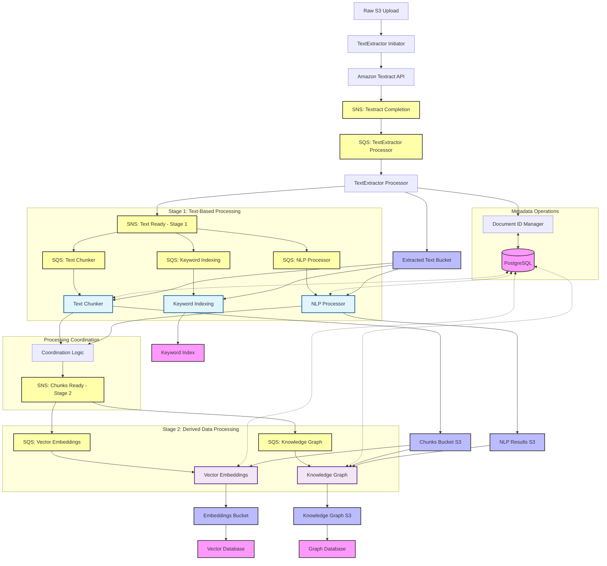

# Document Processing Flow

## Overview Diagrams

### High-Level Processing Flow



### Two-Stage Message Flow

```mermaid
%%{init: {'theme':'default', 'themeVariables': { 'fontSize': '12px'}, 'sequence': {'width': 800, 'height': 800, 'messageAlign': 'center'}}}%%
sequenceDiagram
    participant S3 as Raw S3
    participant TEI as TextExtractor Initiator
    participant TR as Textract API
    participant SNS1 as SNS: Textract Complete
    participant SQS1 as SQS: TextExtractor
    participant TEP as TextExtractor Processor
    participant DIM as Doc ID Manager
    participant PG as PostgreSQL
    participant SNS2 as SNS: Text Ready
    participant SQS2 as SQS: Keyword
    participant SQS3 as SQS: NLP
    participant SQS4 as SQS: Chunker
    participant KW as Keyword Indexing
    participant NLP as NLP Processor
    participant CH as Text Chunker
    participant COORD as Coordination Logic
    participant SNS3 as SNS: Chunks Ready
    participant SQS5 as SQS: Embeddings
    participant SQS6 as SQS: Knowledge Graph
    participant EMB as Vector Embeddings
    participant KG as Knowledge Graph

    S3->>TEI: S3 Upload Event
    Note over S3,TEI: Contains bucket and key information
    TEI->>DIM: Get/Create Doc ID
    DIM->>PG: Store Initial Metadata
    Note over DIM,PG: Document hash, original name, timestamp
    TEI->>TR: Start Async Textract Job
    Note over TEI,TR: Job ID returned for tracking
    TEI->>PG: Store Job Metadata
    
    TR->>SNS1: Job Complete Notification
    Note over TR,SNS1: Contains JobId and Status
    SNS1->>SQS1: Queue Message
    SQS1->>TEP: Trigger Processor
    
    TEP->>TR: Get Textract Results
    TEP->>S3: Store Extracted Text + Structure
    TEP->>PG: Update Job Status
    TEP->>SNS2: Notify Stage 1 Processing
    Note over TEP,SNS2: Full text + document structure ready
    
    par Stage 1: Text-Based Processing
        SNS2->>SQS2: Keyword Message
        SQS2->>KW: Start Keyword Indexing
        Note over SQS2,KW: Uses full text only
        KW->>PG: Update Status
        
        and NLP Processing
        SNS2->>SQS3: NLP Message
        SQS3->>NLP: Start NLP Processing
        Note over SQS3,NLP: Uses full text only
        NLP->>S3: Store NLP Results
        NLP->>PG: Update Status
        NLP->>COORD: Signal NLP Complete
        
        and Text Chunking
        SNS2->>SQS4: Chunker Message
        SQS4->>CH: Start Text Chunking
        Note over SQS4,CH: Uses full text + structure
        CH->>S3: Store Structured Chunks
        CH->>PG: Update Status
        CH->>COORD: Signal Chunking Complete
    end
    
    COORD->>SNS3: Trigger Stage 2 Processing
    Note over COORD,SNS3: Chunks + NLP results ready
    
    par Stage 2: Derived Data Processing
        SNS3->>SQS5: Embeddings Message
        SQS5->>EMB: Start Vector Embeddings
        Note over SQS5,EMB: Document-level chunk processing
        EMB->>S3: Store Embeddings
        EMB->>PG: Update Status
        
        and Knowledge Graph
        SNS3->>SQS6: KG Message
        SQS6->>KG: Start Knowledge Graph
        Note over SQS6,KG: Uses NLP + chunks + structure
        KG->>S3: Store Graph Data
        KG->>PG: Update Status
    end
```



## Processing Flow Details

### 1. Initial Document Upload and Async Text Extraction

The process begins with a document upload to S3. This triggers the **TextExtractor Initiator** Lambda function through an S3 event notification:

```python
# S3 Event Structure
{
    "Records": [{
        "eventVersion": "2.1",
        "eventSource": "aws:s3",
        "awsRegion": "us-east-1",
        "eventTime": "2023-12-01T12:00:00.000Z",
        "eventName": "ObjectCreated:Put",
        "s3": {
            "bucket": {"name": "solve-global-kr-documents-861276078413-us-east-1"},
            "object": {
                "key": "documents/ClimateReport2023.pdf",
                "size": 1024,
                "eTag": "d41d8cd98f00b204e9800998ecf8427e"
            }
        }
    }]
}
```

The **TextExtractor Initiator** Lambda receives this event and performs several critical tasks:

```python
class TextExtractorInitiator:
    def process_upload(self, event):
        # Extract bucket and key from event
        bucket = event['Records'][0]['s3']['bucket']['name']
        key = event['Records'][0]['s3']['object']['key']
        
        # Generate document hash for consistent tracking
        doc_hash = self.generate_doc_hash(bucket, key)
        
        # Create document entry in database
        doc_id = self.doc_manager.create_document_entry(key, doc_hash)
        
        # Start async Textract job
        job_id = self.start_textract_job(bucket, key, doc_hash)
        
        # Store job metadata for tracking
        self.store_job_metadata(job_id, doc_hash, bucket, key)
```

**Why Async Textract Processing?**
1. Handles large documents (up to 3,000 pages)
2. Enables horizontal scaling with multiple concurrent jobs
3. Provides better error handling and retry capabilities
4. Reduces Lambda timeout constraints

### 2. Textract Completion and Enhanced Processing

When Textract completes processing, it sends a notification to SNS, which triggers the **TextExtractor Processor**:

```python
# SNS Message from Textract
{
    "JobId": "abc123def456...",
    "Status": "SUCCEEDED",
    "API": "StartDocumentAnalysis",
    "Timestamp": 1751577182344,
    "DocumentLocation": {
        "S3ObjectName": "documents/ClimateReport2023.pdf",
        "S3Bucket": "solve-global-kr-documents-861276078413-us-east-1"
    }
}
```

The **TextExtractor Processor** now stores both full text and document structure:

```python
class TextExtractorProcessor:
    def process_textract_completion(self, job_id, status):
        if status == "SUCCEEDED":
            # Get Textract results
            textract_response = self.textract.get_document_analysis(JobId=job_id)
            
            # Store full text for Stage 1 processors
            full_text_location = self.store_full_text(textract_response)
            
            # Store document structure for chunking
            structure_location = self.store_document_structure(textract_response)
            
            # Update job status in database
            self.update_job_status(job_id, "SUCCEEDED")
            
            # Trigger Stage 1 processing
            self.trigger_stage1_processing(job_id, full_text_location, structure_location)
```

### 3. Stage 1: Text-Based Processing (Parallel)

Stage 1 processors all work with the original text extraction outputs:

#### **3.1 Keyword Indexing**
```python
class KeywordIndexer:
    def process_document(self, message):
        doc_id = message['doc_id']
        full_text_location = message['full_text_location']
        
        # Read full text from S3
        full_text = self.read_full_text(full_text_location)
        
        # Create keyword index
        keywords = self.extract_keywords(full_text)
        
        # Store in keyword search index
        self.store_keywords(doc_id, keywords, full_text)
```

#### **3.2 NLP Processing**
```python
class NLPProcessor:
    def process_document(self, message):
        doc_id = message['doc_id']
        full_text_location = message['full_text_location']
        
        # Read full text from S3
        full_text = self.read_full_text(full_text_location)
        
        # Extract entities from full document context
        entities = self.extract_entities(full_text)
        relationships = self.extract_relationships(full_text)
        
        # Store NLP results for Stage 2
        self.store_nlp_results(doc_id, entities, relationships)
        
        # Signal completion to coordination logic
        self.signal_nlp_complete(doc_id)
```

#### **3.3 Text Chunking with Smart Overlap**
```python
class TextChunkerProcessor:
    def process_document(self, message):
        doc_id = message['doc_id']
        full_text_location = message['full_text_location']
        structure_location = message['structure_location']
        
        # Read both full text and structure
        full_text = self.read_full_text(full_text_location)
        textract_structure = self.read_document_structure(structure_location)
        
        # Create structured chunks with smart overlap strategy
        chunker = StructuredChunker(
            overlap_sentences=0,        # No fixed overlap
            semantic_overlap=True,      # Smart overlap when needed
            respect_boundaries=True     # Respect section boundaries
        )
        
        chunks = chunker.chunk_document(textract_structure)
        
        # Store chunks in S3 data lake
        self.store_chunks_to_s3(chunks, doc_id)
        
        # Signal completion to coordination logic
        self.signal_chunking_complete(doc_id)
```

### 4. Processing Coordination Logic

The coordination logic manages Stage 2 triggers based on dependencies:

```python
class ProcessingCoordinator:
    def signal_processor_complete(self, doc_id, processor_type):
        """Handle processor completion signals"""
        
        # Update completion status
        self.update_completion_status(doc_id, processor_type)
        
        # Check if we can trigger Stage 2 processors
        status = self.get_processing_status(doc_id)
        
        # Trigger embeddings as soon as chunking completes
        if (processor_type == 'chunking' and 
            status['chunking'] == 'COMPLETED'):
            self.trigger_embeddings_processing(doc_id)
        
        # Trigger knowledge graph when both NLP and chunking complete
        if (status['chunking'] == 'COMPLETED' and 
            status['nlp'] == 'COMPLETED'):
            self.trigger_knowledge_graph_processing(doc_id)
    
    def trigger_embeddings_processing(self, doc_id):
        """Trigger vector embeddings processing"""
        message = {
            "doc_id": doc_id,
            "stage": "embeddings",
            "chunks_location": f"chunks/{doc_id}/",
            "processing_mode": "document_level"
        }
        
        self.sns.publish(
            TopicArn=self.chunks_ready_topic_arn,
            Message=json.dumps(message),
            MessageAttributes={
                'processor_type': {'DataType': 'String', 'StringValue': 'embeddings'}
            }
        )
    
    def trigger_knowledge_graph_processing(self, doc_id):
        """Trigger knowledge graph processing"""
        message = {
            "doc_id": doc_id,
            "stage": "knowledge_graph",
            "chunks_location": f"chunks/{doc_id}/",
            "nlp_results_location": f"nlp_results/{doc_id}/",
            "structure_location": f"structure/{doc_id}/"
        }
        
        self.sns.publish(
            TopicArn=self.chunks_ready_topic_arn,
            Message=json.dumps(message),
            MessageAttributes={
                'processor_type': {'DataType': 'String', 'StringValue': 'knowledge_graph'}
            }
        )
```

### 5. Stage 2: Derived Data Processing

#### **5.1 Document-Level Vector Embeddings**
```python
class VectorEmbeddingProcessor:
    def process_document_chunks(self, message):
        doc_id = message['doc_id']
        chunks_location = message['chunks_location']
        
        # Read ALL chunks for the document as a cohesive unit
        all_chunks = self.read_all_chunks_from_s3(doc_id, chunks_location)
        
        # Process chunks as a document unit for consistency
        embeddings = self.generate_document_embeddings(all_chunks)
        
        # Store embeddings with document-level metadata
        self.store_document_embeddings(doc_id, embeddings, all_chunks)
    
    def generate_document_embeddings(self, chunks):
        """Generate embeddings for all chunks with consistent parameters"""
        embeddings = []
        
        # Use batch processing for efficiency
        chunk_texts = [chunk['chunk_text'] for chunk in chunks]
        
        # Generate embeddings in batches
        for batch in self.batch_chunks(chunk_texts, batch_size=32):
            batch_embeddings = self.embedding_model.encode(batch)
            embeddings.extend(batch_embeddings)
        
        return embeddings
```

#### **5.2 Knowledge Graph Construction**
```python
class KnowledgeGraphProcessor:
    def process_document_knowledge(self, message):
        doc_id = message['doc_id']
        chunks_location = message['chunks_location']
        nlp_results_location = message['nlp_results_location']
        
        # Read chunks for structure
        chunks = self.read_all_chunks_from_s3(doc_id, chunks_location)
        
        # Read NLP results for entities and relationships
        nlp_results = self.read_nlp_results(doc_id, nlp_results_location)
        
        # Build knowledge graph from combined data
        graph_data = self.build_knowledge_graph(chunks, nlp_results)
        
        # Store graph data
        self.store_knowledge_graph(doc_id, graph_data)
```

### 6. Document ID Manager Integration

Every Lambda function interacts with the Document ID Manager for consistent metadata handling:

```python
class DocumentIDManager:
    def create_document_entry(self, original_name: str, doc_hash: str) -> str:
        """
        Creates the initial document record with:
        - Unique document ID (derived from hash)
        - Original filename
        - Document hash
        - Upload timestamp
        - Initial status
        """
        doc_id = self.generate_doc_id(doc_hash)
        
        query = """
        INSERT INTO documents (doc_id, original_filename, doc_hash, created_at, status)
        VALUES (%s, %s, %s, NOW(), 'pending_extraction')
        ON CONFLICT (doc_id) DO UPDATE SET updated_at = NOW()
        RETURNING doc_id;
        """
        return self.db.execute(query, (doc_id, original_name, doc_hash))
    
    def update_processing_status(self, doc_id: str, stage: str, status: str, details: Dict = None):
        """Update processing status for coordination"""
        
        status_updates = {
            f"{stage}_status": status,
            f"{stage}_completed_at": datetime.utcnow() if status == 'COMPLETED' else None,
            "updated_at": datetime.utcnow()
        }
        
        if details:
            status_updates[f"{stage}_details"] = json.dumps(details)
        
        # Update processing status table
        self.update_document_processing_status(doc_id, status_updates)
```

## Database Schema Explanation

The database schema supports the two-stage pipeline tracking:

```sql
-- Documents table tracks overall document status
CREATE TABLE documents (
    doc_id VARCHAR(255) PRIMARY KEY,
    original_filename TEXT,
    pdf_path TEXT,
    text_path TEXT,
    status VARCHAR(50) NOT NULL,
    created_at TIMESTAMP WITH TIME ZONE DEFAULT NOW(),
    updated_at TIMESTAMP WITH TIME ZONE DEFAULT NOW()
);

-- Textract jobs table tracks async processing
CREATE TABLE textract_jobs (
    job_id VARCHAR(255) PRIMARY KEY,
    doc_hash VARCHAR(255) NOT NULL,
    source_bucket VARCHAR(255) NOT NULL,
    source_key VARCHAR(255) NOT NULL,
    status VARCHAR(50) NOT NULL,
    pages_processed INTEGER,
    blocks_extracted INTEGER,
    created_at TIMESTAMP WITH TIME ZONE DEFAULT NOW(),
    completed_at TIMESTAMP WITH TIME ZONE
);

-- Enhanced processing status tracks two-stage pipeline
CREATE TABLE document_processing_status (
    doc_hash VARCHAR(255) PRIMARY KEY,
    filename VARCHAR(255) NOT NULL,
    
    -- Stage 1 status tracking
    text_extraction_status VARCHAR(50),
    text_extraction_job_id VARCHAR(255),
    text_extraction_completed_at TIMESTAMP WITH TIME ZONE,
    
    keyword_indexing_status VARCHAR(50),
    keyword_indexing_completed_at TIMESTAMP WITH TIME ZONE,
    
    nlp_processing_status VARCHAR(50),
    nlp_processing_completed_at TIMESTAMP WITH TIME ZONE,
    
    chunking_status VARCHAR(50),
    chunking_completed_at TIMESTAMP WITH TIME ZONE,
    chunks_created INTEGER DEFAULT 0,
    
    -- Stage 2 status tracking
    embedding_status VARCHAR(50),
    embedding_completed_at TIMESTAMP WITH TIME ZONE,
    
    knowledge_graph_status VARCHAR(50),
    knowledge_graph_completed_at TIMESTAMP WITH TIME ZONE,
    
    -- Coordination tracking
    stage1_complete BOOLEAN DEFAULT FALSE,
    stage2_complete BOOLEAN DEFAULT FALSE,
    
    created_at TIMESTAMP WITH TIME ZONE DEFAULT NOW(),
    updated_at TIMESTAMP WITH TIME ZONE DEFAULT NOW()
);
```

## Message Queue Architecture

### SNS Topics
- `solve-global-kr-textract-completion` - Textract job completions
- `solve-global-kr-text-ready` - Stage 1 processing trigger
- `solve-global-kr-chunks-ready` - Stage 2 processing trigger

### SQS Queues (Two-Stage Architecture)

#### Stage 1 Queues
- `solve-global-kr-textextractor-processor` - TextExtractor completion processing
- `solve-global-kr-keyword-processor` - Keyword indexing
- `solve-global-kr-nlp-processor` - NLP processing
- `solve-global-kr-textchunker-processor` - Text chunking with smart overlap

#### Stage 2 Queues
- `solve-global-kr-embedding-processor` - Vector embeddings (document-level)
- `solve-global-kr-kg-processor` - Knowledge graph processing

### Dead Letter Queues
- Each processing queue has a corresponding DLQ for error handling
- Failed messages automatically routed after 3 retry attempts
- Enables manual inspection and reprocessing of failed documents

## Smart Overlap Strategy Implementation

### Structured Chunking Benefits
1. **Natural Boundaries**: Document structure provides semantic boundaries
2. **Reduced Redundancy**: Eliminates artificial overlap between logical sections
3. **Better Embeddings**: Chunks represent complete thoughts and concepts
4. **Improved Retrieval**: Higher precision with less noise

### Overlap Configuration
```python
SMART_CHUNKING_CONFIG = {
    "overlap_sentences": 0,           # No fixed overlap
    "semantic_overlap": True,         # Smart overlap when needed
    "respect_boundaries": True,       # Respect section boundaries
    "preserve_tables": True,          # Keep tables intact
    "preserve_lists": True,           # Keep lists intact
    "header_context": True,           # Natural header context
    "min_overlap_threshold": 1        # Max 1 sentence overlap when needed
}
```

**Benefits of This Two-Stage Architecture:**
1. **Dependency Management**: Proper sequencing based on data dependencies
2. **Horizontal Scaling**: Each stage scales independently based on queue depth
3. **Fault Tolerance**: Failed processing in one component doesn't block others
4. **Resource Optimization**: Stage 2 processors only run when their inputs are ready
5. **Cost Efficiency**: No wasted processing cycles waiting for dependencies
6. **Monitoring**: Clear visibility into pipeline progress and bottlenecks

Would you like me to:
1. Add more detail about any specific component?
2. Expand on the coordination logic and error handling?
3. Provide additional examples of the smart overlap strategy?
4. Add more configuration details for the two-stage messaging infrastructure?
