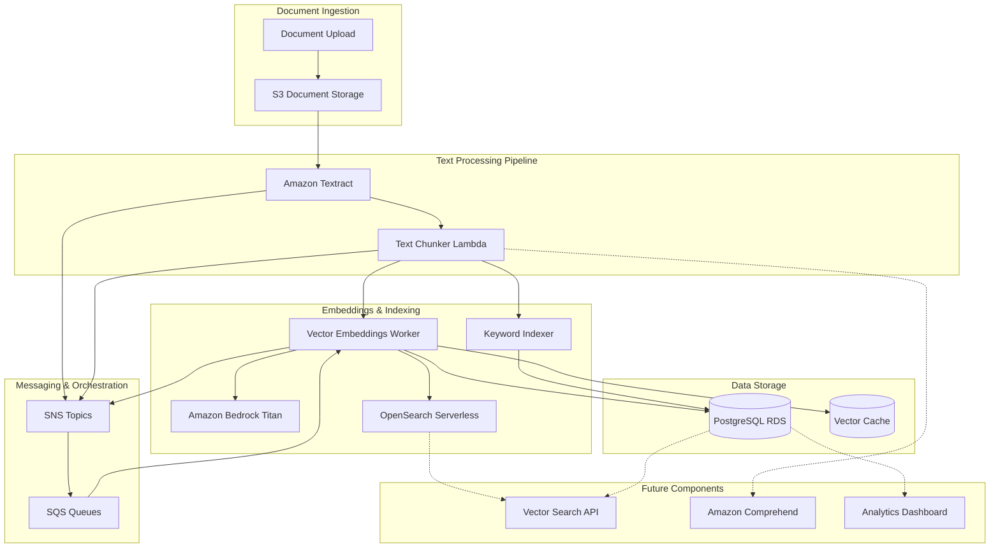
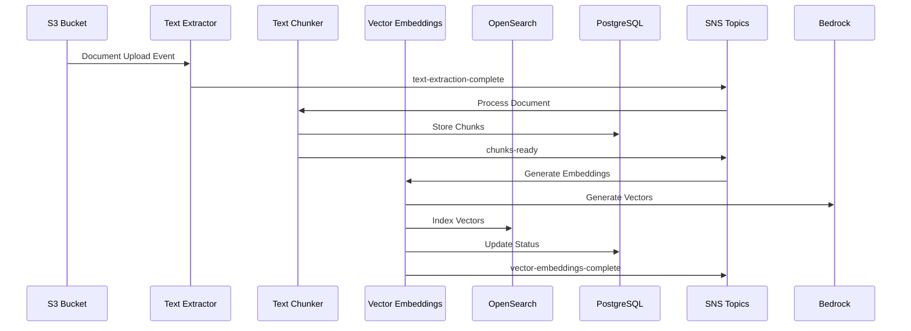
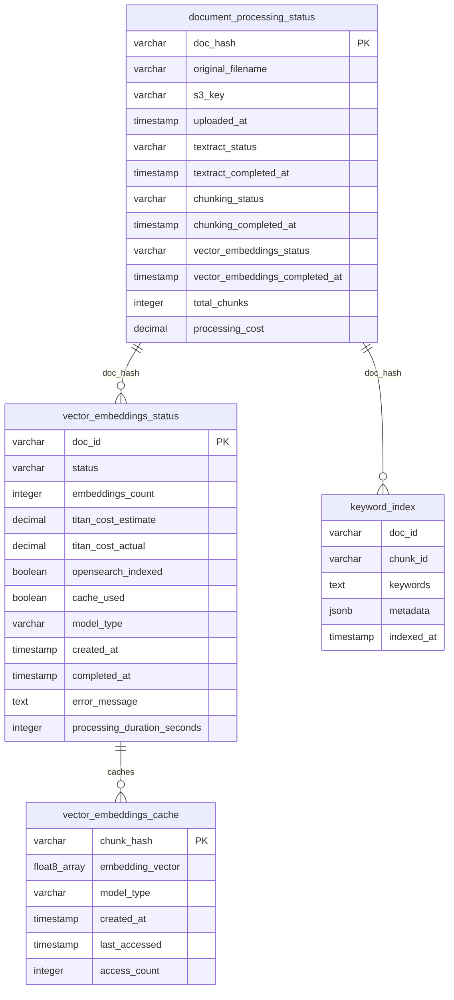
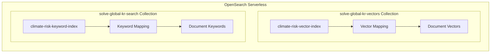
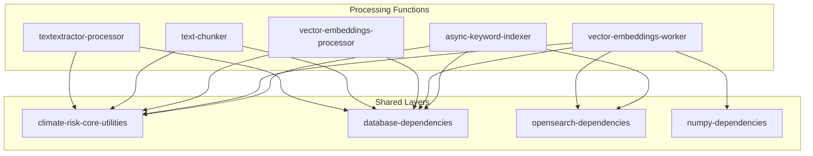
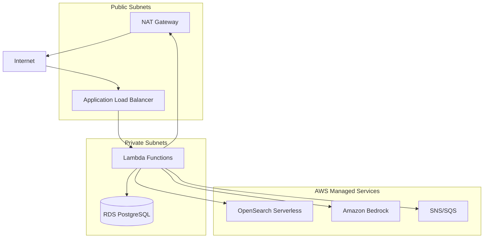

# CLIMATE RISK RAG SYSTEM ARCHITECTURE
**Document Version:** 1.0  
**Last Updated:** 2025-07-06T22:00:00Z  
**Status:** Living Document - Updated as Components are Built

## EXECUTIVE SUMMARY

This document describes the complete architecture of the Climate Risk RAG (Retrieval-Augmented Generation) system, migrated from a proof-of-concept to production AWS infrastructure. The system processes climate risk documents through a multi-stage pipeline including text extraction, chunking, vector embeddings, and search indexing to enable intelligent document retrieval and analysis.

## OVERALL SYSTEM ARCHITECTURE



## DESIGN PRINCIPLES

### Core Architectural Decisions

1. **Event-Driven Architecture**
   - Asynchronous processing with SNS/SQS messaging
   - Loose coupling between components
   - Scalable and fault-tolerant design

2. **Serverless-First Approach**
   - Lambda functions for compute workloads
   - Managed services for infrastructure components
   - Pay-per-use cost model

3. **Multi-Modal Search Strategy**
   - Vector embeddings for semantic search
   - Keyword indexing for exact matches
   - Metadata-based filtering and routing

4. **Cost-Optimized Design**
   - Caching layers to reduce API calls
   - Batch processing to minimize overhead
   - Tiered storage for different access patterns

## MESSAGE FLOW ARCHITECTURE



### SNS Topic Architecture

| Topic Name | Purpose | Subscribers | Message Format |
|------------|---------|-------------|----------------|
| `document-processing-start` | Initial document upload | Text Extractor | `{doc_id, s3_location}` |
| `text-extraction-complete` | Textract completion | Text Chunker | `{doc_id, textract_job_id}` |
| `chunks-ready` | Text chunking complete | Vector Processor, Keyword Indexer | `{doc_id, chunks_location, chunks_count}` |
| `vector-embeddings-worker` | Vector processing trigger | Vector Worker | `{doc_id, chunks_location, model_type}` |
| `vector-embeddings-complete` | Vector processing done | Analytics, Monitoring | `{doc_id, status, metrics}` |

## DATABASE DESIGN

### PostgreSQL Schema



### Database Design Rationale

**document_processing_status**
- Central tracking table for all document processing stages
- Enables pipeline monitoring and error recovery
- Supports cost tracking and performance analytics

**vector_embeddings_status**
- Detailed tracking of vector processing operations
- Cost monitoring for Bedrock Titan usage
- Performance metrics for optimization

**vector_embeddings_cache**
- Reduces duplicate embedding generation costs
- Improves processing speed for similar content
- Implements LRU-style access tracking

**keyword_index**
- Supports exact-match and keyword-based searches
- Complements vector search for hybrid retrieval
- Stores structured metadata for filtering

## OPENSEARCH SERVERLESS DESIGN

### Collection Architecture



### Vector Index Schema

```json
{
  "mappings": {
    "properties": {
      "doc_id": {"type": "keyword"},
      "chunk_id": {"type": "keyword"},
      "chunk_index": {"type": "integer"},
      "content": {"type": "text"},
      "content_vector": {
        "type": "knn_vector",
        "dimension": 1536,
        "method": {
          "name": "hnsw",
          "space_type": "cosinesim",
          "engine": "faiss"
        }
      },
      "metadata": {
        "properties": {
          "confidence": {"type": "float"},
          "structural_quality": {"type": "keyword"},
          "section_type": {"type": "keyword"},
          "language": {"type": "keyword"}
        }
      },
      "processing": {
        "properties": {
          "model_type": {"type": "keyword"},
          "indexed_at": {"type": "date"},
          "embedding_cost": {"type": "float"}
        }
      }
    }
  }
}
```

### OpenSearch Design Decisions

**VECTORSEARCH Collection Type**
- Optimized for k-NN vector operations
- Supports FAISS engine for high-performance similarity search
- Automatic scaling based on query load

**Separate Collections Strategy**
- Vector and keyword searches have different performance characteristics
- Allows independent scaling and optimization
- Reduces cross-collection query complexity

## AWS SERVICES INTEGRATION

### Service Selection Rationale

| Service | Purpose | Alternative Considered | Decision Rationale |
|---------|---------|----------------------|-------------------|
| **Amazon Textract** | Document text extraction | Tesseract OCR | Superior accuracy for complex documents, handles tables/forms |
| **Amazon Bedrock Titan** | Vector embeddings | Sentence Transformers | Better performance, managed scaling, consistent quality |
| **OpenSearch Serverless** | Vector search | Elasticsearch | Managed service, auto-scaling, integrated with AWS |
| **PostgreSQL RDS** | Structured data | DynamoDB | ACID compliance, complex queries, cost-effective |
| **Lambda** | Compute | ECS/Fargate | Event-driven workloads, automatic scaling, cost-effective |
| **SNS/SQS** | Messaging | Apache Kafka | Managed service, integrated with Lambda, simpler operations |

### Cost Optimization Strategies

**Bedrock Titan Usage**
- Implement vector caching to reduce duplicate API calls
- Batch processing to minimize per-request overhead
- Cost tracking and alerting at $0.50 per document threshold

**OpenSearch Serverless**
- Use separate collections to optimize compute allocation
- Implement query result caching
- Monitor OCU usage and optimize query patterns

**Lambda Optimization**
- Right-size memory allocation based on workload
- Use provisioned concurrency for predictable workloads
- Implement connection pooling for database access

## TRADEOFFS: AWS MANAGED VS OPEN SOURCE

### Vector Embeddings: Bedrock Titan vs Sentence Transformers

**AWS Bedrock Titan Advantages:**
- Consistent, high-quality embeddings
- Managed scaling and availability
- No infrastructure management
- Integrated cost tracking

**Open Source Sentence Transformers Advantages:**
- No per-request costs
- Full control over model selection
- Ability to fine-tune models
- No vendor lock-in

**Decision:** Bedrock Titan chosen for production reliability and managed scaling, with option to migrate to self-hosted models if cost becomes prohibitive.

### Search: OpenSearch Serverless vs Self-Managed Elasticsearch

**OpenSearch Serverless Advantages:**
- Zero infrastructure management
- Automatic scaling
- Integrated security and monitoring
- Pay-per-use pricing model

**Self-Managed Elasticsearch Advantages:**
- Lower costs at scale
- Full configuration control
- Custom plugin support
- Predictable pricing

**Decision:** OpenSearch Serverless chosen for operational simplicity during initial deployment, with migration path to self-managed if scale requirements change.

### Database: RDS PostgreSQL vs Self-Managed

**RDS PostgreSQL Advantages:**
- Automated backups and maintenance
- Multi-AZ availability
- Performance monitoring
- Security patching

**Self-Managed PostgreSQL Advantages:**
- Lower operational costs
- Full configuration control
- Custom extensions
- No AWS lock-in

**Decision:** RDS chosen for operational reliability and integrated monitoring, cost-effective for current scale.

## LAMBDA ARCHITECTURE DESIGN

### Function Organization



### Lambda Layer Strategy

**climate-risk-core-utilities**
- Database connection management
- Document ID utilities
- Common logging and error handling
- Shared business logic

**database-dependencies**
- PostgreSQL drivers (psycopg2)
- Connection pooling libraries
- Database migration utilities

**opensearch-dependencies**
- OpenSearch Python client
- AWS authentication libraries
- Search query builders

**numpy-dependencies**
- NumPy for vector operations
- Scientific computing libraries
- Mathematical utilities

### Function Sizing and Configuration

| Function | Memory | Timeout | Concurrency | Purpose |
|----------|--------|---------|-------------|---------|
| textextractor-processor | 512MB | 5min | 10 | Initiate Textract jobs |
| text-chunker | 1024MB | 10min | 5 | Process and chunk documents |
| vector-embeddings-processor | 256MB | 1min | 20 | Initiate vector processing |
| vector-embeddings-worker | 2048MB | 15min | 3 | Generate and index vectors |
| async-keyword-indexer | 512MB | 5min | 10 | Extract and index keywords |

## SECURITY ARCHITECTURE

### Network Security



### IAM Security Model

**Principle of Least Privilege**
- Each Lambda function has minimal required permissions
- Service-specific roles with resource-level restrictions
- Cross-service access through assume roles

**Key IAM Policies**
- Bedrock model access limited to specific foundation models
- OpenSearch data access policies restrict index operations
- S3 bucket policies limit access to specific prefixes
- RDS access through VPC security groups

### Data Security

**Encryption at Rest**
- RDS encrypted with AWS KMS
- S3 buckets with server-side encryption
- OpenSearch collections with AWS-managed keys

**Encryption in Transit**
- TLS 1.2+ for all API communications
- VPC endpoints for AWS service access
- Database connections with SSL/TLS

## MONITORING AND OBSERVABILITY

### CloudWatch Integration

**Metrics Tracked**
- Document processing throughput
- Lambda function performance and errors
- Database connection pool utilization
- OpenSearch query performance
- Bedrock API usage and costs

**Log Aggregation**
- Structured logging across all components
- Centralized log analysis with CloudWatch Insights
- Error tracking and alerting
- Performance trend analysis

**Cost Monitoring**
- Service-level cost allocation
- Per-document processing cost tracking
- Budget alerts and thresholds
- Cost optimization recommendations

## PERFORMANCE CHARACTERISTICS

### Current Performance Metrics (As Built)

**Vector Embeddings Pipeline**
- Processing Time: 4.6 seconds per document (19 chunks)
- Embeddings Generation: 1.97 seconds (Bedrock Titan)
- OpenSearch Indexing: 1.5 seconds (batched)
- Cost per Document: $0.002187

**Text Processing Pipeline**
- Textract Processing: 30-60 seconds per document
- Text Chunking: 2-5 seconds per document
- Keyword Extraction: 1-3 seconds per document

### Scalability Targets

**Throughput Goals**
- 1,000 documents per day sustained processing
- 10,000 documents per day burst capacity
- Sub-2-second search response times
- 99.5% system availability

**Cost Targets**
- Under $500/month operational costs
- Under $0.01 per document processing cost
- 30% cost reduction through caching optimization

## FUTURE ARCHITECTURE COMPONENTS

### Planned Enhancements

**Search API Layer**
- RESTful API for vector and hybrid search
- Query result ranking and relevance scoring
- Search analytics and user behavior tracking
- Rate limiting and authentication

**Entity Extraction Pipeline**
- Amazon Comprehend integration for entity detection
- Named entity recognition and classification
- Entity relationship mapping
- Knowledge graph construction

**Analytics and Reporting**
- Real-time processing dashboards
- Cost analysis and optimization recommendations
- Document processing analytics
- Search usage patterns and insights

### Integration Points

**External System Interfaces**
- REST APIs for document submission
- Webhook notifications for processing completion
- Bulk data export capabilities
- Third-party system integrations

**Data Export and Backup**
- Automated database backups
- Vector index snapshots
- Document archive management
- Disaster recovery procedures

## OPERATIONAL PROCEDURES

### Deployment Strategy

**Infrastructure as Code**
- CDK-based infrastructure deployment
- Environment-specific configurations
- Automated testing and validation
- Blue-green deployment for zero downtime

**Monitoring and Alerting**
- Proactive system health monitoring
- Cost threshold alerting
- Performance degradation detection
- Automated incident response

### Maintenance Procedures

**Regular Maintenance**
- Database performance tuning
- Index optimization and cleanup
- Cost analysis and optimization
- Security patch management

**Capacity Planning**
- Usage trend analysis
- Resource utilization monitoring
- Scaling threshold management
- Cost projection and budgeting

---

## DOCUMENT MAINTENANCE

This document will be updated as new components are built and deployed. Each major component addition will include:

1. Updated architecture diagrams
2. Detailed implementation specifications
3. Performance characteristics
4. Integration patterns
5. Operational procedures

**Next Updates Planned:**
- Search API architecture details
- Comprehend integration design
- Analytics dashboard specifications
- Multi-region deployment architecture

---

**Document Status:** Living Document - Version 1.0  
**Last Updated:** 2025-07-06T22:00:00Z  
**Next Review:** Upon completion of next major component
