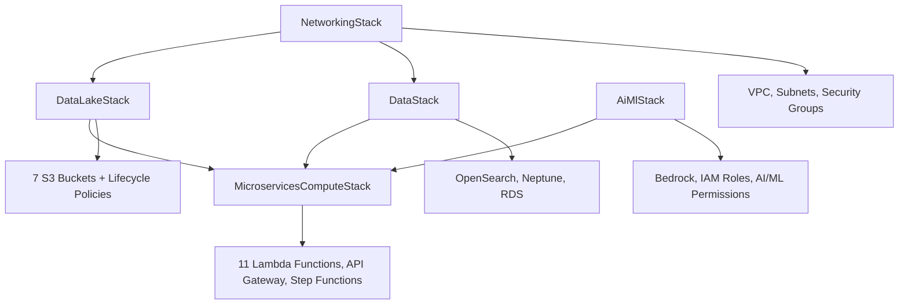

# Climate Risk RAG System - Infrastructure Stacks Guide

## 🏗️ **Overview**

The Climate Risk RAG system is built using 6 specialized AWS CDK stacks that create a complete microservices architecture. Each stack has a specific purpose and manages related AWS resources with proper dependencies and security configurations.

## 📊 **Stack Architecture & Dependencies**



## 🔧 **Stack Details**

### **1. NetworkingStack** 
**File:** `cdk/stacks/networking_stack.py`  
**Purpose:** Foundation networking infrastructure

#### **Resources Created:**
```yaml
VPC Configuration:
  - CIDR: 10.0.0.0/16
  - Availability Zones: 2
  - DNS Support: Enabled
  
Subnets (per AZ):
  - Public Subnet: /24 (for NAT Gateways, Load Balancers)
  - Private Subnet: /24 (for Lambda functions, databases)
  - Isolated Subnet: /24 (for highly secure resources)

Security Groups:
  - Lambda Security Group: Outbound HTTPS, database access
  - Database Security Group: Inbound from Lambda SG only
  - OpenSearch Security Group: Port 443 from Lambda SG
```

#### **Key Features:**
- **Multi-AZ Design:** High availability across 2 availability zones
- **Layered Security:** Public, private, and isolated subnet tiers
- **Least Privilege:** Security groups with minimal required access
- **DNS Resolution:** Enabled for service discovery

#### **Outputs:**
- VPC ID and ARN
- Subnet IDs for each tier
- Security Group IDs
- NAT Gateway IPs

---

### **2. DataLakeStack**
**File:** `cdk/stacks/data_lake_stack.py`  
**Purpose:** S3-based data lake for document processing pipeline

#### **Resources Created:**
```yaml
S3 Buckets (7 total):
  1. documents-bucket: Raw PDF/document uploads
  2. extracted-text-bucket: Textract output
  3. chunks-bucket: Processed text chunks
  4. embeddings-bucket: Vector embeddings
  5. ner-results-bucket: Named entity recognition results
  6. knowledge-graph-data-bucket: Graph data exports
  7. query-cache-bucket: Cached query results

Lifecycle Policies:
  - Transition to IA after 30 days
  - Archive to Glacier after 90 days
  - Delete old versions after 365 days
```

#### **Key Features:**
- **Event-Driven Architecture:** S3 events trigger Lambda processing
- **Cost Optimization:** Intelligent tiering and lifecycle policies
- **Security:** Server-side encryption, block public access
- **Versioning:** Enabled for data protection and rollback
- **Cross-Region Replication:** Optional for disaster recovery

#### **Bucket Structure:**
```
documents-bucket/
├── documents/           # Raw uploads
├── failed/             # Processing failures
└── archive/            # Completed processing

extracted-text-bucket/
├── extracted_text/     # Textract JSON output
└── metadata/          # Processing metadata

chunks-bucket/
├── chunks/            # Individual text chunks
└── summaries/         # Document summaries

embeddings-bucket/
├── vectors/           # Titan embeddings
└── indices/          # OpenSearch index data

ner-results-bucket/
├── entities/         # Extracted entities
├── relationships/    # Entity relationships
└── summaries/       # NER processing summaries
```

---

### **3. DataStack**
**File:** `cdk/stacks/data_stack.py`  
**Purpose:** Managed databases for search, knowledge graph, and metadata

#### **Resources Created:**
```yaml
OpenSearch Serverless:
  - Collection: climate-risk-vectors
  - Index: document-embeddings (768 dimensions)
  - Security: VPC access only
  - Capacity: On-demand scaling

Neptune Graph Database:
  - Instance: db.t3.medium (cost-optimized)
  - Multi-AZ: Enabled for HA
  - Backup: 7-day retention
  - Security: VPC private subnets only

RDS PostgreSQL:
  - Instance: db.t3.micro (cost-optimized)
  - Storage: 20GB GP2 with auto-scaling
  - Backup: 7-day retention
  - Security: Encrypted at rest and in transit
```

#### **Database Purposes:**
- **OpenSearch:** Vector similarity search for embeddings
- **Neptune:** Knowledge graph storage (entities + relationships)
- **RDS:** Document metadata, processing status, user data

#### **Security Configuration:**
```python
# Database access restricted to Lambda security group
database_security_group.add_ingress_rule(
    peer=lambda_security_group,
    connection=ec2.Port.tcp(5432),  # PostgreSQL
    description="Lambda access to RDS"
)

database_security_group.add_ingress_rule(
    peer=lambda_security_group,
    connection=ec2.Port.tcp(8182),  # Neptune
    description="Lambda access to Neptune"
)
```

---

### **4. AiMlStack**
**File:** `cdk/stacks/ai_ml_stack.py`  
**Purpose:** AI/ML service permissions and configurations

#### **Resources Created:**
```yaml
IAM Role: AiMlServiceRole
  Permissions:
    - Bedrock: InvokeModel, ListFoundationModels
    - Textract: DetectDocumentText, AnalyzeDocument
    - Comprehend: DetectEntities, DetectSentiment
    - Titan: Embedding generation
    - Lambda: VPC execution role

Bedrock Model Access:
  - Claude 3 Haiku: Fast responses
  - Claude 3 Sonnet: Balanced performance
  - Titan Text Express: Embeddings
  - Titan Embeddings: Vector generation
```

#### **Service Configurations:**
```python
# Bedrock permissions for LLM access
bedrock_policy = iam.PolicyStatement(
    effect=iam.Effect.ALLOW,
    actions=[
        "bedrock:InvokeModel",
        "bedrock:InvokeModelWithResponseStream",
        "bedrock:ListFoundationModels"
    ],
    resources=[
        "arn:aws:bedrock:*::foundation-model/anthropic.claude-3-haiku-*",
        "arn:aws:bedrock:*::foundation-model/anthropic.claude-3-sonnet-*",
        "arn:aws:bedrock:*::foundation-model/amazon.titan-*"
    ]
)

# Textract permissions for document processing
textract_policy = iam.PolicyStatement(
    effect=iam.Effect.ALLOW,
    actions=[
        "textract:DetectDocumentText",
        "textract:AnalyzeDocument",
        "textract:GetDocumentAnalysis"
    ],
    resources=["*"]
)
```

---

### **5. ComputeStack** (Legacy)
**File:** `cdk/stacks/compute_stack.py`  
**Status:** Superseded by MicroservicesComputeStack
**Purpose:** Original monolithic compute design (kept for reference)

---

### **6. MicroservicesComputeStack** (Primary)
**File:** `cdk/stacks/microservices_compute_stack.py`  
**Purpose:** Complete microservices compute infrastructure

#### **Resources Created:**
```yaml
Lambda Functions (11 total):
  Document Processing Pipeline:
    - text-extractor: Textract integration
    - text-chunker: Structured chunking
    - embedding-generator: Titan embeddings + OpenSearch
    - ner-processor: Comprehend NER + climate filtering
    - entity-extractor: Knowledge graph updates

  Query Processing Pipeline:
    - query-analyzer: Intent classification + entity extraction
    - vector-searcher: OpenSearch similarity search
    - kg-searcher: Neptune graph queries
    - response-generator: Bedrock LLM response generation

  Utility Functions:
    - document-validator: Input validation
    - batch-processor: Bulk operations

API Gateway:
  - REST API: Climate Risk RAG Microservices API
  - Endpoints: /query (POST), /health (GET)
  - Authentication: API keys, custom authorizers
  - CORS: Enabled for web applications

Step Functions:
  - Query Processing Workflow
  - States: Analyze → Parallel Search → Generate Response
  - Error Handling: Retry logic and dead letter queues
```

#### **Lambda Function Details:**

| **Function** | **Runtime** | **Memory** | **Timeout** | **Triggers** |
|--------------|-------------|------------|-------------|--------------|
| text-extractor | Python 3.9 | 1024 MB | 5 min | S3 (PDF upload) |
| text-chunker | Python 3.9 | 512 MB | 3 min | S3 (extracted text) |
| embedding-generator | Python 3.9 | 1024 MB | 10 min | S3 (chunks) |
| ner-processor | Python 3.9 | 512 MB | 5 min | S3 (chunks) |
| query-analyzer | Python 3.9 | 512 MB | 30 sec | API Gateway |
| vector-searcher | Python 3.9 | 512 MB | 30 sec | Step Functions |
| kg-searcher | Python 3.9 | 512 MB | 30 sec | Step Functions |
| response-generator | Python 3.9 | 1024 MB | 2 min | Step Functions |

#### **Event Triggers Configuration:**
```python
# S3 Event Triggers (Document Processing)
documents_bucket.add_event_notification(
    s3n.EventType.OBJECT_CREATED,
    s3n.LambdaDestination(text_extractor),
    s3n.NotificationKeyFilter(prefix="documents/", suffix=".pdf")
)

extracted_text_bucket.add_event_notification(
    s3n.EventType.OBJECT_CREATED,
    s3n.LambdaDestination(text_chunker),
    s3n.NotificationKeyFilter(prefix="extracted_text/", suffix=".txt")
)

# API Gateway Integration
query_resource = api.root.add_resource("query")
query_integration = apigateway.StepFunctionsIntegration(
    state_machine=query_workflow
)
query_resource.add_method("POST", query_integration)
```

## 🚀 **Deployment Guide**

### **Prerequisites**
```bash
# Install AWS CDK
npm install -g aws-cdk

# Install Python dependencies
pip install -r requirements.txt

# Configure AWS credentials
aws configure

# Bootstrap CDK (first time only)
cdk bootstrap
```

### **Deployment Commands**

#### **1. Deploy All Stacks (Recommended)**
```bash
cd cdk/
cdk deploy --all
```

#### **2. Deploy Individual Stacks (Advanced)**
```bash
# Deploy in dependency order
cdk deploy climate-risk-rag-networking
cdk deploy climate-risk-rag-data-lake
cdk deploy climate-risk-rag-data
cdk deploy climate-risk-rag-ai-ml
cdk deploy climate-risk-rag-microservices-compute
```

#### **3. Deployment with Approval**
```bash
# Require manual approval for security changes
cdk deploy --all --require-approval broadening
```

### **Deployment Validation**
```bash
# Check stack status
aws cloudformation describe-stacks --stack-name climate-risk-rag-networking

# Verify resources
aws s3 ls | grep climate-risk
aws opensearch list-domain-names
aws neptune describe-db-clusters
```

## 🔧 **Operations Guide**

### **Monitoring & Logging**

#### **CloudWatch Dashboards**
Each stack creates CloudWatch resources:
```yaml
Networking Stack:
  - VPC Flow Logs
  - NAT Gateway metrics

Data Lake Stack:
  - S3 bucket metrics
  - Object count and size tracking

Data Stack:
  - OpenSearch cluster health
  - Neptune performance metrics
  - RDS connection and query metrics

Microservices Stack:
  - Lambda function metrics (duration, errors, invocations)
  - API Gateway request metrics
  - Step Functions execution metrics
```

#### **Log Groups**
```bash
# Lambda function logs
/aws/lambda/climate-risk-text-extractor
/aws/lambda/climate-risk-query-analyzer
/aws/lambda/climate-risk-response-generator

# API Gateway logs
/aws/apigateway/climate-risk-microservices-api

# Step Functions logs
/aws/stepfunctions/climate-risk-query-workflow
```

### **Scaling Configuration**

#### **Lambda Scaling**
```python
# Reserved concurrency for critical functions
text_extractor.add_environment("RESERVED_CONCURRENCY", "50")
query_analyzer.add_environment("RESERVED_CONCURRENCY", "100")

# Provisioned concurrency for low latency
query_analyzer.add_provisioned_concurrency_config(
    provisioned_concurrent_executions=10
)
```

#### **Database Scaling**
```yaml
OpenSearch:
  - Auto-scaling: Enabled
  - Min instances: 1
  - Max instances: 3
  - Target utilization: 70%

Neptune:
  - Read replicas: 1-2 based on load
  - Instance scaling: Manual upgrade

RDS:
  - Auto-scaling storage: Enabled
  - Max storage: 100GB
  - Read replicas: Optional
```

### **Security Management**

#### **IAM Roles & Policies**
```bash
# View Lambda execution role
aws iam get-role --role-name climate-risk-rag-microservices-compute-*

# Check policy attachments
aws iam list-attached-role-policies --role-name <role-name>

# Review security groups
aws ec2 describe-security-groups --group-names climate-risk-*
```

#### **Encryption Status**
```yaml
S3 Buckets: SSE-S3 encryption enabled
RDS: Encryption at rest enabled
Neptune: Encryption at rest enabled
OpenSearch: Encryption at rest and in transit
Lambda: Environment variables encrypted with KMS
```

### **Cost Optimization**

#### **Resource Right-Sizing**
```yaml
Development Environment:
  Neptune: db.t3.medium
  RDS: db.t3.micro
  Lambda: 512MB-1024MB memory
  OpenSearch: Serverless (on-demand)

Production Environment:
  Neptune: db.r5.large (if needed)
  RDS: db.t3.small with read replicas
  Lambda: Provisioned concurrency for critical functions
  OpenSearch: Dedicated instances for consistent performance
```

#### **Cost Monitoring**
```bash
# Check monthly costs by service
aws ce get-cost-and-usage \
  --time-period Start=2024-07-01,End=2024-07-31 \
  --granularity MONTHLY \
  --metrics BlendedCost \
  --group-by Type=DIMENSION,Key=SERVICE

# Set up billing alerts
aws budgets create-budget \
  --account-id <account-id> \
  --budget file://budget-config.json
```

## 🔍 **Troubleshooting Guide**

### **Common Issues**

#### **1. Stack Deployment Failures**
```bash
# Check CloudFormation events
aws cloudformation describe-stack-events --stack-name <stack-name>

# Common fixes
cdk destroy <stack-name>  # Remove failed stack
cdk deploy <stack-name>   # Redeploy

# Dependency issues
cdk deploy --all --concurrency 1  # Deploy sequentially
```

#### **2. Lambda Function Errors**
```bash
# Check function logs
aws logs filter-log-events \
  --log-group-name /aws/lambda/climate-risk-text-extractor \
  --start-time $(date -d '1 hour ago' +%s)000

# Common issues:
# - VPC configuration (check security groups)
# - IAM permissions (check execution role)
# - Memory/timeout limits
# - Environment variables
```

#### **3. Database Connection Issues**
```bash
# Test Neptune connectivity
aws neptune describe-db-clusters

# Test RDS connectivity
aws rds describe-db-instances

# Check security group rules
aws ec2 describe-security-groups --group-ids <sg-id>
```

#### **4. S3 Event Trigger Issues**
```bash
# Check bucket notifications
aws s3api get-bucket-notification-configuration --bucket <bucket-name>

# Verify Lambda permissions
aws lambda get-policy --function-name <function-name>

# Test trigger manually
aws lambda invoke \
  --function-name climate-risk-text-extractor \
  --payload file://test-event.json \
  response.json
```

### **Performance Tuning**

#### **Lambda Optimization**
```python
# Memory allocation based on function type
text_extractor: 1024MB      # CPU-intensive Textract processing
embedding_generator: 1024MB # Memory for vector operations
query_analyzer: 512MB       # Lightweight NLP processing
response_generator: 1024MB  # LLM response generation
```

#### **Database Optimization**
```sql
-- RDS PostgreSQL indexes
CREATE INDEX idx_documents_status ON documents(processing_status);
CREATE INDEX idx_chunks_doc_id ON chunks(document_id);
CREATE INDEX idx_embeddings_vector ON embeddings USING ivfflat(vector);

-- Neptune graph optimization
// Create property indexes for frequent queries
:property-index create --label Document --property-key title
:property-index create --label Entity --property-key type
```

## 📋 **Stack Summary**

| **Stack** | **Primary Purpose** | **Key Resources** | **Dependencies** |
|-----------|--------------------|--------------------|------------------|
| **NetworkingStack** | Foundation networking | VPC, Subnets, Security Groups | None |
| **DataLakeStack** | Document storage pipeline | 7 S3 Buckets + Lifecycle | NetworkingStack |
| **DataStack** | Managed databases | OpenSearch, Neptune, RDS | NetworkingStack |
| **AiMlStack** | AI/ML service access | IAM Roles, Bedrock Config | None |
| **MicroservicesComputeStack** | Application logic | 11 Lambdas, API Gateway, Step Functions | All others |

### **Total Resource Count**
- **Lambda Functions:** 11
- **S3 Buckets:** 7
- **Databases:** 3 (OpenSearch, Neptune, RDS)
- **API Endpoints:** 2 (/query, /health)
- **Step Functions:** 1 (query processing workflow)
- **IAM Roles:** 5+
- **Security Groups:** 4

### **Estimated Monthly Costs**
```yaml
Development Environment: $150-200/month
  - Lambda: $30-50
  - S3: $20-30
  - OpenSearch: $40-60
  - Neptune: $30-50
  - RDS: $15-25
  - Other: $15-25

Production Environment: $300-500/month
  - Higher instance sizes
  - Read replicas
  - Provisioned concurrency
  - Enhanced monitoring
```

This infrastructure provides a complete, production-ready foundation for the Climate Risk RAG system with proper separation of concerns, security, scalability, and cost optimization.
