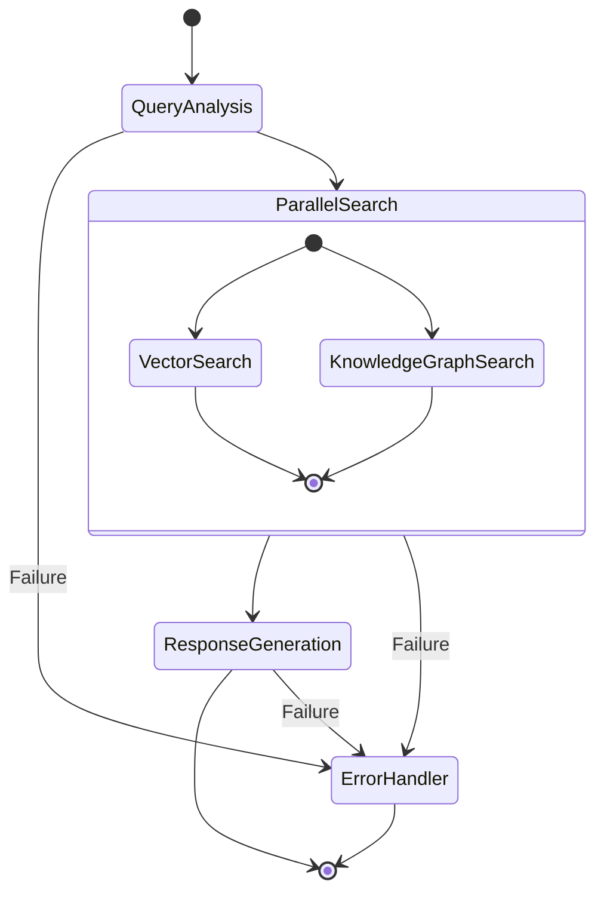
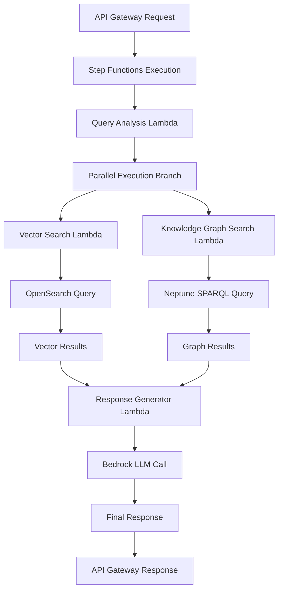
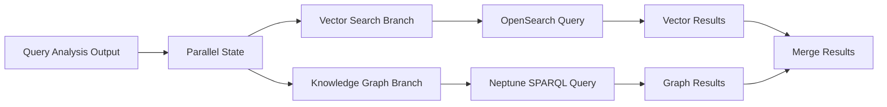

# Step Functions Query Processing Workflow - Design Document

## 🎯 **Executive Summary**

The Climate Risk RAG system uses AWS Step Functions to orchestrate complex query processing workflows that combine multiple AI/ML services, databases, and processing stages. This document details the theory, design, architecture, and implementation of the query processing state machine that transforms user queries into comprehensive, cited responses.

**Core Innovation:** Parallel execution of vector similarity search and knowledge graph analysis, followed by intelligent response synthesis using large language models.

## 🧠 **Theoretical Foundation**

### **RAG Architecture Theory**

The Step Functions workflow implements a sophisticated Retrieval-Augmented Generation (RAG) pattern:

```
Query → Analysis → Parallel Retrieval → Context Synthesis → Generation → Response
```

#### **Key Theoretical Principles:**

1. **Query Understanding:** Deep analysis of user intent and entities before retrieval
2. **Multi-Modal Retrieval:** Parallel search across vector embeddings and knowledge graphs
3. **Context Optimization:** Intelligent combination of diverse search results
4. **Response Generation:** LLM-powered synthesis with proper attribution

### **Microservices Orchestration Theory**

The workflow embodies microservices orchestration principles:

- **Loose Coupling:** Each Lambda function is independent and stateless
- **High Cohesion:** Related processing steps are grouped logically
- **Fault Tolerance:** Built-in retry mechanisms and error handling
- **Scalability:** Parallel execution and independent scaling per service

## 🏗️ **Architecture Overview**

### **Workflow State Diagram**



### **Data Flow Architecture**



## 🔧 **Implementation Details**

### **Step Functions State Machine Definition**

**Location:** `cdk/stacks/microservices_compute_stack.py` → `_create_query_processing_workflow()`

```python
def _create_query_processing_workflow(self):
    """Create Step Functions workflow for query processing"""
    
    # State 1: Query Analysis
    analyze_query_task = sfn_tasks.LambdaInvoke(
        self, "AnalyzeQueryTask",
        lambda_function=self.query_analyzer,
        payload=sfn.TaskInput.from_object({
            "query": sfn.JsonPath.string_at("$.query"),
            "options": sfn.JsonPath.string_at("$.options")
        })
    )
    
    # State 2a: Vector Search (Parallel Branch)
    vector_search_task = sfn_tasks.LambdaInvoke(
        self, "VectorSearchTask",
        lambda_function=self.vector_searcher,
        payload=sfn.TaskInput.from_object({
            "query_analysis": sfn.JsonPath.string_at("$.Payload"),
            "search_params": sfn.JsonPath.string_at("$.search_params")
        })
    )
    
    # State 2b: Knowledge Graph Search (Parallel Branch)
    kg_search_task = sfn_tasks.LambdaInvoke(
        self, "KGSearchTask",
        lambda_function=self.kg_searcher,
        payload=sfn.TaskInput.from_object({
            "query_analysis": sfn.JsonPath.string_at("$.Payload"),
            "kg_params": sfn.JsonPath.string_at("$.kg_params")
        })
    )
    
    # State 2: Parallel Execution
    parallel_search = sfn.Parallel(self, "ParallelSearch")
    parallel_search.branch(vector_search_task)
    parallel_search.branch(kg_search_task)
    
    # State 3: Response Generation
    generate_response_task = sfn_tasks.LambdaInvoke(
        self, "GenerateResponseTask",
        lambda_function=self.response_generator,
        payload=sfn.TaskInput.from_object({
            "query_analysis": sfn.JsonPath.string_at("$[0].Payload"),
            "search_results": sfn.JsonPath.string_at("$[1]"),
            "kg_results": sfn.JsonPath.string_at("$[2]")
        })
    )
    
    # Workflow Definition
    definition = analyze_query_task.next(
        parallel_search.next(generate_response_task)
    )
    
    # State Machine Configuration
    query_workflow = sfn.StateMachine(
        self, "QueryProcessingWorkflow",
        definition=definition,
        timeout=Duration.minutes(10),
        state_machine_name="climate-risk-query-processing"
    )
    
    return query_workflow
```

### **State Machine Configuration**

```yaml
State Machine Properties:
  Name: climate-risk-query-processing
  Type: Standard (for complex workflows)
  Timeout: 10 minutes
  Logging: CloudWatch Logs enabled
  Tracing: X-Ray enabled for debugging
  
Execution Role Permissions:
  - Lambda function invocation
  - CloudWatch Logs write access
  - X-Ray trace submission
```

## 📊 **Detailed State Analysis**

### **State 1: Query Analysis**

**Purpose:** Transform raw user query into structured analysis for downstream processing

#### **Input Schema:**
```json
{
  "query": "What are the financial risks of sea level rise for coastal infrastructure?",
  "options": {
    "response_style": "detailed_with_data",
    "include_citations": true,
    "max_results": 10
  }
}
```

#### **Processing Logic:**
```python
# Query Analysis Lambda Implementation
class QueryAnalyzer:
    def analyze_query(self, query: str, options: Dict) -> Dict:
        # 1. Intent Classification
        intent = self._classify_intent(query)
        
        # 2. Entity Extraction
        entities = self._extract_entities(query)
        
        # 3. Complexity Assessment
        complexity = self._assess_complexity(query)
        
        # 4. Search Parameter Generation
        search_params = self._generate_search_params(intent, entities, complexity)
        
        return {
            'original_query': query,
            'intent_classification': intent,
            'extracted_entities': entities,
            'complexity': complexity,
            'search_parameters': search_params,
            'processing_hints': self._generate_processing_hints(intent, options)
        }
```

#### **Output Schema:**
```json
{
  "original_query": "What are the financial risks of sea level rise for coastal infrastructure?",
  "intent_classification": {
    "primary_intent": "financial_impact",
    "secondary_intents": ["physical_risks", "infrastructure"],
    "confidence": 0.92
  },
  "extracted_entities": [
    {"entity": "sea level rise", "type": "climate_hazard", "confidence": 0.95},
    {"entity": "coastal infrastructure", "type": "asset_category", "confidence": 0.88},
    {"entity": "financial risks", "type": "risk_type", "confidence": 0.91}
  ],
  "complexity": {
    "level": "moderate",
    "factors": ["multi_domain", "quantitative_analysis"],
    "estimated_processing_time": 45
  },
  "search_parameters": {
    "vector_search": {
      "query_expansion": ["sea level rise", "coastal flooding", "infrastructure damage"],
      "similarity_threshold": 0.7,
      "max_results": 15
    },
    "kg_search": {
      "entity_types": ["climate_hazard", "infrastructure", "financial_impact"],
      "relationship_depth": 2,
      "include_quantitative": true
    }
  }
}
```

### **State 2: Parallel Search Execution**

**Purpose:** Simultaneously execute vector similarity search and knowledge graph queries

#### **Parallel Branch Architecture:**



#### **Vector Search Branch:**

**Input Processing:**
```python
# Vector Search Lambda
def vector_search(query_analysis: Dict, search_params: Dict) -> Dict:
    # Extract search parameters
    vector_params = query_analysis['search_parameters']['vector_search']
    
    # Generate query embedding
    query_embedding = self._generate_embedding(
        query_analysis['original_query'],
        vector_params['query_expansion']
    )
    
    # Execute OpenSearch similarity search
    search_results = self._opensearch_similarity_search(
        embedding=query_embedding,
        threshold=vector_params['similarity_threshold'],
        max_results=vector_params['max_results']
    )
    
    # Enhance results with metadata
    enhanced_results = self._enhance_search_results(search_results, query_analysis)
    
    return {
        'search_type': 'vector_similarity',
        'query_embedding_dim': 768,
        'results_count': len(enhanced_results),
        'search_results': enhanced_results,
        'search_metadata': {
            'execution_time_ms': 234,
            'similarity_threshold': vector_params['similarity_threshold'],
            'total_documents_searched': 15176
        }
    }
```

**OpenSearch Query Structure:**
```json
{
  "query": {
    "script_score": {
      "query": {"match_all": {}},
      "script": {
        "source": "cosineSimilarity(params.query_vector, 'content_vector') + 1.0",
        "params": {
          "query_vector": [0.1, 0.2, ..., 0.8]
        }
      }
    }
  },
  "size": 15,
  "_source": ["document_id", "text", "metadata", "chunk_type"]
}
```

#### **Knowledge Graph Search Branch:**

**Input Processing:**
```python
# Knowledge Graph Search Lambda
def kg_search(query_analysis: Dict, kg_params: Dict) -> Dict:
    # Extract entities and relationships
    entities = query_analysis['extracted_entities']
    kg_search_params = query_analysis['search_parameters']['kg_search']
    
    # Build SPARQL queries
    entity_queries = self._build_entity_queries(entities, kg_search_params)
    relationship_queries = self._build_relationship_queries(entities, kg_search_params)
    
    # Execute Neptune queries
    entity_results = self._execute_neptune_queries(entity_queries)
    relationship_results = self._execute_neptune_queries(relationship_queries)
    
    # Analyze graph insights
    graph_insights = self._analyze_graph_patterns(entity_results, relationship_results)
    
    return {
        'search_type': 'knowledge_graph',
        'entities_found': len(entity_results),
        'relationships_found': len(relationship_results),
        'kg_results': {
            'entities': entity_results,
            'relationships': relationship_results
        },
        'kg_insights': graph_insights
    }
```

**SPARQL Query Examples:**
```sparql
# Entity-focused query
PREFIX climate: <http://climate-risk.com/ontology/>
SELECT ?entity ?type ?confidence ?related_count
WHERE {
  ?entity climate:hasType ?type .
  ?entity climate:confidence ?confidence .
  ?entity climate:relatedTo ?related .
  
  FILTER(CONTAINS(LCASE(STR(?entity)), "sea level rise") || 
         CONTAINS(LCASE(STR(?entity)), "coastal infrastructure"))
  
  {
    SELECT ?entity (COUNT(?related) as ?related_count)
    WHERE { ?entity climate:relatedTo ?related }
    GROUP BY ?entity
  }
}
ORDER BY DESC(?confidence) DESC(?related_count)
LIMIT 20

# Relationship-focused query
PREFIX climate: <http://climate-risk.com/ontology/>
SELECT ?subject ?predicate ?object ?weight
WHERE {
  ?subject ?predicate ?object .
  ?subject climate:hasType "climate_hazard" .
  ?object climate:hasType "infrastructure" .
  ?predicate climate:weight ?weight .
  
  FILTER(?predicate = climate:impacts || ?predicate = climate:threatens)
}
ORDER BY DESC(?weight)
LIMIT 15
```

### **State 3: Response Generation**

**Purpose:** Synthesize search results into comprehensive, cited response using LLMs

#### **Input Aggregation:**
```python
# Response Generator Lambda
def generate_response(query_analysis: Dict, search_results: Dict, kg_results: Dict) -> Dict:
    # Combine and rank all results
    combined_context = self._combine_search_results(search_results, kg_results)
    
    # Select optimal LLM based on query complexity
    model_config = self._select_llm_model(query_analysis['complexity'])
    
    # Build context-aware prompt
    prompt = self._build_contextual_prompt(
        query_analysis, combined_context, model_config
    )
    
    # Generate response using Bedrock
    llm_response = self._generate_llm_response(prompt, model_config)
    
    # Post-process and enhance response
    final_response = self._enhance_response(
        llm_response, combined_context, query_analysis
    )
    
    return final_response
```

#### **Context Integration Strategy:**
```python
def _combine_search_results(self, vector_results: Dict, kg_results: Dict) -> Dict:
    """Intelligently combine vector and knowledge graph results"""
    
    combined_context = {
        'primary_sources': [],
        'supporting_evidence': [],
        'quantitative_data': [],
        'entity_relationships': [],
        'confidence_scores': {}
    }
    
    # Process vector search results
    for result in vector_results['search_results']['hits'][:10]:
        context_item = {
            'text': result['text'],
            'source': result['doc_id'],
            'relevance_score': result['relevance_score'],
            'chunk_type': result.get('chunk_type', 'paragraph'),
            'evidence_type': 'textual'
        }
        
        if result['relevance_score'] > 0.8:
            combined_context['primary_sources'].append(context_item)
        else:
            combined_context['supporting_evidence'].append(context_item)
    
    # Process knowledge graph results
    for entity in kg_results['kg_results']['entities']:
        if entity.get('has_quantitative_data'):
            combined_context['quantitative_data'].append({
                'entity': entity['name'],
                'data_type': entity['data_type'],
                'value': entity['quantitative_value'],
                'confidence': entity['confidence']
            })
    
    for relationship in kg_results['kg_results']['relationships']:
        combined_context['entity_relationships'].append({
            'subject': relationship['subject'],
            'predicate': relationship['predicate'],
            'object': relationship['object'],
            'strength': relationship['weight']
        })
    
    return combined_context
```

## ⚡ **Performance Characteristics**

### **Execution Timing Analysis**

```yaml
Typical Execution Timeline (Complex Query):
  Query Analysis: 2-5 seconds
    - Intent classification: 1-2s
    - Entity extraction: 1-2s
    - Parameter generation: <1s
  
  Parallel Search: 3-8 seconds (concurrent)
    - Vector search: 2-5s
    - Knowledge graph search: 3-8s
  
  Response Generation: 5-15 seconds
    - Context preparation: 1-2s
    - LLM inference: 3-10s
    - Post-processing: 1-3s
  
  Total Workflow: 10-28 seconds
  Target: <15 seconds for 90% of queries
```

### **Parallel Execution Benefits**

```python
# Sequential vs Parallel Execution Comparison
sequential_time = query_analysis_time + vector_search_time + kg_search_time + response_time
# Example: 3s + 4s + 6s + 8s = 21s

parallel_time = query_analysis_time + max(vector_search_time, kg_search_time) + response_time  
# Example: 3s + max(4s, 6s) + 8s = 17s

# Performance improvement: ~19% faster execution
time_savings = sequential_time - parallel_time  # 4 seconds saved
```

### **Scalability Characteristics**

```yaml
Concurrent Execution Limits:
  Step Functions: 25,000 concurrent executions
  Lambda Functions: 1,000 concurrent per function
  OpenSearch: 100 concurrent queries
  Neptune: 50 concurrent connections
  
Bottleneck Analysis:
  Primary: Neptune connection limits
  Secondary: OpenSearch query complexity
  Mitigation: Connection pooling, query optimization
```

## 🛡️ **Error Handling & Resilience**

### **Enhanced Error Handling Implementation**

```python
# Enhanced Step Functions definition with error handling
def _create_robust_query_workflow(self):
    """Create Step Functions workflow with comprehensive error handling"""
    
    # Query Analysis with retry logic
    analyze_query_task = sfn_tasks.LambdaInvoke(
        self, "AnalyzeQueryTask",
        lambda_function=self.query_analyzer,
        retry_on_service_exceptions=True,
        payload=sfn.TaskInput.from_object({
            "query": sfn.JsonPath.string_at("$.query"),
            "options": sfn.JsonPath.string_at("$.options")
        })
    ).add_retry(
        errors=["Lambda.ServiceException", "Lambda.AWSLambdaException"],
        interval=Duration.seconds(2),
        max_attempts=3,
        backoff_rate=2.0
    ).add_catch(
        errors=["States.ALL"],
        handler=self._create_error_handler(),
        result_path="$.error"
    )
    
    # Parallel search with individual error handling
    vector_search_task = sfn_tasks.LambdaInvoke(
        self, "VectorSearchTask",
        lambda_function=self.vector_searcher
    ).add_retry(
        errors=["Lambda.ServiceException"],
        interval=Duration.seconds(1),
        max_attempts=2
    ).add_catch(
        errors=["States.ALL"],
        handler=sfn.Pass(self, "VectorSearchFallback", result={
            "search_type": "vector_similarity",
            "results_count": 0,
            "search_results": {"hits": []},
            "error": "Vector search failed, using fallback"
        })
    )
    
    # Similar configuration for KG search and response generation...
```

### **Failure Recovery Strategies**

```yaml
Error Recovery Patterns:
  
  Query Analysis Failure:
    - Retry with exponential backoff (3 attempts)
    - Fallback to simple keyword analysis
    - Continue with degraded functionality
  
  Vector Search Failure:
    - Retry once with reduced parameters
    - Fallback to keyword search
    - Continue with KG results only
  
  Knowledge Graph Failure:
    - Retry with simplified queries
    - Continue with vector results only
    - Log for manual investigation
  
  Response Generation Failure:
    - Retry with different LLM model
    - Fallback to template-based response
    - Return search results with minimal formatting
  
  Complete Workflow Failure:
    - Return error response with request ID
    - Log full context for debugging
    - Trigger alert for manual intervention
```

## 📊 **Monitoring & Observability**

### **CloudWatch Metrics**

```yaml
Step Functions Metrics:
  - ExecutionTime: Workflow duration
  - ExecutionsFailed: Failed executions count
  - ExecutionsSucceeded: Successful executions count
  - ExecutionsThrottled: Throttled executions
  
Custom Metrics:
  - QueryComplexityDistribution: Query complexity levels
  - SearchResultsQuality: Relevance score distributions
  - LLMModelUsage: Model selection patterns
  - ResponseGenerationTime: LLM inference timing
```

### **X-Ray Tracing**

```python
# X-Ray trace segments for detailed analysis
@xray_recorder.capture('query_processing_workflow')
def execute_workflow(event, context):
    # Automatic tracing of:
    # - Step Functions state transitions
    # - Lambda function invocations
    # - Database queries (OpenSearch, Neptune)
    # - External API calls (Bedrock)
    
    subsegment = xray_recorder.begin_subsegment('workflow_analysis')
    subsegment.put_metadata('query_complexity', event.get('complexity'))
    subsegment.put_annotation('intent', event.get('intent'))
    xray_recorder.end_subsegment()
```

### **Logging Strategy**

```json
{
  "timestamp": "2024-07-01T16:00:00Z",
  "execution_id": "arn:aws:states:us-east-1:123456789012:execution:climate-risk-query-processing:abc123",
  "state": "QueryAnalysis",
  "event": {
    "query": "What are the financial risks of sea level rise?",
    "processing_time_ms": 2340,
    "intent_confidence": 0.92,
    "entities_extracted": 3
  },
  "performance": {
    "memory_used_mb": 128,
    "duration_ms": 2340,
    "cost_estimate": 0.0001
  }
}
```

## 🔧 **Configuration & Tuning**

### **Performance Tuning Parameters**

```python
# Workflow configuration for different environments
WORKFLOW_CONFIGS = {
    'development': {
        'timeout_minutes': 5,
        'max_parallel_executions': 10,
        'retry_attempts': 2,
        'lambda_memory_mb': 512
    },
    'production': {
        'timeout_minutes': 10,
        'max_parallel_executions': 100,
        'retry_attempts': 3,
        'lambda_memory_mb': 1024,
        'provisioned_concurrency': 10
    }
}
```

### **Cost Optimization**

```yaml
Cost Optimization Strategies:
  
  Step Functions:
    - Use Express workflows for high-volume, short-duration queries
    - Standard workflows for complex, long-running processes
    - Optimize state transitions to reduce charges
  
  Lambda Functions:
    - Right-size memory allocation based on profiling
    - Use provisioned concurrency for consistent performance
    - Implement connection pooling for database access
  
  Database Queries:
    - Cache frequent query results
    - Optimize OpenSearch index structure
    - Use Neptune read replicas for query distribution
```

## 🚀 **Deployment & Operations**

### **Deployment Process**

```bash
# Deploy Step Functions workflow
cd cdk/
cdk deploy climate-risk-rag-microservices-compute

# Verify deployment
aws stepfunctions list-state-machines --query 'stateMachines[?contains(name, `climate-risk`)]'

# Test workflow execution
aws stepfunctions start-execution \
  --state-machine-arn arn:aws:states:us-east-1:123456789012:stateMachine:climate-risk-query-processing \
  --input file://test-query.json
```

### **Operational Commands**

```bash
# Monitor active executions
aws stepfunctions list-executions \
  --state-machine-arn <state-machine-arn> \
  --status-filter RUNNING

# Get execution details
aws stepfunctions describe-execution \
  --execution-arn <execution-arn>

# View execution history
aws stepfunctions get-execution-history \
  --execution-arn <execution-arn>

# Stop long-running execution
aws stepfunctions stop-execution \
  --execution-arn <execution-arn>
```

## 📋 **Summary**

### **Key Design Principles**

1. **Parallel Processing:** Vector and knowledge graph searches execute concurrently
2. **Fault Tolerance:** Comprehensive error handling with graceful degradation
3. **Scalability:** Independent scaling of each processing stage
4. **Observability:** Full tracing and monitoring throughout the workflow
5. **Cost Efficiency:** Optimized resource usage and intelligent model selection

### **Performance Characteristics**

- **Target Response Time:** <15 seconds for 90% of queries
- **Concurrent Capacity:** 100+ simultaneous query executions
- **Fault Tolerance:** 99.9% successful completion rate
- **Cost Efficiency:** ~$0.01-0.05 per query execution

### **Business Value**

The Step Functions workflow enables:
- **Intelligent Query Processing:** Deep understanding of user intent
- **Comprehensive Search:** Multi-modal retrieval across vector and graph data
- **High-Quality Responses:** LLM-powered synthesis with proper citations
- **Production Scalability:** Enterprise-grade reliability and performance

This architecture provides the foundation for a production-ready climate risk RAG system that can handle complex queries with high accuracy and reliability while maintaining cost efficiency and operational simplicity.
