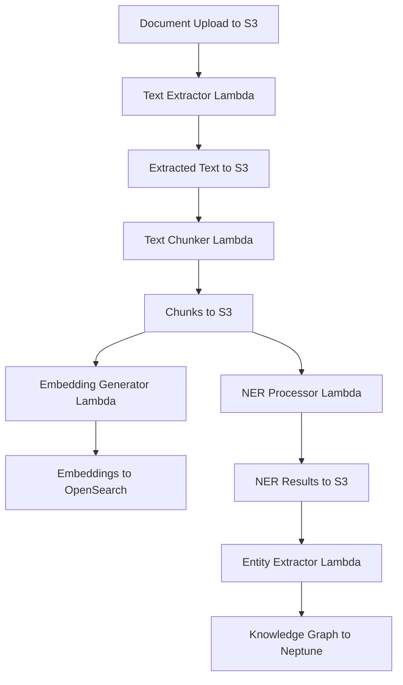
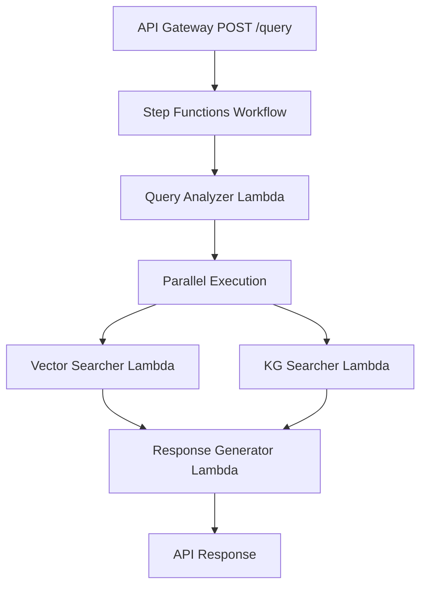

# Climate Risk RAG System - Trigger Mapping & Event Flow

## 📍 **Trigger Information Location**

The trigger configurations are distributed across multiple CDK stack files:

| **File** | **Trigger Types** | **Description** |
|----------|-------------------|-----------------|
| `cdk/stacks/microservices_compute_stack.py` | S3 Events, API Gateway, Step Functions | **Primary trigger definitions** |
| `cdk/stacks/data_lake_stack.py` | S3 Bucket configurations | Bucket setup for event sources |
| `lambda/*/` | Lambda function handlers | Event processing logic |

## 🔄 **Complete Trigger & Event Flow Mapping**

### **1. Document Processing Pipeline (S3 Event Triggers)**

#### **Trigger Chain: Document Upload → Processing → Storage**



#### **S3 Event Trigger Details**

**Location:** `microservices_compute_stack.py` → `_setup_s3_event_triggers()` method

```python
# 1. PDF Upload → Text Extraction
documents_bucket.add_event_notification(
    EventType.OBJECT_CREATED,
    LambdaDestination(text_extractor),
    NotificationKeyFilter(prefix="documents/", suffix=".pdf")
)

# 2. Extracted Text → Text Chunking  
extracted_text_bucket.add_event_notification(
    EventType.OBJECT_CREATED,
    LambdaDestination(text_chunker),
    NotificationKeyFilter(prefix="extracted_text/", suffix=".txt")
)

# 3. Chunks → Embedding Generation
chunks_bucket.add_event_notification(
    EventType.OBJECT_CREATED,
    LambdaDestination(embedding_generator),
    NotificationKeyFilter(prefix="chunks/", suffix=".json")
)

# 4. Chunks → NER Processing
chunks_bucket.add_event_notification(
    EventType.OBJECT_CREATED,
    LambdaDestination(ner_processor),
    NotificationKeyFilter(prefix="chunks/", suffix=".json")
)

# 5. NER Results → Knowledge Graph Updates
ner_results_bucket.add_event_notification(
    EventType.OBJECT_CREATED,
    LambdaDestination(entity_extractor),
    NotificationKeyFilter(prefix="ner_results/", suffix="ner_summary.json")
)
```

### **2. Query Processing Pipeline (API Gateway + Step Functions)**

#### **Trigger Chain: API Request → Orchestration → Response**



#### **API Gateway Trigger Details**

**Location:** `microservices_compute_stack.py` → `_create_api_gateway()` method

```python
# API Gateway REST API
api = RestApi(
    "ClimateRiskMicroservicesAPI",
    rest_api_name="Climate Risk RAG Microservices API"
)

# Query endpoint triggers Step Functions workflow
query_resource = api.root.add_resource("query")
query_integration = StepFunctionsIntegration(
    state_machine=query_workflow
)
query_resource.add_method("POST", query_integration)

# Health check endpoint triggers Lambda directly
health_resource = api.root.add_resource("health")
health_integration = LambdaIntegration(query_analyzer)
health_resource.add_method("GET", health_integration)
```

#### **Step Functions Workflow Details**

**Location:** `microservices_compute_stack.py` → `_create_query_processing_workflow()` method

```python
# Step Functions workflow orchestration
analyze_query_task = LambdaInvoke(
    lambda_function=query_analyzer,
    payload=TaskInput.from_object({
        "query": JsonPath.string_at("$.query"),
        "options": JsonPath.string_at("$.options")
    })
)

# Parallel search execution
parallel_search = Parallel()
parallel_search.branch(
    LambdaInvoke(lambda_function=vector_searcher),
    LambdaInvoke(lambda_function=kg_searcher)
)

# Response generation
response_task = LambdaInvoke(
    lambda_function=response_generator
)
```

## 📊 **Detailed Trigger Specifications**

### **S3 Event Triggers**

| **Source Bucket** | **Event Type** | **Filter** | **Target Lambda** | **Purpose** |
|-------------------|----------------|------------|-------------------|-------------|
| `documents-bucket` | `OBJECT_CREATED` | `documents/*.pdf` | `text-extractor` | Extract text from PDFs |
| `extracted-text-bucket` | `OBJECT_CREATED` | `extracted_text/*.txt` | `text-chunker` | Chunk extracted text |
| `chunks-bucket` | `OBJECT_CREATED` | `chunks/*.json` | `embedding-generator` | Generate embeddings |
| `chunks-bucket` | `OBJECT_CREATED` | `chunks/*.json` | `ner-processor` | Extract entities |
| `ner-results-bucket` | `OBJECT_CREATED` | `ner_results/*_summary.json` | `entity-extractor` | Update knowledge graph |

### **API Gateway Triggers**

| **Endpoint** | **Method** | **Target** | **Purpose** |
|--------------|------------|------------|-------------|
| `/query` | `POST` | Step Functions Workflow | Process user queries |
| `/health` | `GET` | Query Analyzer Lambda | Health check |

### **Step Functions Triggers**

| **State** | **Type** | **Target Lambda** | **Input** | **Output** |
|-----------|----------|-------------------|-----------|------------|
| `AnalyzeQuery` | `Task` | `query-analyzer` | User query + options | Query analysis |
| `VectorSearch` | `Task` | `vector-searcher` | Query analysis | Search results |
| `KGSearch` | `Task` | `kg-searcher` | Query analysis | Graph insights |
| `GenerateResponse` | `Task` | `response-generator` | All search results | Final response |

## 🔍 **Event Payload Examples**

### **S3 Event Payload (Document Upload)**
```json
{
  "Records": [
    {
      "eventVersion": "2.1",
      "eventSource": "aws:s3",
      "eventName": "ObjectCreated:Put",
      "s3": {
        "bucket": {
          "name": "climate-risk-documents-bucket"
        },
        "object": {
          "key": "documents/climate-report-2024.pdf",
          "size": 2048576
        }
      }
    }
  ]
}
```

### **API Gateway Event Payload (Query Request)**
```json
{
  "httpMethod": "POST",
  "path": "/query",
  "headers": {
    "Content-Type": "application/json"
  },
  "body": {
    "query": "What are the financial risks of sea level rise?",
    "options": {
      "response_style": "detailed_with_data",
      "include_citations": true,
      "max_results": 10
    }
  }
}
```

### **Step Functions Input Payload**
```json
{
  "query": "What are the financial risks of sea level rise?",
  "options": {
    "response_style": "detailed_with_data",
    "include_citations": true,
    "max_results": 10
  },
  "timestamp": "2024-07-01T02:00:00Z",
  "request_id": "abc123-def456-ghi789"
}
```

## ⚡ **Trigger Performance Characteristics**

### **S3 Event Triggers**
- **Latency:** ~100-500ms from object creation to Lambda invocation
- **Reliability:** At-least-once delivery (may have duplicates)
- **Concurrency:** Up to 1000 concurrent Lambda executions per function
- **Retry:** Automatic retries with exponential backoff
- **Dead Letter Queue:** Configured for failed processing

### **API Gateway Triggers**
- **Latency:** ~50-200ms from request to Lambda invocation
- **Timeout:** 30 seconds maximum
- **Throttling:** 10,000 requests per second default limit
- **Authentication:** API keys, JWT tokens, custom authorizers
- **Rate Limiting:** Per-client quotas and burst limits

### **Step Functions Triggers**
- **Latency:** ~100-300ms between state transitions
- **Timeout:** 1 year maximum execution time
- **Error Handling:** Built-in retry and catch mechanisms
- **Parallel Execution:** Multiple branches can run concurrently
- **State Management:** Automatic state persistence and recovery

## 🔧 **Trigger Configuration Management**

### **Environment Variables (Lambda Functions)**
```python
# Common environment variables for all Lambda functions
ENVIRONMENT_VARIABLES = {
    'AWS_REGION': 'us-east-1',
    'DOCUMENTS_BUCKET': 'climate-risk-documents',
    'EXTRACTED_TEXT_BUCKET': 'climate-risk-extracted-text',
    'CHUNKS_BUCKET': 'climate-risk-chunks',
    'EMBEDDINGS_BUCKET': 'climate-risk-embeddings',
    'OPENSEARCH_ENDPOINT': 'https://search-climate-risk.us-east-1.es.amazonaws.com',
    'NEPTUNE_ENDPOINT': 'climate-risk-neptune.cluster-xyz.us-east-1.neptune.amazonaws.com',
    'RDS_ENDPOINT': 'climate-risk-rds.xyz.us-east-1.rds.amazonaws.com'
}
```

### **IAM Permissions (Trigger Access)**
```python
# S3 event trigger permissions
s3_event_policy = {
    "Version": "2012-10-17",
    "Statement": [
        {
            "Effect": "Allow",
            "Action": [
                "s3:GetObject",
                "s3:PutObject",
                "s3:DeleteObject"
            ],
            "Resource": "arn:aws:s3:::climate-risk-*/*"
        }
    ]
}

# API Gateway trigger permissions
api_gateway_policy = {
    "Version": "2012-10-17",
    "Statement": [
        {
            "Effect": "Allow",
            "Action": [
                "lambda:InvokeFunction"
            ],
            "Resource": "arn:aws:lambda:*:*:function:climate-risk-*"
        }
    ]
}
```

## 🚨 **Error Handling & Monitoring**

### **Failed Trigger Handling**
```python
# Dead Letter Queue configuration for S3 triggers
dead_letter_queue = sqs.Queue(
    "ProcessingFailuresDLQ",
    retention_period=Duration.days(14)
)

# Lambda function with DLQ
lambda_function = Function(
    "TextExtractor",
    dead_letter_queue=dead_letter_queue,
    retry_attempts=3
)
```

### **CloudWatch Monitoring**
```python
# Custom metrics for trigger monitoring
trigger_metrics = [
    "S3EventsReceived",
    "APIGatewayRequests", 
    "StepFunctionExecutions",
    "LambdaInvocations",
    "ProcessingErrors",
    "AverageProcessingTime"
]

# Alarms for trigger failures
high_error_rate_alarm = cloudwatch.Alarm(
    "HighTriggerErrorRate",
    metric=lambda_function.metric_errors(),
    threshold=10,
    evaluation_periods=2
)
```

## 📈 **Scaling & Optimization**

### **Trigger Scaling Patterns**
```yaml
S3 Event Scaling:
  - Automatic scaling based on object creation rate
  - Concurrent execution limits prevent resource exhaustion
  - Batch processing for high-volume scenarios

API Gateway Scaling:
  - Auto-scaling to handle request spikes
  - Caching for frequently accessed endpoints
  - Regional distribution for global access

Step Functions Scaling:
  - Parallel execution for independent tasks
  - Express workflows for high-throughput scenarios
  - Standard workflows for complex orchestration
```

### **Cost Optimization**
```yaml
Trigger Cost Factors:
  S3 Events: $0.0004 per 1,000 requests
  API Gateway: $3.50 per million requests
  Step Functions: $0.025 per 1,000 state transitions
  Lambda Invocations: $0.20 per 1 million requests

Optimization Strategies:
  - Batch processing to reduce trigger frequency
  - Intelligent filtering to avoid unnecessary invocations
  - Reserved concurrency for predictable workloads
  - Provisioned concurrency for low-latency requirements
```

## 🔍 **Debugging & Troubleshooting**

### **Common Trigger Issues**
```yaml
S3 Event Issues:
  - Missing permissions for Lambda invocation
  - Incorrect event filters (prefix/suffix)
  - Circular trigger loops
  - Event notification limits (1000 per bucket)

API Gateway Issues:
  - CORS configuration problems
  - Authentication/authorization failures
  - Request/response size limits
  - Integration timeout issues

Step Functions Issues:
  - State machine definition errors
  - Task timeout configurations
  - Error handling and retry logic
  - Input/output transformation problems
```

### **Monitoring Commands**
```bash
# Check S3 event notifications
aws s3api get-bucket-notification-configuration --bucket climate-risk-documents

# Monitor API Gateway metrics
aws logs filter-log-events --log-group-name API-Gateway-Execution-Logs

# View Step Functions executions
aws stepfunctions list-executions --state-machine-arn <workflow-arn>

# Lambda function metrics
aws logs filter-log-events --log-group-name /aws/lambda/climate-risk-text-extractor
```

## 📋 **Summary**

**Primary Trigger Configuration Location:** `cdk/stacks/microservices_compute_stack.py`

**Key Methods:**
- `_setup_s3_event_triggers()` - Document processing pipeline triggers
- `_create_api_gateway()` - Query API endpoint triggers  
- `_create_query_processing_workflow()` - Step Functions orchestration

**Trigger Types:**
1. **S3 Events** - Document processing automation
2. **API Gateway** - User query handling
3. **Step Functions** - Query processing orchestration

This trigger mapping provides the complete picture of how events flow through your climate risk RAG system, from document upload through query processing and response generation.
