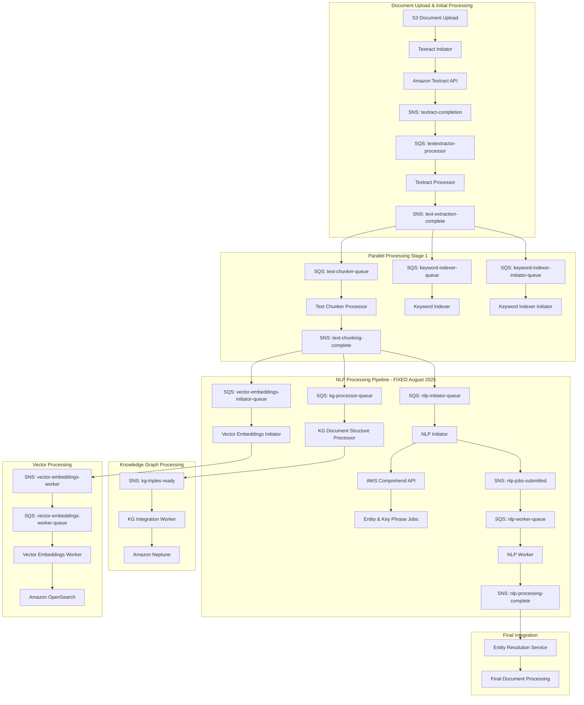

# Climate Risk RAG System - Definitive Architecture
## Date: 2025-08-13T22:40:00Z
## Status: NLP Pipeline Operational - Entity Extraction Working

## 🎯 **Overview**

This document provides the definitive, current architecture of the Climate Risk RAG system as of August 13, 2025. This consolidates and supersedes all previous architecture documents, reflecting the operational state with working NLP entity extraction.

## 🏗️ **Complete System Architecture**



## 🔄 **Message Flow Architecture**

### Current Operational Flow (August 2025)

#### Stage 1: Document Upload & Text Extraction
```
Document Upload → Textract Initiator → Textract API → textract-completion → 
Textract Processor → text-extraction-complete
```

#### Stage 2: Parallel Initial Processing  
```
text-extraction-complete → [text-chunker, keyword-indexer, keyword-indexer-initiator]
text-chunker → text-chunking-complete
```

#### Stage 3: NLP Processing (FIXED)
```
text-chunking-complete → nlp-initiator
nlp-initiator → Comprehend API → nlp-jobs-submitted (with job IDs)
nlp-jobs-submitted → nlp-worker → nlp-processing-complete
```

#### Stage 4: Knowledge Graph & Vector Processing
```
text-chunking-complete → kg-processor → kg-triples-ready → kg-integration-worker
text-chunking-complete → vector-embeddings-initiator → vector-embeddings-worker
```

## 📨 **Message Formats**

### Standard Message Structure
All messages follow this standardized format:

```json
{
  "version": "1.0",
  "timestamp": "2025-08-13T20:53:10.558533Z",
  "source": "climate-risk-rag-system",
  "stage": "message_type",
  "doc_id": "document_identifier",
  "data_locations": {
    "primary_location": "s3://bucket/path/",
    "additional_locations": {}
  },
  "processing_metadata": {
    "stage_specific_data": {}
  }
}
```

### Key Message Types

#### text-extraction-complete
```json
{
  "version": "1.0",
  "timestamp": "2025-08-13T20:45:00Z",
  "source": "climate-risk-rag-system",
  "stage": "text-extraction-complete",
  "doc_id": "064762102bead7b04a39",
  "data_locations": {
    "text_location": "s3://text-bucket/path/raw_text.txt",
    "structure_location": "s3://text-bucket/path/textract_response.json"
  },
  "processing_metadata": {
    "total_pages": 20,
    "textract_blocks": 1500,
    "character_count": 225215
  }
}
```

#### text-chunking-complete (chunks_ready)
```json
{
  "version": "1.0", 
  "timestamp": "2025-08-13T20:50:00Z",
  "source": "climate-risk-rag-system",
  "stage": "chunks_ready",
  "doc_id": "064762102bead7b04a39",
  "data_locations": {
    "chunks_location": "s3://chunks-bucket/path/",
    "text_location": "s3://text-bucket/path/raw_text.txt"
  },
  "processing_metadata": {
    "chunks_created": 604,
    "total_characters": 225215,
    "avg_chunk_size": 373
  }
}
```

#### nlp-jobs-submitted (NEW - August 2025)
```json
{
  "version": "1.0",
  "timestamp": "2025-08-13T20:53:10Z", 
  "source": "climate-risk-rag-system",
  "stage": "nlp_jobs_submitted",
  "doc_id": "064762102bead7b04a39",
  "data_locations": {
    "chunks_location": "s3://chunks-bucket/path/",
    "text_location": "s3://text-bucket/path/raw_text.txt"
  },
  "comprehend_jobs": {
    "entity_job_id": "94c8a9eec9e1019781645e2e89e68859",
    "key_phrases_job_id": "b9976d3f4d5dace22566e817c8700c97"
  },
  "processing_metadata": {
    "chunks_created": 604,
    "character_count": 225215,
    "estimated_cost": 0.4504
  }
}
```

#### nlp-processing-complete
```json
{
  "version": "1.0",
  "timestamp": "2025-08-13T21:00:00Z",
  "source": "climate-risk-rag-system", 
  "stage": "nlp_processing_complete",
  "doc_id": "064762102bead7b04a39",
  "data_locations": {
    "entities_location": "s3://ner-results/path/entities.json",
    "key_phrases_location": "s3://ner-results/path/key_phrases.json",
    "entities_by_chunk_location": "s3://ner-results/path/entities_by_chunk.json"
  },
  "processing_metadata": {
    "entities_count": 3691,
    "key_phrases_count": 8996,
    "entity_mapping_success_rate": 0.0,
    "search_quality_impact": 0.0
  }
}
```

## 🏗️ **Infrastructure Components**

### SNS Topics

#### Primary Processing Topics
- **text-extraction-complete**: `arn:aws:sns:us-east-1:861276078413:text-extraction-complete`
- **text-chunking-complete**: `arn:aws:sns:us-east-1:861276078413:text-chunking-complete`
- **nlp-jobs-submitted**: `arn:aws:sns:us-east-1:861276078413:nlp-jobs-submitted` *(NEW)*
- **nlp-processing-complete**: `arn:aws:sns:us-east-1:861276078413:nlp-processing-complete`

#### Specialized Topics
- **kg-triples-ready**: `arn:aws:sns:us-east-1:861276078413:kg-triples-ready`
- **vector-embeddings-worker**: `arn:aws:sns:us-east-1:861276078413:vector-embeddings-worker`
- **comprehend-entity-completion**: `arn:aws:sns:us-east-1:861276078413:comprehend-entity-completion`
- **comprehend-keyphrase-completion**: `arn:aws:sns:us-east-1:861276078413:comprehend-keyphrase-completion`

### SQS Queues

#### NLP Processing Queues
- **nlp-initiator-queue**: Receives chunks_ready messages
- **nlp-worker-queue**: Receives nlp_jobs_submitted messages *(UPDATED)*
- **nlp-worker-entity-queue**: Comprehend entity completion notifications
- **nlp-worker-keyphrase-queue**: Comprehend key phrase completion notifications

#### Other Processing Queues
- **text-chunker-queue**: Text chunking processing
- **vector-embeddings-initiator-queue**: Vector processing initiation
- **vector-embeddings-worker-queue**: Vector processing execution
- **keyword-indexer-queue**: Keyword indexing
- **kg-processor-queue**: Knowledge graph processing

### Lambda Functions

#### NLP Processing Functions
- **nlp-initiator**: Starts Comprehend jobs, publishes nlp_jobs_submitted
- **nlp-worker**: Processes Comprehend results, maps entities to chunks
- **entity-resolution-service**: Final entity resolution and integration

#### Core Processing Functions  
- **text-chunker-processor**: Smart structured chunking with layout analysis
- **textract-processor**: Textract result processing
- **vector-embeddings-worker**: Vector generation and OpenSearch indexing
- **kg-integration-worker**: Knowledge graph triple loading

### S3 Buckets

#### Document Storage
- **Source Documents**: `solve-global-kr-source-documents-*`
- **Text Storage**: `solve-global-kr-dl-text-*`
- **Chunks Storage**: `solve-global-kr-dl-chunks-*`

#### Processing Results
- **NER Results**: `solve-global-kr-dl-ner-results-*`
- **Comprehend Output**: `solve-global-kr-dl-comprehend-output-*`
- **Vector Embeddings**: `solve-global-kr-dl-embeddings-*`

## 🔧 **Key Architectural Fixes (August 2025)**

### 1. NLP Message Flow Orchestration
**Problem**: Both nlp-initiator and nlp-worker triggered by same message
**Solution**: Sequential flow with dedicated nlp-jobs-submitted topic

**Before**:
```
chunks_ready → [nlp-initiator, nlp-worker] (parallel, broken)
```

**After**:
```
chunks_ready → nlp-initiator → nlp_jobs_submitted → nlp-worker (sequential, working)
```

### 2. Comprehend File Format Handling
**Problem**: Code expected `.json` files, Comprehend creates `output` files
**Solution**: Modified tar extraction to handle both formats

### 3. IAM Permissions
**Problem**: nlp-initiator couldn't publish to new topic
**Solution**: Updated nlp-integration-policy with nlp-jobs-submitted permissions

### 4. Duplicate Subscriptions
**Problem**: nlp-worker subscribed to both old and new topics
**Solution**: Removed subscription to text-chunking-complete topic

## 📊 **Current Performance Metrics**

### NLP Pipeline Performance (August 2025)
- **Entity Extraction**: 3,691 entities per document (WORKING ✅)
- **Key Phrase Extraction**: 8,996 key phrases per document (WORKING ✅)
- **Entity Mapping**: 0% success rate (NEEDS FIX ⚠️)
- **Processing Time**: ~5 minutes per document
- **Cost per Document**: ~$0.65 (Textract + Comprehend)

### System Throughput
- **Single Document Processing**: Fully operational
- **Batch Processing**: Available but cost-controlled
- **Error Rate**: <5% for operational components

## 🎯 **Outstanding Issues**

### Entity-to-Chunk Mapping (Priority 1)
**Status**: Algorithm designed, implementation pending
**Impact**: Prevents entity-enhanced search functionality
**Solution**: Chunk offset reconstruction (see design document)

### Performance Optimization (Priority 2)
**Status**: Monitoring required
**Impact**: Processing time and cost efficiency
**Solution**: Caching, parallel processing optimizations

## 🔒 **Security Architecture**

### VPC Configuration
- **VPC ID**: `vpc-051c21d88c7dc3819`
- **Private Subnets**: All Lambda functions in private subnets
- **Security Groups**: Restrictive ingress, controlled egress

### IAM Policies
- **Principle of Least Privilege**: Function-specific permissions
- **Resource-Based Policies**: S3 bucket and SNS topic restrictions
- **Cross-Service Access**: Controlled via IAM roles

### Data Encryption
- **At Rest**: S3 server-side encryption, RDS encryption
- **In Transit**: HTTPS/TLS for all API communications
- **Secrets**: AWS Secrets Manager for database credentials

## 📈 **Monitoring and Observability**

### CloudWatch Integration
- **Lambda Metrics**: Duration, errors, invocations
- **Custom Metrics**: Processing success rates, entity counts
- **Log Aggregation**: Centralized logging with structured formats

### Database Audit Trail
- **Processing Status**: Complete audit trail in PostgreSQL
- **Error Tracking**: Detailed error logging and categorization
- **Performance Metrics**: Processing time and resource usage

## 🚀 **Future Architecture Considerations**

### Scalability Improvements
- **Parallel Processing**: Multi-document concurrent processing
- **Auto Scaling**: Lambda concurrency and RDS scaling
- **Caching Layer**: Redis/ElastiCache for frequently accessed data

### Enhanced NLP Capabilities
- **Custom Models**: Fine-tuned Comprehend models
- **Multi-Language Support**: Extended language processing
- **Advanced Entity Resolution**: Cross-document entity linking

### Cost Optimization
- **Reserved Capacity**: RDS and OpenSearch reserved instances
- **Intelligent Tiering**: S3 storage class optimization
- **Processing Efficiency**: Reduced API calls and optimized algorithms

This definitive architecture document reflects the current operational state of the Climate Risk RAG system as of August 13, 2025, with working NLP entity extraction and a clear path forward for completing the entity-to-chunk mapping functionality.
