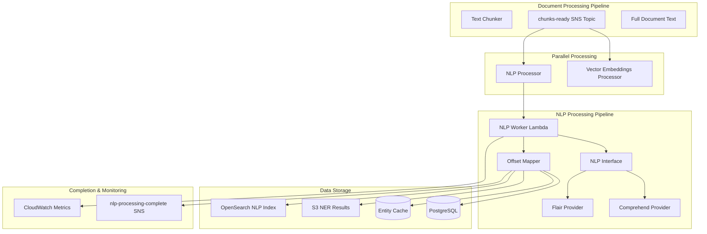
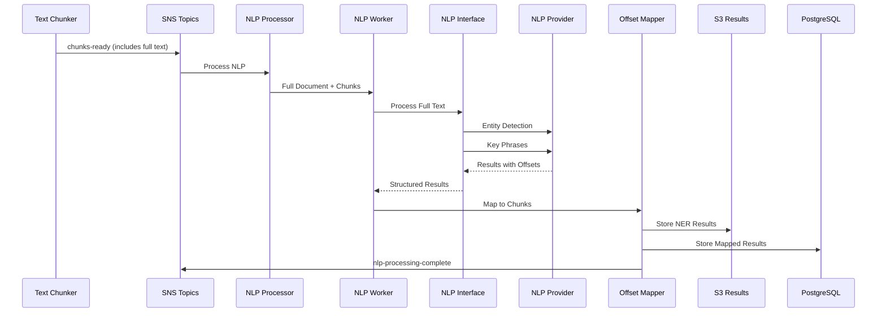

# NLP INTEGRATION PLAN - ENTITY DETECTION & KEY PHRASES
**Document Version:** 1.1  
**Last Updated:** 2025-07-06T22:45:00Z  
**Status:** Implementation Ready - Updated Requirements

## EXECUTIVE SUMMARY

This document outlines the integration plan for Natural Language Processing (NLP) capabilities into the Climate Risk RAG system using Amazon Comprehend or Flair NLP. The NLP pipeline will process full document text to extract entities and key phrases, then map these findings back to specific chunks using document text offsets for future Knowledge Graph construction.

## KEY REQUIREMENTS CLARIFICATION

### Scope Refinement
- **Entity Detection:** Extract named entities from full document text
- **Key Phrase Extraction:** Identify important phrases and terms
- **NO Sentiment Analysis:** Removed from current scope
- **Future:** Custom event detection will be added later

### Critical New Requirement: Offset Mapping
- **Process full document text** for comprehensive entity detection
- **Map entities to chunks** using document text offsets (BeginOffset/EndOffset)
- **Preserve offset information** for Knowledge Graph construction
- **Store results in S3** with doc_id-based file structure

### POC Analysis - Offset Storage
**Finding:** The original POC migration files show NER results were stored but **text offsets were likely NOT preserved** in the original implementation. This is a new requirement that needs to be implemented.

**Evidence:**
- Migration scripts reference `ner_results` files: `{doc_id}_ner_results.json`
- No offset-related code found in migration scripts
- Sample data shows NER file references but not offset structure

### Pluggable Architecture Requirement
- **Primary Implementation:** Amazon Comprehend
- **Alternative Implementation:** Flair NLP
- **Interface-based design** to allow switching between NLP providers
- **Consistent output format** regardless of underlying NLP service

## POC ANALYSIS AND PORTING REQUIREMENTS

### Original POC Components Identified

Based on the POC to Lambda mapping document and migration files, the original system included:

| POC Component | Original Files | AWS Service | Processing Load |
|---------------|----------------|-------------|-----------------|
| **NERProcessor** | `/src/knowledge_graph/ChunkNERWorker.py`<br>`/src/knowledge_graph/DocumentNERWorker.py`<br>`/src/utils/nlp_utils.py` | Amazon Comprehend | 50 chunks |
| **EntityExtractor** | `/src/knowledge_graph/EntityAligner.py`<br>`/src/knowledge_graph/EntityFilter.py`<br>`/src/ontology/OntologyManager.py` | Custom Logic + Comprehend | NER results |
| **RelationshipMiner** | `/src/knowledge_graph/CoOccurrenceDetector.py`<br>`/src/knowledge_graph/RelationshipExtractor.py`<br>`/src/patterns/PatternMatcher.py` | Amazon Bedrock | 100 entity pairs |

### Migration Evidence

The migration scripts show NER processing was a key component:
- `selective_migration_ner.py` - Handles NER results migration
- `validate_sample_ner.py` - Validates NER processing quality
- `sample_documents_1000_ner.json` - NER-processed sample data

## ARCHITECTURE DESIGN

### NLP Pipeline Architecture



### Message Flow Design



## LAMBDA FUNCTION DESIGN

### 1. NLP Processor (Initiator)

**Function:** `nlp-processor`  
**Purpose:** Initiate NLP processing for full document text  
**Trigger:** SNS `chunks-ready` topic  

```python
# /lambda/nlp_processor/nlp_processor.py
import json
import boto3
import os
from utils.DatabaseManager import DatabaseManager
from utils.DocumentIDManager import DocumentIDManager

def lambda_handler(event, context):
    """Process NLP initiation requests"""
    
    # Parse SNS message
    message = json.loads(event['Records'][0]['Sns']['Message'])
    doc_id = message['doc_id']
    chunks_location = message['chunks_location']
    chunks_count = message['chunks_count']
    full_text_location = message.get('full_text_location')  # New requirement
    
    # Check if NLP processing already completed
    if check_nlp_status(doc_id) == 'COMPLETED':
        return {'statusCode': 200, 'body': 'Already processed'}
    
    # Publish to NLP worker topic
    sns_client = boto3.client('sns')
    worker_message = {
        'doc_id': doc_id,
        'chunks_location': chunks_location,
        'full_text_location': full_text_location,
        'chunks_count': chunks_count,
        'processing_type': 'entity_and_phrases',  # Updated scope
        'nlp_provider': os.environ.get('NLP_PROVIDER', 'comprehend'),
        'timestamp': datetime.now().isoformat()
    }
    
    sns_client.publish(
        TopicArn=os.environ['NLP_WORKER_TOPIC_ARN'],
        Message=json.dumps(worker_message)
    )
    
    return {'statusCode': 200, 'body': 'NLP processing initiated'}
```

### 2. NLP Worker (Background Processor)

**Function:** `nlp-worker`  
**Purpose:** Execute NLP processing with pluggable providers and offset mapping  
**Trigger:** SQS queue from `nlp-worker` SNS topic  

```python
# /lambda/nlp_worker/nlp_worker.py
import json
import boto3
import os
from datetime import datetime
from typing import List, Dict, Any
from nlp_interface import NLPProcessorFactory
from offset_mapper import OffsetMapper
from s3_results_manager import S3ResultsManager
from utils.DatabaseManager import DatabaseManager

def lambda_handler(event, context):
    """Process NLP analysis for full document with chunk mapping"""
    
    # Parse SQS message
    message = json.loads(event['Records'][0]['body'])
    sns_message = json.loads(message['Message'])
    
    doc_id = sns_message['doc_id']
    chunks_location = sns_message['chunks_location']
    full_text_location = sns_message['full_text_location']
    nlp_provider = sns_message.get('nlp_provider', 'comprehend')
    
    try:
        # Update status to processing
        update_nlp_status(doc_id, 'PROCESSING')
        
        # Load full document text and chunks
        full_text = load_full_text_from_s3(full_text_location)
        chunks = load_chunks_from_s3(chunks_location)
        
        # Get NLP processor based on provider
        nlp_processor = NLPProcessorFactory.create_processor(nlp_provider)
        
        # Process full document text
        nlp_results = nlp_processor.process_document(doc_id, full_text)
        
        # Map entities and phrases to chunks using offsets
        offset_mapper = OffsetMapper(full_text, chunks)
        mapped_results = offset_mapper.map_to_chunks(nlp_results)
        
        # Store results in S3 (NER results bucket)
        s3_manager = S3ResultsManager()
        s3_manager.store_nlp_results(doc_id, mapped_results)
        
        # Store mapped results in database
        store_nlp_results(doc_id, mapped_results)
        
        # Index in OpenSearch
        index_nlp_results(doc_id, mapped_results)
        
        # Update completion status
        update_nlp_status(doc_id, 'COMPLETED')
        
        # Publish completion message
        publish_completion_message(doc_id, mapped_results)
        
        return {'statusCode': 200, 'body': 'NLP processing completed'}
        
    except Exception as e:
        update_nlp_status(doc_id, 'FAILED', str(e))
        raise
```

### 3. NLP Interface (Pluggable Architecture)

```python
# /lambda/nlp_worker/nlp_interface.py
from abc import ABC, abstractmethod
from typing import Dict, List, Any
from comprehend_provider import ComprehendProvider
from flair_provider import FlairProvider

class NLPProvider(ABC):
    """Abstract base class for NLP providers"""
    
    @abstractmethod
    def detect_entities(self, text: str) -> List[Dict[str, Any]]:
        """Detect entities in text with offsets"""
        pass
    
    @abstractmethod
    def extract_key_phrases(self, text: str) -> List[Dict[str, Any]]:
        """Extract key phrases with offsets"""
        pass
    
    @abstractmethod
    def get_provider_name(self) -> str:
        """Return provider name"""
        pass

class NLPProcessorFactory:
    """Factory for creating NLP processors"""
    
    @staticmethod
    def create_processor(provider_name: str) -> NLPProvider:
        if provider_name.lower() == 'comprehend':
            return ComprehendProvider()
        elif provider_name.lower() == 'flair':
            return FlairProvider()
        else:
            raise ValueError(f"Unknown NLP provider: {provider_name}")

class NLPProcessor:
    """Main NLP processing coordinator"""
    
    def __init__(self, provider: NLPProvider):
        self.provider = provider
        self.cost_tracker = CostTracker(provider.get_provider_name())
    
    def process_document(self, doc_id: str, full_text: str) -> Dict[str, Any]:
        """Process full document text for entities and key phrases"""
        
        results = {
            'doc_id': doc_id,
            'provider': self.provider.get_provider_name(),
            'entities': [],
            'key_phrases': [],
            'processing_cost': 0.0,
            'processed_at': datetime.now().isoformat(),
            'text_length': len(full_text)
        }
        
        # Entity detection
        entities = self.provider.detect_entities(full_text)
        results['entities'] = entities
        
        # Key phrase extraction
        key_phrases = self.provider.extract_key_phrases(full_text)
        results['key_phrases'] = key_phrases
        
        # Calculate costs
        results['processing_cost'] = self.cost_tracker.calculate_cost(full_text)
        
        return results
```

### 4. Amazon Comprehend Provider

```python
# /lambda/nlp_worker/comprehend_provider.py
import boto3
from typing import List, Dict, Any
from nlp_interface import NLPProvider

class ComprehendProvider(NLPProvider):
    """Amazon Comprehend implementation of NLP provider"""
    
    def __init__(self):
        self.comprehend = boto3.client('comprehend')
    
    def detect_entities(self, text: str) -> List[Dict[str, Any]]:
        """Detect entities using Amazon Comprehend"""
        
        # Handle text length limits (5000 characters for Comprehend)
        if len(text) > 5000:
            # Process in chunks but maintain global offsets
            return self._process_long_text_entities(text)
        
        response = self.comprehend.detect_entities(
            Text=text,
            LanguageCode='en'
        )
        
        entities = []
        for entity in response['Entities']:
            entities.append({
                'text': entity['Text'],
                'type': entity['Type'],
                'confidence': entity['Score'],
                'begin_offset': entity['BeginOffset'],
                'end_offset': entity['EndOffset']
            })
        
        return entities
    
    def extract_key_phrases(self, text: str) -> List[Dict[str, Any]]:
        """Extract key phrases using Amazon Comprehend"""
        
        if len(text) > 5000:
            return self._process_long_text_phrases(text)
        
        response = self.comprehend.detect_key_phrases(
            Text=text,
            LanguageCode='en'
        )
        
        phrases = []
        for phrase in response['KeyPhrases']:
            phrases.append({
                'text': phrase['Text'],
                'confidence': phrase['Score'],
                'begin_offset': phrase['BeginOffset'],
                'end_offset': phrase['EndOffset']
            })
        
        return phrases
    
    def get_provider_name(self) -> str:
        return "comprehend"
    
    def _process_long_text_entities(self, text: str) -> List[Dict[str, Any]]:
        """Process long text by splitting while maintaining offsets"""
        entities = []
        chunk_size = 4500  # Leave buffer for word boundaries
        
        for i in range(0, len(text), chunk_size):
            # Find word boundary
            end_pos = min(i + chunk_size, len(text))
            if end_pos < len(text):
                # Find last space to avoid cutting words
                while end_pos > i and text[end_pos] != ' ':
                    end_pos -= 1
            
            chunk_text = text[i:end_pos]
            chunk_entities = self.detect_entities(chunk_text)
            
            # Adjust offsets to global document positions
            for entity in chunk_entities:
                entity['begin_offset'] += i
                entity['end_offset'] += i
                entities.append(entity)
        
        return entities
```

### 5. Flair NLP Provider

```python
# /lambda/nlp_worker/flair_provider.py
from typing import List, Dict, Any
from nlp_interface import NLPProvider

# Note: Flair would need to be included in a Lambda layer
try:
    from flair.data import Sentence
    from flair.models import SequenceTagger
    FLAIR_AVAILABLE = True
except ImportError:
    FLAIR_AVAILABLE = False

class FlairProvider(NLPProvider):
    """Flair NLP implementation of NLP provider"""
    
    def __init__(self):
        if not FLAIR_AVAILABLE:
            raise ImportError("Flair NLP not available. Install flair package.")
        
        # Load models (these would be cached in Lambda)
        self.ner_tagger = SequenceTagger.load('ner')
        # Note: Flair doesn't have built-in key phrase extraction
        # Would need custom implementation or use spaCy
    
    def detect_entities(self, text: str) -> List[Dict[str, Any]]:
        """Detect entities using Flair NLP"""
        
        sentence = Sentence(text)
        self.ner_tagger.predict(sentence)
        
        entities = []
        for entity in sentence.get_spans('ner'):
            entities.append({
                'text': entity.text,
                'type': entity.get_label('ner').value,
                'confidence': entity.get_label('ner').score,
                'begin_offset': entity.start_position,
                'end_offset': entity.end_position
            })
        
        return entities
    
    def extract_key_phrases(self, text: str) -> List[Dict[str, Any]]:
        """Extract key phrases using custom logic"""
        # Placeholder - would need custom implementation
        # Could use spaCy noun phrases or other techniques
        return []
    
    def get_provider_name(self) -> str:
        return "flair"
```

### 6. Offset Mapper

```python
# /lambda/nlp_worker/offset_mapper.py
from typing import List, Dict, Any

class OffsetMapper:
    """Maps NLP results from full document to specific chunks"""
    
    def __init__(self, full_text: str, chunks: List[Dict[str, Any]]):
        self.full_text = full_text
        self.chunks = chunks
        self.chunk_offsets = self._calculate_chunk_offsets()
    
    def _calculate_chunk_offsets(self) -> List[Dict[str, Any]]:
        """Calculate the text offsets for each chunk in the full document"""
        chunk_offsets = []
        current_offset = 0
        
        for chunk in self.chunks:
            chunk_text = chunk['text']
            # Find the chunk text in the full document
            start_offset = self.full_text.find(chunk_text, current_offset)
            
            if start_offset != -1:
                end_offset = start_offset + len(chunk_text)
                chunk_offsets.append({
                    'chunk_id': chunk['chunk_id'],
                    'chunk_index': chunk['chunk_index'],
                    'start_offset': start_offset,
                    'end_offset': end_offset,
                    'text': chunk_text
                })
                current_offset = end_offset
            else:
                # Handle case where exact text match fails
                # This could happen due to text processing differences
                chunk_offsets.append({
                    'chunk_id': chunk['chunk_id'],
                    'chunk_index': chunk['chunk_index'],
                    'start_offset': -1,  # Mark as unmappable
                    'end_offset': -1,
                    'text': chunk_text
                })
        
        return chunk_offsets
    
    def map_to_chunks(self, nlp_results: Dict[str, Any]) -> Dict[str, Any]:
        """Map entities and phrases to their containing chunks"""
        
        mapped_results = {
            'doc_id': nlp_results['doc_id'],
            'provider': nlp_results['provider'],
            'processed_at': nlp_results['processed_at'],
            'processing_cost': nlp_results['processing_cost'],
            'chunk_mappings': []
        }
        
        # Map entities to chunks
        for entity in nlp_results['entities']:
            chunk_mapping = self._find_containing_chunk(
                entity['begin_offset'], 
                entity['end_offset']
            )
            
            if chunk_mapping:
                mapped_results['chunk_mappings'].append({
                    'type': 'entity',
                    'chunk_id': chunk_mapping['chunk_id'],
                    'chunk_index': chunk_mapping['chunk_index'],
                    'text': entity['text'],
                    'entity_type': entity['type'],
                    'confidence': entity['confidence'],
                    'document_begin_offset': entity['begin_offset'],
                    'document_end_offset': entity['end_offset'],
                    'chunk_begin_offset': entity['begin_offset'] - chunk_mapping['start_offset'],
                    'chunk_end_offset': entity['end_offset'] - chunk_mapping['start_offset']
                })
        
        # Map key phrases to chunks
        for phrase in nlp_results['key_phrases']:
            chunk_mapping = self._find_containing_chunk(
                phrase['begin_offset'], 
                phrase['end_offset']
            )
            
            if chunk_mapping:
                mapped_results['chunk_mappings'].append({
                    'type': 'key_phrase',
                    'chunk_id': chunk_mapping['chunk_id'],
                    'chunk_index': chunk_mapping['chunk_index'],
                    'text': phrase['text'],
                    'confidence': phrase['confidence'],
                    'document_begin_offset': phrase['begin_offset'],
                    'document_end_offset': phrase['end_offset'],
                    'chunk_begin_offset': phrase['begin_offset'] - chunk_mapping['start_offset'],
                    'chunk_end_offset': phrase['end_offset'] - chunk_mapping['start_offset']
                })
        
        return mapped_results
    
    def _find_containing_chunk(self, begin_offset: int, end_offset: int) -> Dict[str, Any]:
        """Find which chunk contains the given text offsets"""
        
        for chunk_info in self.chunk_offsets:
            if (chunk_info['start_offset'] <= begin_offset < chunk_info['end_offset'] and
                chunk_info['start_offset'] < end_offset <= chunk_info['end_offset']):
                return chunk_info
        
        return None
```

### 7. S3 Results Manager

```python
# /lambda/nlp_worker/s3_results_manager.py
import boto3
import json
import os
from typing import Dict, Any
from datetime import datetime

class S3ResultsManager:
    """Manages storage of NLP results in S3"""
    
    def __init__(self):
        self.s3_client = boto3.client('s3')
        self.bucket_name = os.environ.get('NER_RESULTS_BUCKET', 'solve-global-kr-dl-ner-results-861276078413-us-east-1')
    
    def store_nlp_results(self, doc_id: str, mapped_results: Dict[str, Any]) -> str:
        """Store NLP results in S3 with doc_id-based structure"""
        
        # Create directory structure: doc_id/
        # Files: doc_id_entities.json, doc_id_key_phrases.json, doc_id_complete.json
        
        timestamp = datetime.now().strftime('%Y%m%d_%H%M%S')
        
        # Store complete results
        complete_key = f"{doc_id}/{doc_id}_nlp_complete_{timestamp}.json"
        self._store_json_file(complete_key, mapped_results)
        
        # Store entities separately for easy access
        entities_data = {
            'doc_id': doc_id,
            'provider': mapped_results['provider'],
            'processed_at': mapped_results['processed_at'],
            'entities': [mapping for mapping in mapped_results['chunk_mappings'] if mapping['type'] == 'entity']
        }
        entities_key = f"{doc_id}/{doc_id}_entities_{timestamp}.json"
        self._store_json_file(entities_key, entities_data)
        
        # Store key phrases separately
        phrases_data = {
            'doc_id': doc_id,
            'provider': mapped_results['provider'],
            'processed_at': mapped_results['processed_at'],
            'key_phrases': [mapping for mapping in mapped_results['chunk_mappings'] if mapping['type'] == 'key_phrase']
        }
        phrases_key = f"{doc_id}/{doc_id}_key_phrases_{timestamp}.json"
        self._store_json_file(phrases_key, phrases_data)
        
        # Store processing metadata
        metadata = {
            'doc_id': doc_id,
            'provider': mapped_results['provider'],
            'processed_at': mapped_results['processed_at'],
            'processing_cost': mapped_results['processing_cost'],
            'entities_count': len(entities_data['entities']),
            'key_phrases_count': len(phrases_data['key_phrases']),
            'files': {
                'complete': complete_key,
                'entities': entities_key,
                'key_phrases': phrases_key
            }
        }
        metadata_key = f"{doc_id}/{doc_id}_metadata_{timestamp}.json"
        self._store_json_file(metadata_key, metadata)
        
        return complete_key
    
    def _store_json_file(self, s3_key: str, data: Dict[str, Any]):
        """Store JSON data in S3"""
        
        json_data = json.dumps(data, indent=2, default=str)
        
        self.s3_client.put_object(
            Bucket=self.bucket_name,
            Key=s3_key,
            Body=json_data,
            ContentType='application/json',
            Metadata={
                'doc_id': data.get('doc_id', ''),
                'provider': data.get('provider', ''),
                'processed_at': data.get('processed_at', '')
            }
        )
```

## S3 STORAGE STRUCTURE

### NER Results Bucket Organization

```
solve-global-kr-dl-ner-results-861276078413-us-east-1/
├── {doc_id}/
│   ├── {doc_id}_nlp_complete_{timestamp}.json      # Complete results with all mappings
│   ├── {doc_id}_entities_{timestamp}.json          # Entity mappings only
│   ├── {doc_id}_key_phrases_{timestamp}.json       # Key phrase mappings only
│   └── {doc_id}_metadata_{timestamp}.json          # Processing metadata
└── processing_logs/
    └── {date}/
        └── {doc_id}_processing_log_{timestamp}.json
```

### File Format Examples

**Complete Results File:**
```json
{
  "doc_id": "0032f6cb_f0caef34",
  "provider": "comprehend",
  "processed_at": "2025-07-06T22:45:00Z",
  "processing_cost": 0.0285,
  "chunk_mappings": [
    {
      "type": "entity",
      "chunk_id": "0032f6cb_f0caef34_chunk_001",
      "chunk_index": 1,
      "text": "climate change",
      "entity_type": "EVENT",
      "confidence": 0.95,
      "document_begin_offset": 1250,
      "document_end_offset": 1264,
      "chunk_begin_offset": 45,
      "chunk_end_offset": 59
    },
    {
      "type": "key_phrase",
      "chunk_id": "0032f6cb_f0caef34_chunk_002",
      "chunk_index": 2,
      "text": "carbon emissions reduction",
      "confidence": 0.88,
      "document_begin_offset": 2100,
      "document_end_offset": 2126,
      "chunk_begin_offset": 120,
      "chunk_end_offset": 146
    }
  ]
}
```

## DATABASE SCHEMA DESIGN

### NLP Processing Tables

```sql
-- NLP processing status tracking
CREATE TABLE nlp_processing_status (
    doc_id VARCHAR(255) PRIMARY KEY,
    status VARCHAR(50) NOT NULL,
    processing_type VARCHAR(50) DEFAULT 'entity_and_phrases',
    nlp_provider VARCHAR(50) DEFAULT 'comprehend',
    entities_count INTEGER,
    key_phrases_count INTEGER,
    comprehend_cost_estimate DECIMAL(10,6),
    comprehend_cost_actual DECIMAL(10,6),
    s3_results_stored BOOLEAN DEFAULT FALSE,
    opensearch_indexed BOOLEAN DEFAULT FALSE,
    cache_used BOOLEAN DEFAULT FALSE,
    created_at TIMESTAMP DEFAULT CURRENT_TIMESTAMP,
    completed_at TIMESTAMP,
    error_message TEXT,
    processing_duration_seconds INTEGER,
    s3_results_location VARCHAR(500)
);

-- Entity extraction results with chunk mapping
CREATE TABLE document_entities (
    id SERIAL PRIMARY KEY,
    doc_id VARCHAR(255) NOT NULL,
    chunk_id VARCHAR(255) NOT NULL,
    chunk_index INTEGER NOT NULL,
    entity_text VARCHAR(500) NOT NULL,
    entity_type VARCHAR(100) NOT NULL,
    confidence_score DECIMAL(4,3),
    document_begin_offset INTEGER NOT NULL,
    document_end_offset INTEGER NOT NULL,
    chunk_begin_offset INTEGER NOT NULL,
    chunk_end_offset INTEGER NOT NULL,
    nlp_provider VARCHAR(50) DEFAULT 'comprehend',
    created_at TIMESTAMP DEFAULT CURRENT_TIMESTAMP,
    FOREIGN KEY (doc_id) REFERENCES document_processing_status(doc_hash)
);

-- Key phrases extraction with chunk mapping
CREATE TABLE document_key_phrases (
    id SERIAL PRIMARY KEY,
    doc_id VARCHAR(255) NOT NULL,
    chunk_id VARCHAR(255) NOT NULL,
    chunk_index INTEGER NOT NULL,
    phrase_text VARCHAR(500) NOT NULL,
    confidence_score DECIMAL(4,3),
    document_begin_offset INTEGER NOT NULL,
    document_end_offset INTEGER NOT NULL,
    chunk_begin_offset INTEGER NOT NULL,
    chunk_end_offset INTEGER NOT NULL,
    nlp_provider VARCHAR(50) DEFAULT 'comprehend',
    created_at TIMESTAMP DEFAULT CURRENT_TIMESTAMP,
    FOREIGN KEY (doc_id) REFERENCES document_processing_status(doc_hash)
);

-- NLP results caching for cost optimization
CREATE TABLE nlp_results_cache (
    text_hash VARCHAR(64) PRIMARY KEY,
    entities JSONB NOT NULL,
    key_phrases JSONB NOT NULL,
    nlp_provider VARCHAR(50) NOT NULL,
    text_length INTEGER,
    created_at TIMESTAMP DEFAULT CURRENT_TIMESTAMP,
    last_accessed TIMESTAMP DEFAULT CURRENT_TIMESTAMP,
    access_count INTEGER DEFAULT 1
);

-- Performance indexes
CREATE INDEX idx_document_entities_doc_id ON document_entities(doc_id);
CREATE INDEX idx_document_entities_chunk_id ON document_entities(chunk_id);
CREATE INDEX idx_document_entities_type ON document_entities(entity_type);
CREATE INDEX idx_document_entities_offsets ON document_entities(document_begin_offset, document_end_offset);

CREATE INDEX idx_document_key_phrases_doc_id ON document_key_phrases(doc_id);
CREATE INDEX idx_document_key_phrases_chunk_id ON document_key_phrases(chunk_id);
CREATE INDEX idx_document_key_phrases_offsets ON document_key_phrases(document_begin_offset, document_end_offset);

CREATE INDEX idx_nlp_processing_status ON nlp_processing_status(status);
CREATE INDEX idx_nlp_processing_provider ON nlp_processing_status(nlp_provider);

-- Add NLP columns to main document processing status
ALTER TABLE document_processing_status 
ADD COLUMN IF NOT EXISTS nlp_processing_status VARCHAR(50) DEFAULT 'PENDING',
ADD COLUMN IF NOT EXISTS nlp_processing_completed_at TIMESTAMP;

CREATE INDEX IF NOT EXISTS idx_doc_processing_nlp_status 
ON document_processing_status(nlp_processing_status);
```

## OPENSEARCH INTEGRATION

### NLP Index Schema

```json
{
  "mappings": {
    "properties": {
      "doc_id": {"type": "keyword"},
      "chunk_id": {"type": "keyword"},
      "entities": {
        "type": "nested",
        "properties": {
          "text": {"type": "text"},
          "type": {"type": "keyword"},
          "confidence": {"type": "float"}
        }
      },
      "sentiment": {
        "properties": {
          "overall": {"type": "keyword"},
          "scores": {
            "properties": {
              "positive": {"type": "float"},
              "negative": {"type": "float"},
              "neutral": {"type": "float"},
              "mixed": {"type": "float"}
            }
          }
        }
      },
      "key_phrases": {
        "type": "nested",
        "properties": {
          "text": {"type": "text"},
          "confidence": {"type": "float"}
        }
      },
      "processing": {
        "properties": {
          "model_type": {"type": "keyword"},
          "processed_at": {"type": "date"},
          "processing_cost": {"type": "float"}
        }
      }
    }
  }
}
```

## COST MANAGEMENT STRATEGY

### Amazon Comprehend Pricing Analysis

**Current Pricing (as of 2025):**
- Entity Detection: $0.0001 per unit (100 characters)
- Key Phrase Extraction: $0.0001 per unit (100 characters)
- **NO Sentiment Analysis** (removed from scope)

**Cost Calculation Example:**
- Document with 19 chunks, average 500 characters per chunk
- Total characters: 9,500
- Units per service: 95 units
- Cost per document: $0.019 (2 services × 95 units × $0.0001)
- **33% cost reduction** vs original 3-service approach

### Flair NLP Cost Analysis

**Infrastructure Costs:**
- Lambda with larger memory allocation (3008MB for model loading)
- Longer cold start times (model initialization)
- No per-request API costs
- Break-even point: ~500 documents per month

**Performance Trade-offs:**
- Higher accuracy for domain-specific entities
- Longer processing time per document
- Requires custom model management

### Cost Optimization Strategies

1. **Text Caching**
   ```python
   class NLPCacheManager:
       def get_cached_results(self, text_hash: str) -> Optional[Dict]:
           # Check cache before processing
           return self.cache.get(text_hash)
       
       def cache_results(self, text_hash: str, results: Dict):
           # Store results for future use
           self.cache.set(text_hash, results, ttl=86400)
   ```

2. **Batch Processing**
   - Process multiple chunks in single API calls
   - Optimize batch sizes for cost efficiency
   - Implement intelligent queuing

3. **Selective Processing**
   - Skip processing for duplicate content
   - Process only high-value chunks
   - Implement confidence thresholds

4. **Budget Controls**
   ```python
   class ComprehendBudgetManager:
       def __init__(self, daily_budget: float = 25.0):
           self.daily_budget = daily_budget
           self.current_spend = self.get_daily_spend()
       
       def can_process(self, estimated_cost: float) -> bool:
           return (self.current_spend + estimated_cost) <= self.daily_budget
   ```

## SNS TOPIC ARCHITECTURE

### New Topics for NLP Pipeline

| Topic Name | Purpose | Subscribers | Message Format |
|------------|---------|-------------|----------------|
| `nlp-worker` | NLP processing trigger | NLP Worker Lambda | `{doc_id, chunks_location, processing_type}` |
| `nlp-processing-complete` | NLP completion notification | Analytics, Monitoring | `{doc_id, status, entities_count, cost}` |

### Integration with Existing Topics

The NLP processor subscribes to the existing `chunks-ready` topic in parallel with the vector embeddings processor, enabling concurrent processing.

## CDK INFRASTRUCTURE UPDATES

### NLP Pipeline Stack

```typescript
// Add to existing vector embeddings CDK stack
export class NLPIntegrationStack extends Stack {
  constructor(scope: Construct, construct_id: string, props?: StackProps) {
    super(scope, construct_id, props);
    
    // NLP Worker Topic
    const nlpWorkerTopic = new sns.Topic(this, 'NLPWorkerTopic', {
      topicName: 'nlp-worker',
      displayName: 'NLP Processing Worker Topic'
    });
    
    // NLP Completion Topic
    const nlpCompletionTopic = new sns.Topic(this, 'NLPCompletionTopic', {
      topicName: 'nlp-processing-complete',
      displayName: 'NLP Processing Completion Topic'
    });
    
    // NLP Worker Queue with DLQ
    const nlpWorkerDlq = new sqs.Queue(this, 'NLPWorkerDLQ', {
      queueName: 'nlp-worker-dlq',
      retentionPeriod: Duration.days(14)
    });
    
    const nlpWorkerQueue = new sqs.Queue(this, 'NLPWorkerQueue', {
      queueName: 'nlp-worker-queue',
      visibilityTimeout: Duration.minutes(15),
      deadLetterQueue: {
        maxReceiveCount: 3,
        queue: nlpWorkerDlq
      }
    });
    
    // NLP Processor Lambda
    const nlpProcessor = new lambda_.Function(this, 'NLPProcessor', {
      runtime: lambda_.Runtime.PYTHON_3_11,
      handler: 'nlp_processor.lambda_handler',
      code: lambda_.Code.from_asset('../lambda/nlp_processor'),
      layers: [coreUtilitiesLayer, databaseLayer],
      timeout: Duration.minutes(1),
      memorySize: 256,
      environment: {
        NLP_WORKER_TOPIC_ARN: nlpWorkerTopic.topicArn,
        DATABASE_URL: process.env.DATABASE_URL || ''
      }
    });
    
    // NLP Worker Lambda
    const nlpWorker = new lambda_.Function(this, 'NLPWorker', {
      runtime: lambda_.Runtime.PYTHON_3_11,
      handler: 'nlp_worker.lambda_handler',
      code: lambda_.Code.from_asset('../lambda/nlp_worker'),
      layers: [coreUtilitiesLayer, databaseLayer, opensearchLayer],
      timeout: Duration.minutes(10),
      memorySize: 1024,
      vpc: vpc,
      environment: {
        DATABASE_URL: process.env.DATABASE_URL || '',
        NLP_COMPLETION_TOPIC_ARN: nlpCompletionTopic.topicArn,
        COMPREHEND_REGION: 'us-east-1',
        DAILY_BUDGET_LIMIT: '25.00'
      }
    });
    
    // IAM Permissions
    nlpWorker.addToRolePolicy(
      new iam.PolicyStatement({
        actions: [
          'comprehend:DetectEntities',
          'comprehend:DetectSentiment',
          'comprehend:DetectKeyPhrases'
        ],
        resources: ['*']
      })
    );
  }
}
```

## TESTING STRATEGY

### Cost-Aware Testing Protocol

**Phase 1: Development Testing**
- Budget: $5 per test session
- Test documents: 5-10 documents (50-100 chunks)
- Expected cost: $1.50-$3.00 per session
- Validation: Entity extraction accuracy, sentiment analysis

**Phase 2: Integration Testing**
- Budget: $15 per test session
- Test documents: 20-30 documents (200-300 chunks)
- Expected cost: $6.00-$9.00 per session
- Validation: End-to-end pipeline, database integration

**Phase 3: Performance Testing**
- Budget: $25 per test session
- Test documents: 50-100 documents (500-1000 chunks)
- Expected cost: $15.00-$30.00 per session
- Validation: Throughput, cost optimization, caching effectiveness

### Testing Checklist

- [ ] Comprehend API integration working
- [ ] Entity extraction accuracy >85%
- [ ] Sentiment analysis functioning
- [ ] Key phrase extraction working
- [ ] Database storage and retrieval
- [ ] OpenSearch indexing
- [ ] Cost tracking accurate
- [ ] Caching system functional
- [ ] Error handling and retry logic
- [ ] SNS message publishing

## MONITORING AND ALERTING

### CloudWatch Metrics

```python
# Custom metrics for NLP processing
cloudwatch = boto3.client('cloudwatch')

def publish_nlp_metrics(doc_id: str, processing_time: float, 
                       entities_count: int, cost: float):
    cloudwatch.put_metric_data(
        Namespace='ClimateRisk/NLP',
        MetricData=[
            {
                'MetricName': 'ProcessingTime',
                'Value': processing_time,
                'Unit': 'Seconds'
            },
            {
                'MetricName': 'EntitiesExtracted',
                'Value': entities_count,
                'Unit': 'Count'
            },
            {
                'MetricName': 'ProcessingCost',
                'Value': cost,
                'Unit': 'None'
            }
        ]
    )
```

### Cost Alerts

- Daily Comprehend spend >$15
- Weekly NLP processing costs >$75
- Monthly budget threshold at $200
- Error rate >5% for NLP processing

## PERFORMANCE TARGETS

### Processing Metrics

- **NLP Processing Time:** <8 seconds per document (reduced from 10s)
- **Entity Extraction Accuracy:** >85%
- **Key Phrase Extraction Accuracy:** >80%
- **Cost per Document:** <$0.02 (reduced from $0.03)
- **Cache Hit Rate:** >40% (after initial processing)
- **Offset Mapping Accuracy:** >95% (new requirement)

### Throughput Targets

- **Documents per Hour:** 300-400 documents (improved due to reduced scope)
- **Concurrent Processing:** 5 documents simultaneously
- **Daily Processing Capacity:** 2,500-3,500 documents
- **Error Rate:** <2%

## TESTING STRATEGY

### Cost-Aware Testing Protocol

**Phase 1: Development Testing**
- Budget: $3 per test session (reduced from $5)
- Test documents: 5-10 documents (50-100 chunks)
- Expected cost: $1.00-$2.00 per session
- Validation: Entity extraction accuracy, key phrase extraction, offset mapping

**Phase 2: Integration Testing**
- Budget: $10 per test session (reduced from $15)
- Test documents: 20-30 documents (200-300 chunks)
- Expected cost: $4.00-$6.00 per session
- Validation: End-to-end pipeline, database integration, S3 storage

**Phase 3: Performance Testing**
- Budget: $20 per test session (reduced from $25)
- Test documents: 50-100 documents (500-1000 chunks)
- Expected cost: $10.00-$20.00 per session
- Validation: Throughput, cost optimization, caching effectiveness

### Testing Checklist

- [ ] Comprehend API integration working
- [ ] Entity extraction accuracy >85%
- [ ] Key phrase extraction working
- [ ] **Offset mapping to chunks accurate**
- [ ] **S3 results storage with proper file structure**
- [ ] Database storage and retrieval with offsets
- [ ] OpenSearch indexing
- [ ] Cost tracking accurate
- [ ] Caching system functional
- [ ] **Pluggable architecture (Comprehend/Flair switching)**
- [ ] Error handling and retry logic
- [ ] SNS message publishing

## DEPLOYMENT TIMELINE

### Week 1: Core Implementation
- [ ] Create pluggable NLP interface architecture
- [ ] Implement Comprehend provider with offset mapping
- [ ] Set up database schema with offset columns
- [ ] Basic testing with 5-10 documents

### Week 2: Integration & S3 Storage
- [ ] Implement S3 results storage with doc_id structure
- [ ] Integrate with existing pipeline (chunks-ready topic)
- [ ] Implement offset mapping to chunks
- [ ] Testing with 20-50 documents

### Week 3: Flair Implementation & Optimization
- [ ] Implement Flair NLP provider
- [ ] Add caching system for cost optimization
- [ ] Performance testing and optimization
- [ ] Deploy CDK infrastructure

### Week 4: Production Deployment
- [ ] Deploy to production environment
- [ ] Monitor system performance and costs
- [ ] Validate offset mapping accuracy
- [ ] Scale testing with larger document sets

---

## IMPLEMENTATION SUMMARY

### Key Changes from Original Plan

1. **Removed Sentiment Analysis** - Focus on entities and key phrases only
2. **Added Offset Mapping** - Map full-document results to specific chunks
3. **Pluggable Architecture** - Support both Comprehend and Flair providers
4. **S3 Results Storage** - Structured file storage with doc_id directories
5. **Enhanced Database Schema** - Include both document and chunk offsets
6. **Reduced Costs** - 33% cost reduction by removing sentiment analysis

### Critical Success Factors

1. **Accurate Offset Mapping** - Essential for Knowledge Graph construction
2. **Pluggable Provider Support** - Flexibility for future NLP improvements
3. **Cost Control** - Budget monitoring and caching optimization
4. **S3 Storage Structure** - Proper file organization for downstream processing
5. **Database Integration** - Complete offset information preservation

---

**Document Status:** Implementation Ready with Updated Requirements  
**Estimated Effort:** 3-4 weeks  
**Budget Requirement:** $100/month development, $200/month production (reduced costs)
