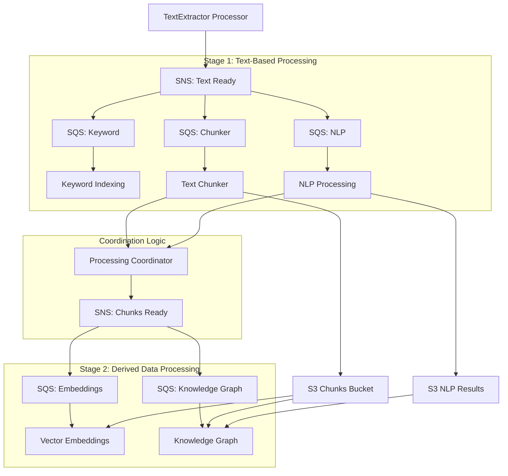

# TextChunker Integration Plan - Two-Stage Architecture with Smart Overlap
## Date: 2025-07-03T23:00:00Z

## 🎯 **Integration Objective**

Integrate the structured TextChunker with the operational TextExtractor pipeline using **two-stage messaging architecture** with proper dependency management and **smart overlap strategy** that eliminates unnecessary redundancy while preserving semantic coherence.

## 📊 **Refined Architecture Understanding**

### **✅ Two-Stage Processing Architecture**
```
Stage 1 (Text-Based): Keyword Indexing + NLP Processing + Text Chunking
                     ↓ (Coordination Logic)
Stage 2 (Derived Data): Vector Embeddings + Knowledge Graph
```

### **✅ Data Dependencies**
- **Stage 1 Inputs**: Full text + document structure (from TextExtractor)
- **Stage 2 Inputs**: Chunks (from chunking) + NLP results (from NLP processing)
- **Vector Embeddings**: Document-level chunk processing
- **Knowledge Graph**: NLP entities + chunk structure + full text

### **✅ Smart Overlap Strategy**
- **No fixed overlap** for structured chunks
- **Semantic boundaries** from document structure
- **Minimal overlap** (1 sentence) only when splitting within logical units
- **Complete preservation** of tables, lists, headers

## 🏗️ **Updated Integration Architecture**

### **Two-Stage Message Flow**


### **Stage 1 Message Structure (Text Ready)**
```json
{
    "Type": "Notification",
    "MessageId": "uuid-string",
    "TopicArn": "arn:aws:sns:us-east-1:861276078413:solve-global-kr-text-ready",
    "Message": {
        "doc_id": "abc123_def456",
        "doc_hash": "sha256-hash-string",
        "textract_job_id": "job-id-string",
        "stage": "text_ready",
        "full_text_location": {
            "bucket": "solve-global-kr-text-861276078413-us-east-1",
            "key": "extracted/abc123_def456/full_text.json"
        },
        "document_structure_location": {
            "bucket": "solve-global-kr-text-861276078413-us-east-1",
            "key": "structure/abc123_def456/textract_structure.json"
        },
        "textract_results": {
            "pages": 9,
            "blocks": 4384,
            "processing_time": 25.5
        },
        "timestamp": "2025-07-03T23:00:00Z"
    }
}
```

### **Stage 2 Message Structure (Chunks Ready)**
```json
{
    "Type": "Notification",
    "MessageId": "uuid-string",
    "TopicArn": "arn:aws:sns:us-east-1:861276078413:solve-global-kr-chunks-ready",
    "Message": {
        "doc_id": "abc123_def456",
        "stage": "chunks_ready",
        "chunks_location": {
            "bucket": "solve-global-kr-chunks-861276078413-us-east-1",
            "prefix": "chunks/abc123_def456/"
        },
        "nlp_results_location": {
            "bucket": "solve-global-kr-nlp-861276078413-us-east-1",
            "key": "nlp_results/abc123_def456/entities.json"
        },
        "chunk_summary": {
            "total_chunks": 45,
            "chunk_types": ["header", "paragraph", "table", "list"],
            "processing_method": "structured_smart_overlap"
        },
        "dependencies_ready": {
            "chunking": true,
            "nlp_processing": true
        },
        "timestamp": "2025-07-03T23:00:00Z"
    }
}
```

## 📋 **Implementation Plan**

### **Phase 1: Enhanced TextExtractor Processor (Priority 1)**

#### **1.1 Update TextExtractor Processor for Two-Stage Triggering**
```python
# Update text_extractor_processor.py

class TextExtractorProcessor:
    def __init__(self):
        self.sns = boto3.client('sns')
        self.text_ready_topic_arn = os.environ['TEXT_READY_TOPIC_ARN']
        # ... existing initialization
    
    def process_textract_completion(self, job_id: str, status: str):
        """Enhanced to trigger Stage 1 processing only"""
        
        try:
            if status == "SUCCEEDED":
                # Get Textract results
                textract_response = self.textract.get_document_analysis(JobId=job_id)
                
                # Get job metadata from database
                job_metadata = self.get_job_metadata(job_id)
                doc_hash = job_metadata['doc_hash']
                doc_id = self.generate_doc_id(doc_hash)
                
                # Store full text for Stage 1 processors
                full_text_location = self.store_full_text(textract_response, doc_id)
                
                # Store document structure for chunking
                structure_location = self.store_document_structure(textract_response, doc_id)
                
                # Update job status in database
                self.update_job_status(job_id, "SUCCEEDED", textract_response)
                
                # Trigger Stage 1 processing only
                self.trigger_stage1_processing(
                    doc_id, doc_hash, job_id, textract_response, 
                    full_text_location, structure_location
                )
                
                return {'success': True, 'doc_id': doc_id, 'stage': 'stage1_triggered'}
            else:
                # Handle failed jobs
                self.handle_job_failure(job_id, status)
                return {'success': False, 'status': status}
                
        except Exception as e:
            logger.error(f"Error processing Textract completion: {e}")
            self.handle_processing_error(job_id, str(e))
            raise
    
    def trigger_stage1_processing(self, doc_id, doc_hash, job_id, textract_response, 
                                  full_text_location, structure_location):
        """Trigger Stage 1 processing with proper data locations"""
        
        message = {
            "doc_id": doc_id,
            "doc_hash": doc_hash,
            "textract_job_id": job_id,
            "stage": "text_ready",
            "full_text_location": full_text_location,
            "document_structure_location": structure_location,
            "textract_results": {
                "pages": textract_response.get('DocumentMetadata', {}).get('Pages', 0),
                "blocks": len(textract_response.get('Blocks', [])),
                "processing_time": self.calculate_processing_time(job_id)
            },
            "timestamp": datetime.utcnow().isoformat()
        }
        
        # Publish to Stage 1 SNS topic
        self.sns.publish(
            TopicArn=self.text_ready_topic_arn,
            Message=json.dumps(message),
            Subject=f"Stage 1 Processing Ready: {doc_id}",
            MessageAttributes={
                'stage': {'DataType': 'String', 'StringValue': 'stage1'},
                'doc_id': {'DataType': 'String', 'StringValue': doc_id}
            }
        )
        
        logger.info(f"Triggered Stage 1 processing for document {doc_id}")
    
    def store_document_structure(self, textract_response, doc_id):
        """Store Textract structure data for chunking"""
        
        structure_key = f"structure/{doc_id}/textract_structure.json"
        structure_data = {
            "doc_id": doc_id,
            "textract_blocks": textract_response.get('Blocks', []),
            "document_metadata": textract_response.get('DocumentMetadata', {}),
            "created_at": datetime.utcnow().isoformat(),
            "purpose": "structured_chunking"
        }
        
        self.s3.put_object(
            Bucket=self.text_bucket,
            Key=structure_key,
            Body=json.dumps(structure_data, indent=2),
            ContentType='application/json'
        )
        
        return {
            "bucket": self.text_bucket,
            "key": structure_key
        }
```

### **Phase 2: Smart Overlap TextChunker Processor (Priority 1)**

#### **2.1 Enhanced TextChunker with Smart Overlap**
```python
# lambda/text_chunker_processor/text_chunker_processor.py

import boto3
import json
import os
from datetime import datetime
from structured_chunking_smart import SmartStructuredChunker  # Updated chunker
from DatabaseManager import DatabaseManager

class TextChunkerProcessor:
    def __init__(self):
        self.s3 = boto3.client('s3')
        self.sns = boto3.client('sns')
        self.db_manager = DatabaseManager()
        self.chunks_bucket = os.environ['CHUNKS_BUCKET']
        self.text_bucket = os.environ['TEXT_BUCKET']
        self.coordination_topic_arn = os.environ.get('COORDINATION_TOPIC_ARN')
        
        # Smart structured chunker with no fixed overlap
        self.structured_chunker = SmartStructuredChunker(
            min_chunk_size=150,         # Slightly larger for complete thoughts
            max_chunk_size=1200,        # Allow larger chunks for complete sections
            overlap_sentences=0,        # No fixed overlap
            semantic_overlap=True,      # Smart overlap when needed
            respect_boundaries=True,    # Respect section boundaries
            preserve_tables=True,       # Keep tables intact
            preserve_lists=True,        # Keep lists intact
            header_context=True         # Include context with headers
        )
    
    def lambda_handler(self, event, context):
        """Lambda handler for Stage 1 SQS messages"""
        
        results = []
        
        for record in event['Records']:
            try:
                # Parse SQS message (from SNS)
                message_body = json.loads(record['body'])
                sns_message = json.loads(message_body['Message'])
                
                # Process the Stage 1 text completion
                result = self.process_stage1_text_ready(sns_message)
                results.append(result)
                
            except Exception as e:
                logger.error(f"Error processing SQS record: {e}")
                results.append({'success': False, 'error': str(e)})
        
        return {
            'statusCode': 200,
            'body': json.dumps({
                'processed': len(results),
                'successful': len([r for r in results if r.get('success')]),
                'failed': len([r for r in results if not r.get('success')])
            })
        }
    
    def process_stage1_text_ready(self, message):
        """Process Stage 1 text ready message"""
        
        doc_id = message['doc_id']
        doc_hash = message['doc_hash']
        full_text_location = message['full_text_location']
        structure_location = message['document_structure_location']
        
        try:
            logger.info(f"Starting smart chunking for document {doc_id}")
            
            # Read document structure from S3
            textract_structure = self.read_document_structure(structure_location)
            
            # Create structured chunks with smart overlap
            chunks = self.structured_chunker.chunk_document(textract_structure)
            
            # Store chunks in S3 data lake with enhanced metadata
            chunk_s3_keys = self.store_chunks_to_s3(chunks, doc_id, message)
            
            # Update processing status in database
            self.update_processing_status(doc_hash, 'COMPLETED', len(chunks))
            
            # Signal coordination logic for Stage 2 triggering
            self.signal_chunking_complete(doc_id, len(chunks))
            
            logger.info(f"Successfully chunked document {doc_id}: {len(chunks)} chunks created")
            
            return {
                'success': True,
                'doc_id': doc_id,
                'chunks_created': len(chunks),
                's3_keys': chunk_s3_keys,
                'chunking_strategy': 'smart_overlap'
            }
            
        except Exception as e:
            logger.error(f"Smart chunking failed for document {doc_id}: {e}")
            self.update_processing_status(doc_hash, 'FAILED', 0, str(e))
            raise
    
    def signal_chunking_complete(self, doc_id, chunks_created):
        """Signal coordination logic that chunking is complete"""
        
        if self.coordination_topic_arn:
            coordination_message = {
                "doc_id": doc_id,
                "processor": "text_chunker",
                "status": "COMPLETED",
                "chunks_created": chunks_created,
                "timestamp": datetime.utcnow().isoformat()
            }
            
            self.sns.publish(
                TopicArn=self.coordination_topic_arn,
                Message=json.dumps(coordination_message),
                Subject=f"Chunking Complete: {doc_id}",
                MessageAttributes={
                    'processor': {'DataType': 'String', 'StringValue': 'text_chunker'},
                    'doc_id': {'DataType': 'String', 'StringValue': doc_id}
                }
            )
```

### **Phase 3: Processing Coordination Logic (Priority 1)**

#### **3.1 Coordination Lambda Function**
```python
# lambda/processing_coordinator/processing_coordinator.py

class ProcessingCoordinator:
    def __init__(self):
        self.sns = boto3.client('sns')
        self.db_manager = DatabaseManager()
        self.chunks_ready_topic_arn = os.environ['CHUNKS_READY_TOPIC_ARN']
    
    def lambda_handler(self, event, context):
        """Handle processor completion signals"""
        
        for record in event['Records']:
            message_body = json.loads(record['body'])
            sns_message = json.loads(message_body['Message'])
            
            self.handle_processor_completion(sns_message)
    
    def handle_processor_completion(self, message):
        """Handle individual processor completion"""
        
        doc_id = message['doc_id']
        processor = message['processor']
        status = message['status']
        
        if status == 'COMPLETED':
            # Update completion tracking
            self.update_completion_status(doc_id, processor)
            
            # Check if we can trigger Stage 2 processors
            self.check_and_trigger_stage2(doc_id)
    
    def check_and_trigger_stage2(self, doc_id):
        """Check dependencies and trigger Stage 2 processors"""
        
        status = self.get_processing_status(doc_id)
        
        # Trigger embeddings as soon as chunking completes
        if (status.get('chunking_status') == 'COMPLETED' and 
            not status.get('embeddings_triggered', False)):
            self.trigger_embeddings_processing(doc_id)
            self.mark_embeddings_triggered(doc_id)
        
        # Trigger knowledge graph when both NLP and chunking complete
        if (status.get('chunking_status') == 'COMPLETED' and 
            status.get('nlp_processing_status') == 'COMPLETED' and
            not status.get('knowledge_graph_triggered', False)):
            self.trigger_knowledge_graph_processing(doc_id)
            self.mark_knowledge_graph_triggered(doc_id)
    
    def trigger_embeddings_processing(self, doc_id):
        """Trigger vector embeddings processing"""
        
        message = {
            "doc_id": doc_id,
            "stage": "embeddings",
            "chunks_location": {
                "bucket": "solve-global-kr-chunks-861276078413-us-east-1",
                "prefix": f"chunks/{doc_id}/"
            },
            "processing_mode": "document_level",
            "dependencies_ready": {
                "chunking": True
            },
            "timestamp": datetime.utcnow().isoformat()
        }
        
        self.sns.publish(
            TopicArn=self.chunks_ready_topic_arn,
            Message=json.dumps(message),
            Subject=f"Embeddings Processing Ready: {doc_id}",
            MessageAttributes={
                'processor_type': {'DataType': 'String', 'StringValue': 'embeddings'},
                'doc_id': {'DataType': 'String', 'StringValue': doc_id}
            }
        )
        
        logger.info(f"Triggered embeddings processing for document {doc_id}")
    
    def trigger_knowledge_graph_processing(self, doc_id):
        """Trigger knowledge graph processing"""
        
        message = {
            "doc_id": doc_id,
            "stage": "knowledge_graph",
            "chunks_location": {
                "bucket": "solve-global-kr-chunks-861276078413-us-east-1",
                "prefix": f"chunks/{doc_id}/"
            },
            "nlp_results_location": {
                "bucket": "solve-global-kr-nlp-861276078413-us-east-1",
                "key": f"nlp_results/{doc_id}/entities.json"
            },
            "dependencies_ready": {
                "chunking": True,
                "nlp_processing": True
            },
            "timestamp": datetime.utcnow().isoformat()
        }
        
        self.sns.publish(
            TopicArn=self.chunks_ready_topic_arn,
            Message=json.dumps(message),
            Subject=f"Knowledge Graph Processing Ready: {doc_id}",
            MessageAttributes={
                'processor_type': {'DataType': 'String', 'StringValue': 'knowledge_graph'},
                'doc_id': {'DataType': 'String', 'StringValue': doc_id}
            }
        )
        
        logger.info(f"Triggered knowledge graph processing for document {doc_id}")
```

## 🔄 **Complete Integration Workflow**

### **End-to-End Two-Stage Message Flow**
```
1. S3 Document Upload
   ↓ (S3 Event)
2. TextExtractor Initiator
   - Creates document record
   - Starts async Textract job
   - Stores job metadata
   ↓ (Textract completion)
3. SNS: Textract Completion
   ↓ (SQS message)
4. TextExtractor Processor
   - Processes Textract results
   - Stores full text + document structure
   - Updates job status
   - Publishes to Stage 1 SNS
   ↓ (Stage 1 SNS fan-out)
5. Stage 1 Parallel Processing
   ├─ Keyword Indexing (full text)
   ├─ NLP Processing (full text) → Coordination Signal
   └─ Text Chunking (full text + structure) → Coordination Signal
   ↓ (Coordination Logic)
6. Processing Coordinator
   - Tracks Stage 1 completion
   - Triggers Stage 2 when dependencies ready
   - Publishes to Stage 2 SNS
   ↓ (Stage 2 SNS fan-out)
7. Stage 2 Parallel Processing
   ├─ Vector Embeddings (document-level chunks)
   └─ Knowledge Graph (chunks + NLP results + structure)
   ↓
8. S3 Data Lake Storage Complete
   - All processing artifacts stored
   - Ready for query and retrieval
```

---

**Status**: 📋 **TWO-STAGE ARCHITECTURE WITH SMART OVERLAP INTEGRATION PLAN**  
**Key Features**: Dependency-aware processing, smart overlap strategy, document-level embeddings  
**Next Action**: Implement Phase 1 - Enhanced TextExtractor Processor with Stage 1 triggering
