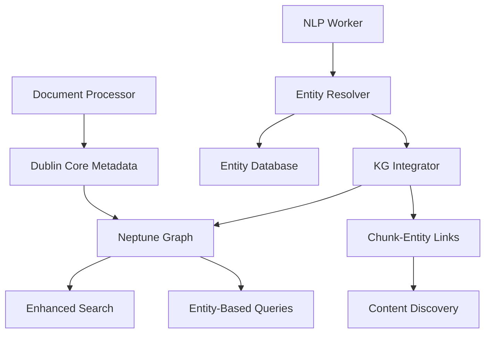

# Knowledge Graph Entity Integration Implementation Guide
## From NLP Results to Semantic RDF Entities

**Purpose**: Technical implementation guide for integrating NLP-extracted entities into the Knowledge Graph using established RDF ontologies  
**Status**: Ready for Development  
**Estimated Effort**: 6-8 weeks  

---

## 🏗️ ARCHITECTURE OVERVIEW

### **Current State**
```
NLP Worker → S3 Data Lake → Database (minimal tracking)
```

### **Target State**
```
NLP Worker → Entity Resolver → KG Integration → Neptune Graph
                     ↓
              Chunk-Entity Linking → Enhanced Search
```

### **Key Components**
1. **Entity Resolution Service** - Maps NLP entities to RDF nodes
2. **Ontology Manager** - Handles RDF schema and namespaces  
3. **KG Integration Service** - Creates and links entities in Neptune
4. **Chunk-Entity Linker** - Connects entities to content chunks

---

## 🔧 IMPLEMENTATION COMPONENTS

### **1. Entity Resolution Service**

#### **Lambda Function: `entity_resolver`**
```python
# entity_resolver/entity_resolver.py
"""
Entity Resolution Service
Maps NLP entities to standardized RDF entities with deduplication
"""

import json
import boto3
from typing import Dict, List, Any, Optional
from dataclasses import dataclass
from rdflib import Graph, Namespace, URIRef, Literal
from rdflib.namespace import FOAF, DCTERMS, RDF, RDFS

# Ontology namespaces
FOAF = Namespace("http://xmlns.com/foaf/0.1/")
SCHEMA = Namespace("https://schema.org/")
DCTERMS = Namespace("http://purl.org/dc/terms/")
SKOS = Namespace("http://www.w3.org/2004/02/skos/core#")
QUDT = Namespace("http://qudt.org/schema/qudt/")
TIME = Namespace("http://www.w3.org/2006/time#")
CLIMATE = Namespace("http://climate-risk.org/ontology/")

@dataclass
class ResolvedEntity:
    """Standardized entity representation"""
    canonical_name: str
    entity_type: str
    rdf_type: str
    confidence: float
    properties: Dict[str, Any]
    source_chunk: str
    kg_uri: Optional[str] = None

class EntityResolver:
    """Resolves NLP entities to RDF entities with deduplication"""
    
    def __init__(self):
        self.neptune_client = boto3.client('neptunedata')
        self.s3_client = boto3.client('s3')
        
        # Entity type mappings
        self.type_mappings = {
            'PERSON': {
                'rdf_type': 'foaf:Person',
                'resolver': self._resolve_person
            },
            'ORGANIZATION': {
                'rdf_type': 'foaf:Organization', 
                'resolver': self._resolve_organization
            },
            'LOCATION': {
                'rdf_type': 'schema:Place',
                'resolver': self._resolve_location
            },
            'DATE': {
                'rdf_type': 'time:Instant',
                'resolver': self._resolve_date
            },
            'QUANTITY': {
                'rdf_type': 'qudt:Quantity',
                'resolver': self._resolve_quantity
            },
            'TITLE': {
                'rdf_type': 'skos:Concept',
                'resolver': self._resolve_concept
            }
        }
    
    def resolve_entities(self, nlp_results: Dict[str, Any]) -> List[ResolvedEntity]:
        """Resolve all entities from NLP results"""
        resolved_entities = []
        
        for chunk_mapping in nlp_results['chunk_mappings']:
            if chunk_mapping['type'] == 'entity':
                entity = self._resolve_single_entity(chunk_mapping)
                if entity:
                    resolved_entities.append(entity)
        
        return resolved_entities
    
    def _resolve_single_entity(self, entity_data: Dict) -> Optional[ResolvedEntity]:
        """Resolve a single entity with type-specific logic"""
        entity_type = entity_data['entity_type']
        
        if entity_type not in self.type_mappings:
            return self._resolve_generic_entity(entity_data)
        
        mapping = self.type_mappings[entity_type]
        resolver_func = mapping['resolver']
        
        return resolver_func(entity_data, mapping['rdf_type'])
    
    def _resolve_person(self, entity_data: Dict, rdf_type: str) -> ResolvedEntity:
        """Resolve PERSON entities to foaf:Person"""
        name = entity_data['text']
        
        # Check for existing person in KG
        existing_uri = self._find_existing_person(name)
        
        # Parse name components
        name_parts = self._parse_person_name(name)
        
        properties = {
            'foaf:name': name,
            'foaf:givenName': name_parts.get('given_name'),
            'foaf:familyName': name_parts.get('family_name'),
            'schema:jobTitle': self._infer_job_title(entity_data)
        }
        
        return ResolvedEntity(
            canonical_name=name,
            entity_type='PERSON',
            rdf_type=rdf_type,
            confidence=entity_data['confidence'],
            properties=properties,
            source_chunk=entity_data['chunk_id'],
            kg_uri=existing_uri
        )
    
    def _resolve_organization(self, entity_data: Dict, rdf_type: str) -> ResolvedEntity:
        """Resolve ORGANIZATION entities to foaf:Organization"""
        name = entity_data['text']
        
        # Check for existing organization
        existing_uri = self._find_existing_organization(name)
        
        # Normalize organization name
        canonical_name = self._normalize_organization_name(name)
        
        properties = {
            'foaf:name': canonical_name,
            'schema:alternateName': name if name != canonical_name else None,
            'schema:organizationType': self._classify_organization_type(name),
            'climate:organizationRole': self._infer_climate_role(name)
        }
        
        return ResolvedEntity(
            canonical_name=canonical_name,
            entity_type='ORGANIZATION',
            rdf_type=rdf_type,
            confidence=entity_data['confidence'],
            properties=properties,
            source_chunk=entity_data['chunk_id'],
            kg_uri=existing_uri
        )
    
    def _resolve_location(self, entity_data: Dict, rdf_type: str) -> ResolvedEntity:
        """Resolve LOCATION entities to schema:Place"""
        name = entity_data['text']
        
        # Geocoding and normalization
        geo_data = self._geocode_location(name)
        
        properties = {
            'schema:name': name,
            'geo:lat': geo_data.get('latitude'),
            'geo:long': geo_data.get('longitude'),
            'schema:addressCountry': geo_data.get('country'),
            'climate:seaLevelRisk': self._assess_sea_level_risk(geo_data),
            'climate:vulnerabilityScore': self._calculate_climate_vulnerability(geo_data)
        }
        
        return ResolvedEntity(
            canonical_name=name,
            entity_type='LOCATION',
            rdf_type=rdf_type,
            confidence=entity_data['confidence'],
            properties=properties,
            source_chunk=entity_data['chunk_id']
        )
    
    def _resolve_quantity(self, entity_data: Dict, rdf_type: str) -> ResolvedEntity:
        """Resolve QUANTITY entities to qudt:Quantity"""
        text = entity_data['text']
        
        # Parse quantity and unit
        parsed = self._parse_quantity(text)
        
        properties = {
            'qudt:numericValue': parsed['value'],
            'qudt:unit': parsed['unit_uri'],
            'qudt:quantityKind': parsed['quantity_kind'],
            'schema:description': f"Extracted quantity: {text}"
        }
        
        return ResolvedEntity(
            canonical_name=text,
            entity_type='QUANTITY',
            rdf_type=rdf_type,
            confidence=entity_data['confidence'],
            properties=properties,
            source_chunk=entity_data['chunk_id']
        )

def lambda_handler(event, context):
    """Lambda handler for entity resolution"""
    try:
        # Parse input from NLP worker
        nlp_results = json.loads(event['Records'][0]['body'])
        doc_id = nlp_results['doc_id']
        
        # Resolve entities
        resolver = EntityResolver()
        resolved_entities = resolver.resolve_entities(nlp_results)
        
        # Store resolved entities
        storage_location = store_resolved_entities(doc_id, resolved_entities)
        
        # Trigger KG integration
        trigger_kg_integration(doc_id, resolved_entities, storage_location)
        
        return {
            'statusCode': 200,
            'body': json.dumps({
                'doc_id': doc_id,
                'entities_resolved': len(resolved_entities),
                'storage_location': storage_location
            })
        }
        
    except Exception as e:
        logger.error(f"Entity resolution failed: {str(e)}")
        raise
```

### **2. KG Integration Service**

#### **Lambda Function: `kg_integrator`**
```python
# kg_integrator/kg_integrator.py
"""
Knowledge Graph Integration Service
Creates and links RDF entities in Neptune
"""

from rdflib import Graph, Namespace, URIRef, Literal, BNode
from rdflib.namespace import RDF, RDFS, XSD
import boto3
import uuid

class KGIntegrator:
    """Integrates resolved entities into Neptune Knowledge Graph"""
    
    def __init__(self):
        self.neptune_endpoint = os.environ['NEPTUNE_ENDPOINT']
        self.graph = Graph()
        
        # Bind namespaces
        self._bind_namespaces()
    
    def integrate_entities(self, doc_id: str, resolved_entities: List[ResolvedEntity]):
        """Integrate resolved entities into KG"""
        
        # Create document node
        doc_uri = self._create_document_node(doc_id)
        
        # Process each entity
        for entity in resolved_entities:
            entity_uri = self._create_or_update_entity(entity)
            self._link_entity_to_chunk(entity_uri, entity.source_chunk, doc_uri)
        
        # Upload to Neptune
        self._upload_to_neptune()
    
    def _create_or_update_entity(self, entity: ResolvedEntity) -> URIRef:
        """Create new entity or update existing one"""
        
        if entity.kg_uri:
            # Update existing entity
            entity_uri = URIRef(entity.kg_uri)
            self._update_entity_properties(entity_uri, entity)
        else:
            # Create new entity
            entity_uri = self._generate_entity_uri(entity)
            self._create_new_entity(entity_uri, entity)
        
        return entity_uri
    
    def _create_new_entity(self, entity_uri: URIRef, entity: ResolvedEntity):
        """Create new RDF entity with all properties"""
        
        # Add type
        rdf_type = self._resolve_rdf_type(entity.rdf_type)
        self.graph.add((entity_uri, RDF.type, rdf_type))
        
        # Add properties
        for prop_name, prop_value in entity.properties.items():
            if prop_value is not None:
                prop_uri = self._resolve_property_uri(prop_name)
                literal_value = self._create_literal(prop_value)
                self.graph.add((entity_uri, prop_uri, literal_value))
        
        # Add extraction metadata
        self._add_extraction_metadata(entity_uri, entity)
    
    def _link_entity_to_chunk(self, entity_uri: URIRef, chunk_id: str, doc_uri: URIRef):
        """Create relationships between entities and content chunks"""
        
        chunk_uri = URIRef(f"http://climate-risk.org/chunk/{chunk_id}")
        
        # Chunk contains entity
        self.graph.add((chunk_uri, CLIMATE.containsEntity, entity_uri))
        
        # Entity mentioned in chunk
        self.graph.add((entity_uri, CLIMATE.mentionedIn, chunk_uri))
        
        # Chunk part of document
        self.graph.add((chunk_uri, DCTERMS.isPartOf, doc_uri))
```

### **3. Ontology Manager**

#### **Service: `ontology_manager`**
```python
# ontology_manager/ontology_manager.py
"""
Ontology Management Service
Handles RDF schema, namespaces, and ontology imports
"""

class OntologyManager:
    """Manages RDF ontologies and schema validation"""
    
    def __init__(self):
        self.namespaces = {
            'foaf': 'http://xmlns.com/foaf/0.1/',
            'schema': 'https://schema.org/',
            'dcterms': 'http://purl.org/dc/terms/',
            'skos': 'http://www.w3.org/2004/02/skos/core#',
            'qudt': 'http://qudt.org/schema/qudt/',
            'time': 'http://www.w3.org/2006/time#',
            'climate': 'http://climate-risk.org/ontology/'
        }
        
        self.climate_ontology = self._load_climate_ontology()
    
    def _load_climate_ontology(self) -> Graph:
        """Load custom climate risk ontology"""
        g = Graph()
        
        # Define climate-specific classes
        g.add((CLIMATE.ClimateRisk, RDF.type, RDFS.Class))
        g.add((CLIMATE.ClimateEvent, RDF.type, RDFS.Class))
        g.add((CLIMATE.ClimateProjection, RDF.type, RDFS.Class))
        
        # Define climate-specific properties
        g.add((CLIMATE.seaLevelRisk, RDF.type, RDF.Property))
        g.add((CLIMATE.temperatureProjection, RDF.type, RDF.Property))
        g.add((CLIMATE.carbonFootprint, RDF.type, RDF.Property))
        g.add((CLIMATE.vulnerabilityScore, RDF.type, RDF.Property))
        
        return g
    
    def validate_entity(self, entity_uri: URIRef, entity_type: str) -> bool:
        """Validate entity against ontology constraints"""
        # Implementation for schema validation
        pass
    
    def get_property_constraints(self, rdf_type: str) -> Dict:
        """Get property constraints for RDF type"""
        # Implementation for property validation
        pass
```

---

## 📊 DATABASE SCHEMA UPDATES

### **Enhanced Entity Storage**
```sql
-- Enhanced entities table with RDF support
CREATE TABLE entities (
    entity_id UUID PRIMARY KEY DEFAULT gen_random_uuid(),
    canonical_name VARCHAR(500) NOT NULL,
    entity_type VARCHAR(50) NOT NULL,
    rdf_type VARCHAR(100) NOT NULL,
    kg_uri VARCHAR(500) UNIQUE,
    confidence DECIMAL(4,3),
    properties JSONB,
    created_at TIMESTAMP DEFAULT CURRENT_TIMESTAMP,
    updated_at TIMESTAMP DEFAULT CURRENT_TIMESTAMP
);

-- Entity mentions in chunks
CREATE TABLE entity_mentions (
    mention_id UUID PRIMARY KEY DEFAULT gen_random_uuid(),
    entity_id UUID REFERENCES entities(entity_id),
    chunk_id UUID REFERENCES chunks(chunk_id),
    mention_text VARCHAR(500),
    start_offset INTEGER,
    end_offset INTEGER,
    confidence DECIMAL(4,3),
    created_at TIMESTAMP DEFAULT CURRENT_TIMESTAMP
);

-- Entity relationships
CREATE TABLE entity_relationships (
    relationship_id UUID PRIMARY KEY DEFAULT gen_random_uuid(),
    subject_entity_id UUID REFERENCES entities(entity_id),
    predicate VARCHAR(100),
    object_entity_id UUID REFERENCES entities(entity_id),
    confidence DECIMAL(4,3),
    source_chunk_id UUID REFERENCES chunks(chunk_id),
    created_at TIMESTAMP DEFAULT CURRENT_TIMESTAMP
);

-- Indexes for performance
CREATE INDEX idx_entities_type ON entities(entity_type);
CREATE INDEX idx_entities_kg_uri ON entities(kg_uri);
CREATE INDEX idx_entity_mentions_chunk ON entity_mentions(chunk_id);
CREATE INDEX idx_entity_mentions_entity ON entity_mentions(entity_id);
```

### **Document Schema Migration to Dublin Core**
```sql
-- Migrate documents table to Dublin Core terms
ALTER TABLE documents 
ADD COLUMN dc_title VARCHAR(1000),
ADD COLUMN dc_creator VARCHAR(500),
ADD COLUMN dc_created TIMESTAMP,
ADD COLUMN dc_publisher VARCHAR(500),
ADD COLUMN dc_subject TEXT[],
ADD COLUMN dc_description TEXT,
ADD COLUMN dc_source VARCHAR(1000),
ADD COLUMN dc_type VARCHAR(100),
ADD COLUMN dc_language VARCHAR(10) DEFAULT 'en';

-- Migration script
UPDATE documents SET
    dc_title = title,
    dc_creator = author,
    dc_created = created_at,
    dc_source = source_url,
    dc_description = summary,
    dc_type = document_type;
```

---

## 🔄 INTEGRATION WORKFLOW

### **End-to-End Process**


### **Event Flow**
1. **NLP Processing Complete** → Trigger Entity Resolution
2. **Entities Resolved** → Trigger KG Integration  
3. **KG Updated** → Update Search Indexes
4. **Search Enhanced** → Enable Entity-Based Queries

---

## 🧪 TESTING STRATEGY

### **Unit Tests**
```python
# test_entity_resolver.py
def test_person_resolution():
    """Test PERSON entity resolution to foaf:Person"""
    entity_data = {
        'text': 'Dr. Sarah Johnson',
        'entity_type': 'PERSON',
        'confidence': 0.997,
        'chunk_id': 'chunk_123'
    }
    
    resolver = EntityResolver()
    resolved = resolver._resolve_person(entity_data, 'foaf:Person')
    
    assert resolved.canonical_name == 'Dr. Sarah Johnson'
    assert resolved.rdf_type == 'foaf:Person'
    assert 'foaf:name' in resolved.properties
    assert resolved.properties['foaf:givenName'] == 'Sarah'
    assert resolved.properties['foaf:familyName'] == 'Johnson'

def test_organization_deduplication():
    """Test organization entity deduplication"""
    # Test that 'IPCC' and 'Intergovernmental Panel on Climate Change' 
    # resolve to the same entity
    pass

def test_quantity_parsing():
    """Test QUANTITY entity parsing with QUDT"""
    entity_data = {
        'text': '2.5 degrees Celsius',
        'entity_type': 'QUANTITY',
        'confidence': 0.992
    }
    
    resolver = EntityResolver()
    resolved = resolver._resolve_quantity(entity_data, 'qudt:Quantity')
    
    assert resolved.properties['qudt:numericValue'] == 2.5
    assert 'DEG_C' in resolved.properties['qudt:unit']
```

### **Integration Tests**
```python
# test_kg_integration.py
def test_end_to_end_entity_integration():
    """Test complete NLP → KG integration pipeline"""
    # Mock NLP results
    nlp_results = load_test_nlp_results()
    
    # Process through pipeline
    resolved_entities = entity_resolver.resolve_entities(nlp_results)
    kg_integrator.integrate_entities('test_doc', resolved_entities)
    
    # Verify in Neptune
    query_result = query_neptune_for_entities('test_doc')
    assert len(query_result) == expected_entity_count
    
    # Verify entity properties
    person_entity = find_entity_by_type(query_result, 'foaf:Person')
    assert person_entity['foaf:name'] == 'Expected Name'
```

---

## 📈 PERFORMANCE CONSIDERATIONS

### **Optimization Strategies**
- **Entity Caching**: Cache resolved entities to avoid re-processing
- **Batch Processing**: Process multiple entities in single Neptune transactions
- **Async Processing**: Use SQS for decoupled entity resolution
- **Index Optimization**: Proper indexing for entity lookup queries

### **Scalability Targets**
- **Entity Resolution**: <200ms per entity
- **KG Integration**: <500ms per document
- **Query Performance**: <100ms for entity-based searches
- **Throughput**: 1000+ entities per minute

---

## 🎯 SUCCESS CRITERIA

### **Functional Requirements**
- [ ] All Comprehend entity types mapped to RDF ontologies
- [ ] Entity deduplication working correctly
- [ ] Chunk-entity relationships established
- [ ] Dublin Core document metadata implemented
- [ ] SPARQL queries working for entity discovery

### **Quality Metrics**
- [ ] >90% entity resolution accuracy
- [ ] <5% duplicate entities in KG
- [ ] >95% successful KG integrations
- [ ] <1s end-to-end processing time per document

### **Integration Success**
- [ ] Enhanced search with entity filtering
- [ ] Entity-based content discovery
- [ ] Rich metadata queries working
- [ ] Relationship inference operational

This implementation guide provides the technical foundation for transforming your NLP results into a rich, semantically-aware Knowledge Graph using established RDF ontologies and best practices.
